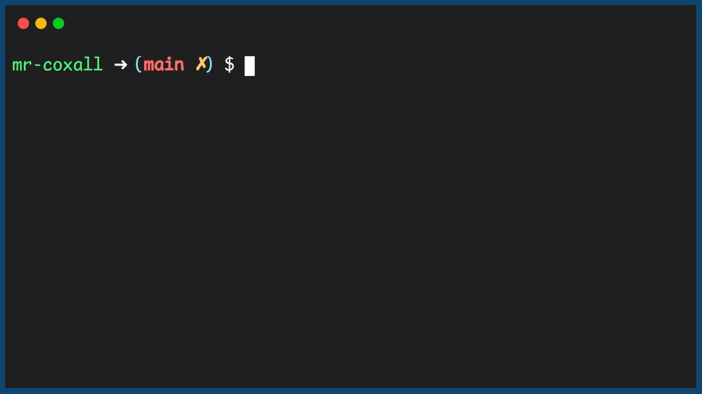

.. _by-value-or-by-reference:

By Value or By Reference
========================

The second method of transferring information to a function is to pass it `By Reference <https://en.wikipedia.org/wiki/Evaluation_strategy#Call_by_reference>`_. This means that a pointer or *reference* to where the data is stored in memory is passed to the function and not a copy of the data. Since a pointer to where the data exists has been passed, if you actually change the value of the data in the function, the actual values of the data in the main program where the function was called from will also be changed. This can be very powerful but also **very dangerous**. Be careful passing parameters *By Reference*, you might mistakenly change a value when that is not what you or someone else is expecting. The rule of thumb is that unless there is a **really good** reason to pass something By Reference, you never do and you always pass parameters By Value (even though it takes up more space in memory). 

Each language has its own syntax on how to declare you are going to accept a value by reference when you are declaring a function here is an example:

Code for Function passing a value By Reference
^^^^^^^^^^^^^^^^^^^^^^^^^^^^^^^^^^^^^^^^^^^^^^
.. tabs::

  .. group-tab:: C
    .. code-block:: C
      .. literalinclude:: ../../code_examples/4-Functions/6-By_Value_or_By_Reference/C/main.c
        :language: C
        :linenos:
        :emphasize-lines: 9-12, 23

  .. group-tab:: C++
    .. code-block:: C++
      .. literalinclude:: ../../code_examples/4-Functions/6-By_Value_or_By_Reference/CPP/main.cpp
        :language: C++
        :linenos:
        :emphasize-lines: 9-12, 23

  .. group-tab:: C#
    .. code-block:: C#
      .. literalinclude:: ../../code_examples/4-Functions/6-By_Value_or_By_Reference/CSharp/main.cs
        :language: C#
        :linenos:
        :emphasize-lines: 12-15, 26

  .. group-tab:: Go
    .. code-block:: Go
      .. literalinclude:: ../../code_examples/4-Functions/6-By_Value_or_By_Reference/Go/main.go
        :language: go
        :linenos:
        :emphasize-lines: 11-14, 25

  .. group-tab:: Java
    .. code-block:: Java
      .. literalinclude:: ../../code_examples/4-Functions/6-By_Value_or_By_Reference/Java/Main.java
        :language: java
        :linenos:
        :emphasize-lines: 13-19, 33

  .. group-tab:: JavaScript
    .. code-block:: JavaScript
      .. literalinclude:: ../../code_examples/4-Functions/6-By_Value_or_By_Reference/JavaScript/main.js
        :language: javascript
        :linenos:
        :emphasize-lines: 7-10, 21

  .. group-tab:: Python
    .. code-block:: Python
      .. literalinclude:: ../../code_examples/4-Functions/6-By_Value_or_By_Reference/Python/main.py
        :language: python
        :linenos:
        :emphasize-lines: 8-12, 24

Example Output
^^^^^^^^^^^^^^

