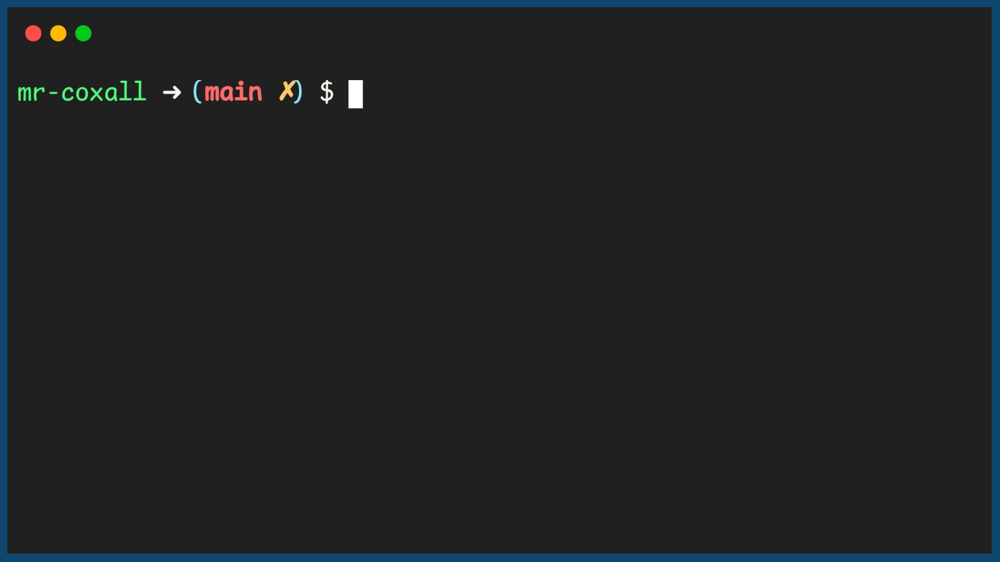

.. _functions-with-a-parameter:

Functions with a Parameter
==========================

A function often needs pieces of information to be able to complete its work. In the last section you might have noticed that I had to ask for the length and width twice, once for each of the area and perimeter calculations; clearly not ideal. One method of doing this is to declare the variable as a *global variable* and then any code within that file can access it. This is a very bruit force method and is **very bad programming style**. By doing it this way, the variable is created and held in memory for the entire time the file is running, even thought the information may only be needed for a small fraction of the time. Also the function is no longer portable, since it relies on external global variables that might not exist in another program. A better, more elegant and more memory friendly way is to pass the information into the function using a `parameter <https://en.wikipedia.org/wiki/Parameter_(computer_programming)>`_. There are three main ways to pass information to a function, by value, by reference and by object reference. For the time being we will just consider by value. (We will even assume python is doing by value, even though it is really doing by `object reference <https://www.python-course.eu/passing_arguments.php>`_.)

Passing By Value
----------------

The first method of transferring information to a function is to pass it `“By Value” <https://www.mathwarehouse.com/programming/passing-by-value-vs-by-reference-visual-explanation.php>`_. This means that a copy of the data is made and it is passed over to the function to do with it what it pleases. Since it is a **copy** of the data, any changes to the data are not reflected in the original variable. From the animation below you can see that when the cup is passed "By Value" to the function and then filled up, the original cup is still empty. This is because the variable passed to the function is a copy, not the original variable. If the function changes this variable, nothing happens to the original one. 

.. image:: ./images/pass-by-reference-vs-pass-by-value-animation.gif
   :alt: Pass by value or reference
   :align: center

A variable or value passed along inside a function call is called an `parameter <https://en.wikipedia.org/wiki/Parameter_(computer_programming)>`_. Parameter(s) are usually placed inside a bracket when you invoke the function. For example:

.. tabs::

  .. group-tab:: C
    .. code-block:: C
		
		// calling a function
		CalculateArea(lengthFromUser, widthFromUser);

  .. group-tab:: C++

    .. code-block:: C++

		// calling a function
		CalculateArea(lengthFromUser, widthFromUser);

  .. group-tab:: C#
    .. code-block:: C#

		// calling a function
		CalculateArea(lengthFromUser, widthFromUser);

  .. group-tab:: Go

    .. code-block:: Go

		// calling a function
		CalculateArea(lengthFromUser, widthFromUser)

  .. group-tab:: Java

    .. code-block:: Java

		// calling a function
		CalculateArea(lengthFromUser, widthFromUser);

  .. group-tab:: JavaScript

    .. code-block:: JavaScript

		// calling a function
		CalculateArea(lengthFromUser, widthFromUser)

  .. group-tab:: Python3

    .. code-block:: Python

		# calling a function
		calculate_area(length_from_user, width_from_user)

When you are creating your function, you must also tell the program that the function is expecting these two values. To do this after the function name declaration you place in brackets the two declaration statements declaring that the function must be passed in two variable (just like when a regular variable is being declared). If your programming language requires that you declare what type the variables will be normally, you will most like have to do that to. 

The following is the function declaration line for the examples above:

.. tabs::

  .. group-tab:: C
    .. code-block:: C
		
		// declaring a function
		int CalculateArea(int length, int width) {
		    ...

  .. group-tab:: C++

    .. code-block:: C++

		// declaring a function
		int CalculateArea(int length, int width) {
		    ...

  .. group-tab:: C#
    .. code-block:: C#

		// declaring a function
		int CalculateArea(int length, int width) {
		    ...

  .. group-tab:: Go

    .. code-block:: Go

		// declaring a function
		func CalculateArea(int length, int width) {
		    ...

  .. group-tab:: Java

    .. code-block:: Java

		// declaring a function
		int CalculateArea(int length, int width) {
		    ...

  .. group-tab:: JavaScript

    .. code-block:: JavaScript

		// declaring a function
		int CalculateArea(int length, int width) {
		    ...

  .. group-tab:: Python3

    .. code-block:: Python

		# declaring a function, with type hints
		def calculate_area(length: int, width: int) -> None:
		    ...

Here is a full example of the previous sections program, but now the main function takes care of getting the length and width. This way it only has to ask you the information once and it passes the length and width to each function:

.. tabs::

  .. group-tab:: C
    .. code-block:: C
      .. literalinclude:: ../../code_examples/4-Functions/2-Functions_with_a_Parameter/C/main.c
        :language: C
        :linenos:
        :emphasize-lines: 9, 19, 40-41

  .. group-tab:: C++
    .. code-block:: C++
      .. literalinclude:: ../../code_examples/4-Functions/2-Functions_with_a_Parameter/CPP/main.cpp
        :language: C++
        :linenos:
        :emphasize-lines: 10, 20, 41-42

  .. group-tab:: C#
    .. code-block:: C#
      .. literalinclude:: ../../code_examples/4-Functions/2-Functions_with_a_Parameter/CSharp/main.cs
        :language: C#
        :linenos:
        :emphasize-lines: 13, 23, 42-43

  .. group-tab:: Go
    .. code-block:: Go
      .. literalinclude:: ../../code_examples/4-Functions/2-Functions_with_a_Parameter/Go/main.go
        :language: go
        :linenos:
        :emphasize-lines: 13, 23, 42-43

  .. group-tab:: Java
    .. code-block:: Java
      .. literalinclude:: ../../code_examples/4-Functions/2-Functions_with_a_Parameter/Java/Main.java
        :language: java
        :linenos:
        :emphasize-lines: 17, 30, 60-61

  .. group-tab:: JavaScript
    .. code-block:: JavaScript
      .. literalinclude:: ../../code_examples/4-Functions/2-Functions_with_a_Parameter/JavaScript/main.js
        :language: javascript
        :linenos:
        :emphasize-lines: 9, 19, 35-36

  .. group-tab:: Python
    .. code-block:: Python
      .. literalinclude:: ../../code_examples/4-Functions/2-Functions_with_a_Parameter/Python/main.py
        :language: python
        :linenos:
        :emphasize-lines: 9, 19, 38-39

Example Output
^^^^^^^^^^^^^^
