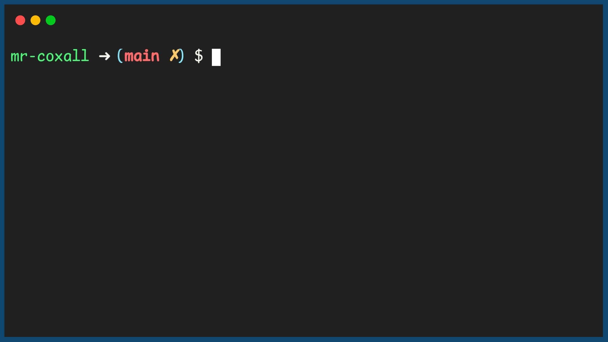

.. _functions-with-multiple-parameters:

Functions with Multiple Parameters
==================================

All of the functions that we have looked at to this point, there has been one (1) parameter passed into the function. This is not always the case. There might be cases where you need to pass in two (2) or more peices of infomation. Suppose you have a function that calculates the area of a rectangle. In this case unless you are only going to do squares, you will need a length and a width.

Fortunately you can pass multiple parameters into a function. The thing to remember is that, since you now have more than one (1) item, the order of the parameters is important, since this is how the computer is going to keep track of the different variables.

Since people are not always great at keeping things in order, many programming languages (but not all, for example `C++ does not do this <https://stackoverflow.com/questions/38076786/why-c-doesnt-support-named-parameter>`_) let you pass multiple parameters to functions using "parameteres by keyword". This means that you actually give each parameter a name and then refer to this name when you are passing the values to the function, so there is no confusion about what value is going where.

In the example below, I have a function that can calculate the area of a rectangle. Is is important to keep all two (2) parameters organzied, or you will not get the correct answer. To do this each parameter will be given a name:

.. tabs::

  .. group-tab:: C
    .. code-block:: C
      .. literalinclude:: ../../code_examples/4-Functions/4-Functions_with_Multiple_Parameters/C/main.c
        :language: C
        :linenos:
        :emphasize-lines: 9-16, 32

  .. group-tab:: C++
    .. code-block:: C++
      .. literalinclude:: ../../code_examples/4-Functions/4-Functions_with_Multiple_Parameters/CPP/main.cpp
        :language: C++
        :linenos:
        :emphasize-lines: 10-17, 34

  .. group-tab:: C#
    .. code-block:: C#
      .. literalinclude:: ../../code_examples/4-Functions/4-Functions_with_Multiple_Parameters/CSharp/main.cs
        :language: C#
        :linenos:
        :emphasize-lines: 13-20, 34

  .. group-tab:: Go
    .. code-block:: Go
      .. literalinclude:: ../../code_examples/4-Functions/4-Functions_with_Multiple_Parameters/Go/main.go
        :language: go
        :linenos:
        :emphasize-lines: 13-20, 35

  .. group-tab:: Java
    .. code-block:: Java
      .. literalinclude:: ../../code_examples/4-Functions/4-Functions_with_Multiple_Parameters/Java/Main.java
        :language: java
        :linenos:
        :emphasize-lines: 12-22, 49

  .. group-tab:: JavaScript
    .. code-block:: JavaScript
      .. literalinclude:: ../../code_examples/4-Functions/4-Functions_with_Multiple_Parameters/JavaScript/main.js
        :language: javascript
        :linenos:
        :emphasize-lines: 11-19, 27

  .. group-tab:: Python
    .. code-block:: Python
      .. literalinclude:: ../../code_examples/4-Functions/4-Functions_with_Multiple_Parameters/Python/main.py
        :language: python
        :linenos:
        :emphasize-lines: 9-16, 28

Example Output
^^^^^^^^^^^^^^
