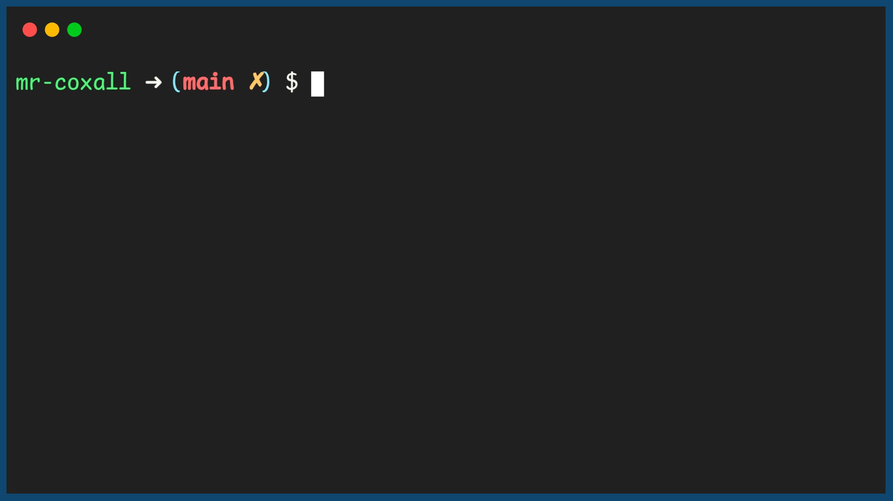

.. _return-values:

Return Values
=============

If this was math class, the definition of a `mathimatical function <https://en.wikipedia.org/wiki/Function_(mathematics)>`_ might be, "... a function is a relation between sets that associates to every element of a first set exactly one element of the second set.", which is a fancy way to say that if you put in a particular number into the function you get one and only one number out and it will always be the same value. The key is that you actually get something back. In computer science it is also common for functions to give you something back and we normally call this a `return value or statement <https://en.wikipedia.org/wiki/Return_statement>`_.

We have already seen many built in functions that have a return value, like the square root function:

.. tabs::

  .. group-tab:: C

    .. code-block:: C

		// square root function
		someVariable = sqrt(someNumber);

    .. code-block:: C++

		// square root function
		someVariable = sqrt(someNumber);

    .. code-block:: C#

		// square root function
		someVariable = sqrt(someNumber);

  .. group-tab:: Go

    .. code-block:: Go

      // square root function

  .. group-tab:: Java

    .. code-block:: Java

      // square root function

  .. group-tab:: JavaScript

    .. code-block:: JavaScript

      // square root function

  .. group-tab:: Python

    .. code-block:: Python

		# square root function
		some_variable = math.sqrt(some_number)

You will notice that the function is now on the right hand side of an assignment statement and the calculated value is being placed right into another variable. To allow this ability, we normally use the reserved word "return" to pass the value back. In many programming languages, in the definition of the function you must specify what type of variable will be returned. This way the IDE can confirm that the same types are being passe back and placed into variable of the same type. This way the language remains type safe.

.. tabs::

  .. group-tab:: C
    .. code-block:: C
      .. literalinclude:: ../../code_examples/4-Functions/3-Return_Values/C/main.c
        :language: C
        :lines: 9

  .. group-tab:: C++
    .. code-block:: C++
      .. literalinclude:: ../../code_examples/4-Functions/3-Return_Values/CPP/main.cpp
        :language: C++
        :lines: 10

  .. group-tab:: C#
    .. code-block:: C#
      .. literalinclude:: ../../code_examples/4-Functions/3-Return_Values/CSharp/main.cs
        :language: C#
        :lines: 13

  .. group-tab:: Go
    .. code-block:: Go
      .. literalinclude:: ../../code_examples/4-Functions/3-Return_Values/Go/main.go
        :language: go
        :lines: 13

  .. group-tab:: Java
    .. code-block:: Java
      .. literalinclude:: ../../code_examples/4-Functions/3-Return_Values/Java/Main.java
        :language: java
        :lines: 17

  .. group-tab:: JavaScript
    .. code-block:: JavaScript
      .. literalinclude:: ../../code_examples/4-Functions/3-Return_Values/JavaScript/main.js
        :language: javascript
        :lines: 9

  .. group-tab:: Python
    .. code-block:: Python
      .. literalinclude:: ../../code_examples/4-Functions/3-Return_Values/Python/main.py
        :language: python
        :lines: 9-16

Now that we know how to use a return statement, we should no longer print out results inside a function like in the last few chapters. It is much better style to retrun the value from a funstion and let the calling process decide what to do with it. Here is the example from last section, this time using return values:

.. tabs::

  .. group-tab:: C
    .. code-block:: C
      .. literalinclude:: ../../code_examples/4-Functions/3-Return_Values/C/main.c
        :language: C
        :linenos:
        :emphasize-lines: 9, 19, 40-41

  .. group-tab:: C++
    .. code-block:: C++
      .. literalinclude:: ../../code_examples/4-Functions/3-Return_Values/CPP/main.cpp
        :language: C++
        :linenos:
        :emphasize-lines: 10, 20, 41-42

  .. group-tab:: C#
    .. code-block:: C#
      .. literalinclude:: ../../code_examples/4-Functions/3-Return_Values/CSharp/main.cs
        :language: C#
        :linenos:
        :emphasize-lines: 13, 23, 42-43

  .. group-tab:: Go
    .. code-block:: Go
      .. literalinclude:: ../../code_examples/4-Functions/3-Return_Values/Go/main.go
        :language: go
        :linenos:
        :emphasize-lines: 13, 23, 42-43

  .. group-tab:: Java
    .. code-block:: Java
      .. literalinclude:: ../../code_examples/4-Functions/3-Return_Values/Java/Main.java
        :language: java
        :linenos:
        :emphasize-lines: 17, 30, 60-61

  .. group-tab:: JavaScript
    .. code-block:: JavaScript
      .. literalinclude:: ../../code_examples/4-Functions/3-Return_Values/JavaScript/main.js
        :language: javascript
        :linenos:
        :emphasize-lines: 9, 19, 35-36

  .. group-tab:: Python
    .. code-block:: Python
      .. literalinclude:: ../../code_examples/4-Functions/3-Return_Values/Python/main.py
        :language: python
        :linenos:
        :emphasize-lines: 9-16, 19-36, 38-39

Example Output
^^^^^^^^^^^^^^

