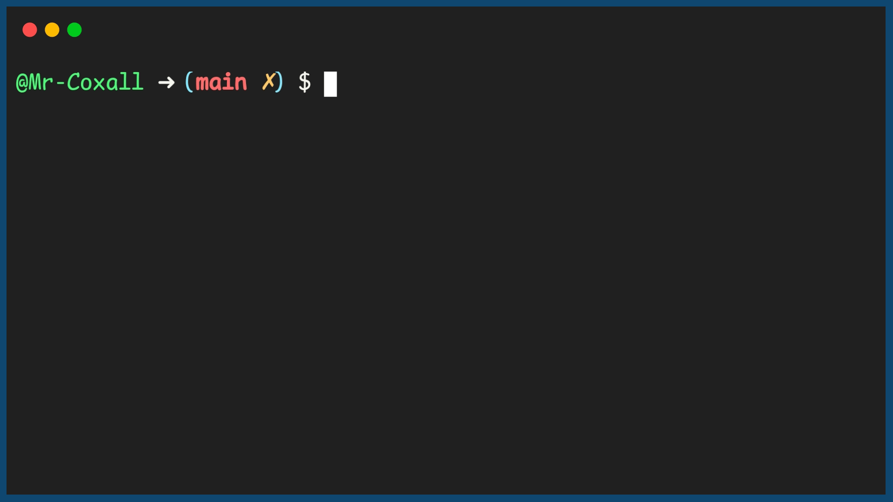

.. _understanding-functions:

Understanding Functions
=======================

A `Subroutine <https://en.wikipedia.org/wiki/Subroutine>`_ or what we will just refer to as a function is a block of code written to perform a specific task. We have actually been using functions all along our programming journey so far and you probably have not even notices. Many functions are built into most programming languages, like the print() function for example. In python we usually placing our code in main(), which is a function. In C, C++ or Java the compiler looks for the main() function to start running its program. You can also create functions to do specific calculations, like converting temperature from Celsius to Fahrenheit for example. This type of conversion is very common and we might want to use it in another program (re-usability is very important in programming; why re-invent the wheel, just use someone else's code, as long as you can trust that it will work!).

Functions need to have two (2) seperate mechanisms to work correctly. You need a way to create the function in your program and you also need a way to then "call" the function and get the code inside of it to run. Although not normally needed for the computer, we usually place the function definition before we call the function, so that when people are actually reading the code they have seen the function definition and know what it will do *before* they see it being called.

This is a good template for keeping all the parts of your program organized in a program file:

1. comment header
2. global (to the file) constant(s)
3. global (to the file) variable(s)
4. function(s)
5. main body of code

Creating and Calling a  Function
--------------------------------

Each programming language has its own syntax to create and call a function. Here is an example program that uses functions to calculate area and perimeter (I know there are many ways to improve this code, we will be doing that in the next sections)

Code for While loop
^^^^^^^^^^^^^^^^^^^
.. tabs::

  .. group-tab:: C
    .. code-block:: C
      .. literalinclude:: ../../code_examples/4-Functions/1-Understanding_Functions/C/main.c
        :language: C
        :linenos:
        :emphasize-lines: 9-24, 26-41, 45-46

  .. group-tab:: C++
    .. code-block:: C++
      .. literalinclude:: ../../code_examples/4-Functions/1-Understanding_Functions/CPP/main.cpp
        :language: C++
        :linenos:
        :emphasize-lines: 9-23, 25-39, 43-44

  .. group-tab:: C#
    .. code-block:: C#
      .. literalinclude:: ../../code_examples/4-Functions/1-Understanding_Functions/CSharp/main.cs
        :language: C#
        :linenos:
        :emphasize-lines: 13-25, 27-39, 43-44

  .. group-tab:: Go
    .. code-block:: Go
      .. literalinclude:: ../../code_examples/4-Functions/1-Understanding_Functions/Go/main.go
        :language: go
        :linenos:
        :emphasize-lines: 13-26, 28-41, 45-46

  .. group-tab:: Java
    .. code-block:: Java
      .. literalinclude:: ../../code_examples/4-Functions/1-Understanding_Functions/Java/Main.java
        :language: java
        :linenos:
        :emphasize-lines: 12-30, 32-50, 66-67

  .. group-tab:: JavaScript
    .. code-block:: JavaScript
      .. literalinclude:: ../../code_examples/4-Functions/1-Understanding_Functions/JavaScript/main.js
        :language: javascript
        :linenos:
        :emphasize-lines: 9-19, 21-31, 34-35

  .. group-tab:: Python
    .. code-block:: Python
      .. literalinclude:: ../../code_examples/4-Functions/1-Understanding_Functions/Python/main.py
        :language: python
        :linenos:
        :emphasize-lines: 9-21, 24-36, 43-44

Example Output
^^^^^^^^^^^^^^

