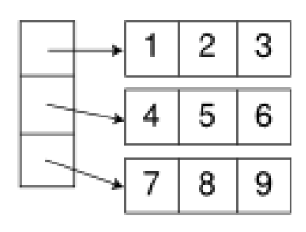
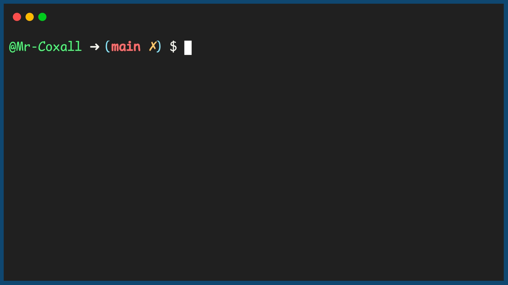

.. _2d-arrays:

2D Arrays
=========

All the arrays that we have used thus far have been to represent a collection of information. This is a very powerful tool and can save the programmer a lot of time and confusion when dealing with items that are somehow related to each other. Not all things can be represented with a single collection though. Several times we use a grid or `spreadsheet <https://en.wikipedia.org/wiki/Spreadsheet>`_ to keep information in rows and columns. This `matrix <https://en.wikipedia.org/wiki/Matrix_(math)>`_ of information can not be represented in a single array. In these situations we represent our data with a 2-dimensional (or `multi-dimensional array <https://en.wikipedia.org/wiki/Index_notation#Multi-dimensional_arrays>`_ ). 

A 2-D array can just be thought of an array of arrays.

We represent a given element with 2 indices now, instead of 1 when we
had a single dimension. Unlike in math class where you used the
`Cartesian plane <https://en.wikipedia.org/wiki/Cartesian_coordinate_system>`_, and moved in the X direction and then the Y direction,

.. image:: ./images/Cartesian-coordinate-system.png
   :alt: Cartesian-coordinate-system
   :height: 250 px
   :align: center

in computer science you move up and down in the rows first and then across to the column position. Thus if we want to refer to the element in the above array that has a value of 8, we would say, studentMarks(2, 1).

There are many applications of 2-D arrays, like a game board (tic-tac-toe), adventure games and business applications like spreadsheets.

Code for Creating and using a 2D Array
^^^^^^^^^^^^^^^^^^^^^^^^^^^^^^^^^^^^^^
.. tabs::

  .. group-tab:: C
    .. code-block:: C
      .. literalinclude:: ../../code_examples/5-Holding_Data/1-Arrays/4-Array_2D/C/main.c
        :language: C
				:emphasize-lines: 11-26, 30-32, 41, 49

  .. group-tab:: C++
    .. code-block:: C++
      .. literalinclude:: ../../code_examples/5-Holding_Data/1-Arrays/4-Array_2D/CPP/main.cpp
        :language: C++
        :linenos:
        :emphasize-lines: 12-29, 33-35, 51, 58

  .. group-tab:: C#
    .. code-block:: C#
      .. literalinclude:: ../../code_examples/5-Holding_Data/1-Arrays/4-Array_2D/CSharp/main.cs
        :language: C#
        :linenos:
        :emphasize-lines: 13-24, 38

  .. group-tab:: Go
    .. code-block:: Go
      .. literalinclude:: ../../code_examples/5-Holding_Data/1-Arrays/4-Array_2D/Go/main.go
        :language: go
        :linenos:
        :emphasize-lines: 15-25, 40

  .. group-tab:: Java
    .. code-block:: Java
      .. literalinclude:: ../../code_examples/5-Holding_Data/1-Arrays/4-Array_2D/Java/Main.java
        :language: java
        :linenos:
        :emphasize-lines: 13-30, 57

  .. group-tab:: JavaScript
    .. code-block:: JavaScript
      .. literalinclude:: ../../code_examples/5-Holding_Data/1-Arrays/4-Array_2D/JavaScript/main.js
        :language: javascript
        :linenos:
        :emphasize-lines: 8-20, 36

  .. group-tab:: Python
    .. code-block:: Python
      .. literalinclude:: ../../code_examples/5-Holding_Data/1-Arrays/4-Array_2D/Python/main.py
        :language: python
        :linenos:
        :emphasize-lines: 13-23, 29, 36-43, 45

Example Output
^^^^^^^^^^^^^^

