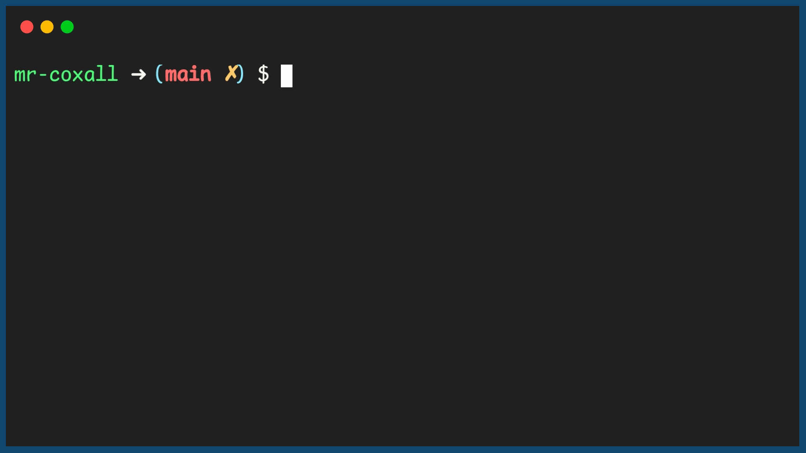

.. _array-as-a-parameter:

Array as a Parameter
====================

We know from the previous section that functions are a great way to ensure that your program is modular in its design. Any time a piece of code needs to be repeated more than once or twice, a function might want to be used. When we use functions, we passed variables by value (making a copy) or by reference (passing the pointer); so that the function can do some process on the data. We normally pass variables like integers, strings, and floats but we have seen that you can pass any object, like an image. Since an array is just a variable that happens to hold several values and not just one, it also can be passed to a function, either by value or by reference (depending what the language will allow.).

There is some disagreement in the computer world whether it is wise to pass arrays, especially large ones with many values in them, by value. This is because you are making a complete copy of the array and it could take up a large quantity of memory. Other programmers do not like the idea of passing by reference if you do not want the original array to change, because there is always the risk that you or someone that comes after you, will change the array by accident. They argue that modern computers have so much memory these days (as compared to the “old days”) that the risk of changing the original array is not worth the potential memory usage. We will continue to pass variables into parameters by value, unless there is a really good reason that you want to pass the object in by reference (or i the programming language only lets you pass it in my reference).

To pass an array into a function, you declare the array inside the name of your function, just like you have been doing for regular variable, but you **do not place** any brackets or a number inside brackets, like when you were declaring your array normally. This is because the function does not know exactly how many elements the array will have. If you had to set it to a fixed amount, your function would not be very flexible. When the array is passed into the function, it will determine how many elements it has and an appropriate array variable with that many elements will be created. 

To declare an array as a parameter in a function, it would look like this:

.. tabs::

  .. group-tab:: C
      .. literalinclude:: ../../code_examples/5-Holding_Data/1-Arrays/1-Array_as_a_Parameter/C/main.c
        :language: C
        :lines: 11-12

  .. group-tab:: C++
      .. literalinclude:: ../../code_examples/5-Holding_Data/1-Arrays/1-Array_as_a_Parameter/CPP/main.cpp
        :language: C++
        :lines: 12-15

  .. group-tab:: C#
      .. literalinclude:: ../../code_examples/5-Holding_Data/1-Arrays/1-Array_as_a_Parameter/CSharp/main.cs
        :language: C#
        :lines: 13-14

  .. group-tab:: Go
      .. literalinclude:: ../../code_examples/5-Holding_Data/1-Arrays/1-Array_as_a_Parameter/Go/main.go
        :language: go
        :lines: 15-16

  .. group-tab:: Java
      .. literalinclude:: ../../code_examples/5-Holding_Data/1-Arrays/1-Array_as_a_Parameter/Java/Main.java
        :language: java
        :lines: 18-21

  .. group-tab:: JavaScript
      .. literalinclude:: ../../code_examples/5-Holding_Data/1-Arrays/1-Array_as_a_Parameter/JavaScript/main.js
        :language: javascript
        :lines: 8-11

  .. group-tab:: Python
      .. literalinclude:: ../../code_examples/5-Holding_Data/1-Arrays/1-Array_as_a_Parameter/Python/main.py
        :language: python
        :lines: 13-14

To pass an array into this function as a parameter, it would look like this:

.. tabs::

  .. group-tab:: C
    .. code-block:: C
      .. literalinclude:: ../../code_examples/5-Holding_Data/1-Arrays/1-Array_as_a_Parameter/C/main.c
        :language: C
        :lines: 44

  .. group-tab:: C++
    .. code-block:: C++
      .. literalinclude:: ../../code_examples/5-Holding_Data/1-Arrays/1-Array_as_a_Parameter/CPP/main.cpp
        :language: C++
        :lines: 44

  .. group-tab:: C#
    .. code-block:: C#
      .. literalinclude:: ../../code_examples/5-Holding_Data/1-Arrays/1-Array_as_a_Parameter/CSharp/main.cs
        :language: C#
        :lines: 40

  .. group-tab:: Go
    .. code-block:: Go
      .. literalinclude:: ../../code_examples/5-Holding_Data/1-Arrays/1-Array_as_a_Parameter/Go/main.go
        :language: go
        :lines: 42

  .. group-tab:: Java
    .. code-block:: Java
      .. literalinclude:: ../../code_examples/5-Holding_Data/1-Arrays/1-Array_as_a_Parameter/Java/Main.java
        :language: java
        :lines: 59

  .. group-tab:: JavaScript
    .. code-block:: JavaScript
      .. literalinclude:: ../../code_examples/5-Holding_Data/1-Arrays/1-Array_as_a_Parameter/JavaScript/main.js
        :language: javascript
        :lines: 38

  .. group-tab:: Python
    .. code-block:: Python
      .. literalinclude:: ../../code_examples/5-Holding_Data/1-Arrays/1-Array_as_a_Parameter/Python/main.py
        :language: python
        :lines: 39

Here is a complete example of creating an array and passing it as a parameter to a function:

Code for Creating an Array
^^^^^^^^^^^^^^^^^^^^^^^^^^
.. tabs::

  .. group-tab:: C
    .. code-block:: C
      .. literalinclude:: ../../code_examples/5-Holding_Data/1-Arrays/1-Array_as_a_Parameter/C/main.c
        :language: C
        :linenos:
        :emphasize-lines: 11-24, 42-44

  .. group-tab:: C++
    .. code-block:: C++
      .. literalinclude:: ../../code_examples/5-Holding_Data/1-Arrays/1-Array_as_a_Parameter/CPP/main.cpp
        :language: C++
        :linenos:
        :emphasize-lines: 12-27, 44

  .. group-tab:: C#
    .. code-block:: C#
      .. literalinclude:: ../../code_examples/5-Holding_Data/1-Arrays/1-Array_as_a_Parameter/CSharp/main.cs
        :language: C#
        :linenos:
        :emphasize-lines: 13-26, 40

  .. group-tab:: Go
    .. code-block:: Go
      .. literalinclude:: ../../code_examples/5-Holding_Data/1-Arrays/1-Array_as_a_Parameter/Go/main.go
        :language: go
        :linenos:
        :emphasize-lines: 15-27, 42

  .. group-tab:: Java
    .. code-block:: Java
      .. literalinclude:: ../../code_examples/5-Holding_Data/1-Arrays/1-Array_as_a_Parameter/Java/Main.java
        :language: java
        :linenos:
        :emphasize-lines: 18-32, 59

  .. group-tab:: JavaScript
    .. code-block:: JavaScript
      .. literalinclude:: ../../code_examples/5-Holding_Data/1-Arrays/1-Array_as_a_Parameter/JavaScript/main.js
        :language: javascript
        :linenos:
        :emphasize-lines: 8-22, 38

  .. group-tab:: Python
    .. code-block:: Python
      .. literalinclude:: ../../code_examples/5-Holding_Data/1-Arrays/1-Array_as_a_Parameter/Python/main.py
        :language: python
        :linenos:
        :emphasize-lines: 13-22, 39

Example Output
^^^^^^^^^^^^^^

