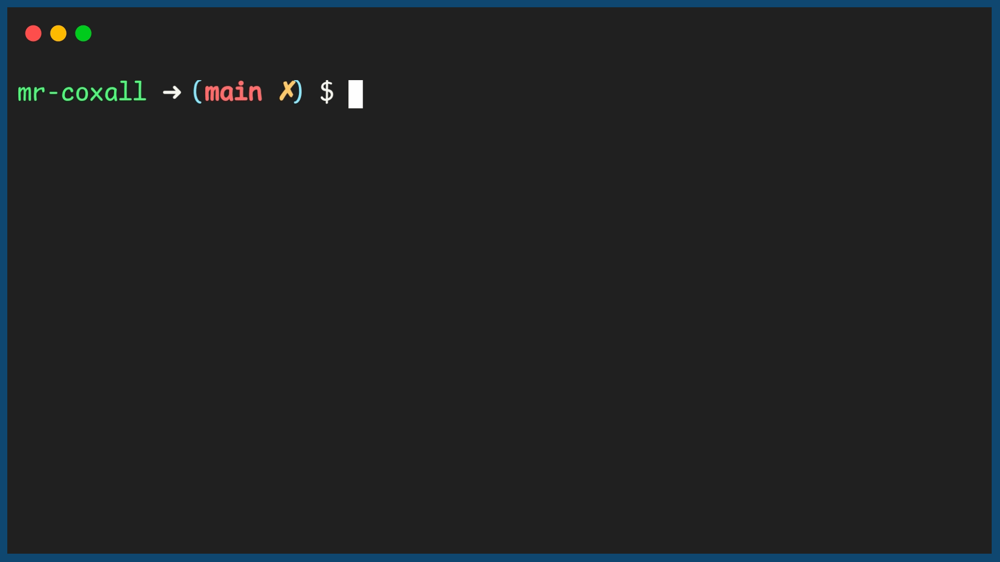

.. _arrays-and-for-each:

Arrays and For ... Each Loops
=============================

If you think way back to when we did different types of looping structures, one of the methods to loop was using the For loop. The purpose of the for each loop was that the loop would manage counting for us. It turnes out that since an array is a collection of variables held in a common structure, you can use a for loop with it. This type of loop, usually called a For ... Each loop, is used when you have a collection of things and you wanted to iterate through each one of them, one at a time. Since an array is a collection of variables, the For ... Each loop takes one element out of the array at a time and lets you do something with it. The loop will continue until it has gone through all the elements in the array.

From the previous example of summing up all the values in an array, a For Each loop would look like the following:

Code for Creating an Array
^^^^^^^^^^^^^^^^^^^^^^^^^^
.. tabs::

  .. group-tab:: C
    .. code-block:: C
      .. literalinclude:: ../../code_examples/5-Holding_Data/1-Arrays/3-Arrays_and_For_Each/C/main.c
        :language: C

  .. group-tab:: C++
    .. code-block:: C++
      .. literalinclude:: ../../code_examples/5-Holding_Data/1-Arrays/3-Arrays_and_For_Each/CPP/main.cpp
        :language: C++
        :linenos:
        :emphasize-lines: 12-26, 43

  .. group-tab:: C#
    .. code-block:: C#
      .. literalinclude:: ../../code_examples/5-Holding_Data/1-Arrays/3-Arrays_and_For_Each/CSharp/main.cs
        :language: C#
        :linenos:
        :emphasize-lines: 13-23, 37

  .. group-tab:: Go
    .. code-block:: Go
      .. literalinclude:: ../../code_examples/5-Holding_Data/1-Arrays/3-Arrays_and_For_Each/Go/main.go
        :language: go
        :linenos:
        :emphasize-lines: 15-24, 39

  .. group-tab:: Java
    .. code-block:: Java
      .. literalinclude:: ../../code_examples/5-Holding_Data/1-Arrays/3-Arrays_and_For_Each/Java/Main.java
        :language: java
        :linenos:
        :emphasize-lines: 18-24, 54

  .. group-tab:: JavaScript
    .. code-block:: JavaScript
      .. literalinclude:: ../../code_examples/5-Holding_Data/1-Arrays/3-Arrays_and_For_Each/JavaScript/main.js
        :language: javascript
        :linenos:
        :emphasize-lines: 8-17, 33

  .. group-tab:: Python
    .. code-block:: Python
      .. literalinclude:: ../../code_examples/5-Holding_Data/1-Arrays/3-Arrays_and_For_Each/Python/main.py
        :language: python
        :linenos:
        :emphasize-lines: 13-22, 39

Example Output
^^^^^^^^^^^^^^

.. tabs::

  .. group-tab:: C++

    .. code-block:: C++

		template<size_t N>
		int SumOfNumbers(std::array<int, N> listOfNumbers) {
		    // this function adds up all the numbers in a list

		    int total = 0;
		    
		    // add up each element in an array, listOfNumbers
		    for (int aSingleElement : listOfNumbers){
		        total += aSingleElement;
		    }

		    return total;
		}

  .. group-tab:: Go

    .. code-block:: Go

      // declare an array as a parameter in a function

  .. group-tab:: Java

    .. code-block:: Java

      // declare an array as a parameter in a function

  .. group-tab:: JavaScript

    .. code-block:: JavaScript

      // declare an array as a parameter in a function

  .. group-tab:: Python3

    .. code-block:: Python

		def sum_of_numbers(list_of_numbers):
		    # this functions uses a for ... in loop

		    total = 0
		    
		    for a_single_number in list_of_numbers:
		        total += a_single_number

		    return total

  .. group-tab:: Ruby

    .. code-block:: Ruby

      // declare an array as a parameter in a function

  .. group-tab:: Swift

    .. code-block:: Swift

      // declare an array as a parameter in a function
