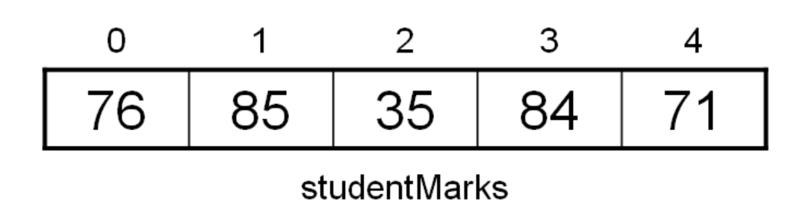

.. _arrays:

Arrays
======

An `array <https://en.wikipedia.org/wiki/Array_data_structure>`_ stores many pieces of data but in the same variable. For example I could save the marks for 5 students in an array like:

This array has 5 elements (note that you usually start counting at 0 with arrays!) but they all have just one variable name (studentMarks). To refer to a specific mark you place the index of the mark after the variable name, usually in brackets. For example, you would refer to the mark of 84 as:

.. tabs::

  .. group-tab:: C++

    .. code-block:: C++

      // array

  .. group-tab:: Go

    .. code-block:: Go

      // array

  .. group-tab:: Java

    .. code-block:: Java

      // array

  .. group-tab:: JavaScript

    .. code-block:: JavaScript

      // array

  .. group-tab:: Python3

    .. code-block:: Python

      #array

  .. group-tab:: Ruby

    .. code-block:: Ruby

      // array

  .. group-tab:: Swift

    .. code-block:: Swift

      // array

Arrays are an important programming concept because they allow a collection of related objects to be stored within a single variable. To declare an array, you usually must specify how many elements will be in the array during the declaration.

.. tabs::

  .. group-tab:: C++

    .. code-block:: C++

      // array

  .. group-tab:: Go

    .. code-block:: Go

      // array

  .. group-tab:: Java

    .. code-block:: Java

      // array

  .. group-tab:: JavaScript

    .. code-block:: JavaScript

      // array

  .. group-tab:: Python3

    .. code-block:: Python

      #array

  .. group-tab:: Ruby

    .. code-block:: Ruby

      // array

  .. group-tab:: Swift

    .. code-block:: Swift

      // array

This will create our student mark array and ensure 5 student marks can be held. We often use a loop to either place infomation in an array or to get the infomation out of an array, since we need to do the same process for each element in the array. Here is an example:

.. tabs::

  .. group-tab:: C++

    .. code-block:: C++

      // array

  .. group-tab:: Go

    .. code-block:: Go

      // array

  .. group-tab:: Java

    .. code-block:: Java

      // array

  .. group-tab:: JavaScript

    .. code-block:: JavaScript

      // array

  .. group-tab:: Python3

    .. code-block:: Python

      #array

  .. group-tab:: Ruby

    .. code-block:: Ruby

      // array

  .. group-tab:: Swift

    .. code-block:: Swift

      // array

.. toctree::
   :maxdepth: 1
   :glob:

   Pass an Array as a Parameter <array-as-a-parameter>
   Pass an Array as a Return Values <array-as-a-return-value>
   Arrays with For ... Each Loops <arrays-and-for-each>
   2D Arrays <2d-arrays>