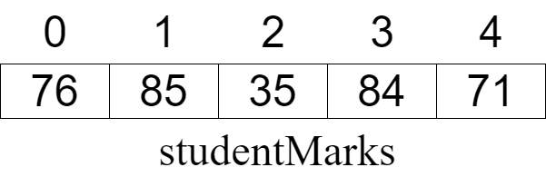

.. _arrays:

Arrays
======

An `array <https://en.wikipedia.org/wiki/Array_data_structure>`_ stores many pieces of data but in the same variable. For example I could save the marks for 5 students in an array like:

This array has 5 `elements <https://en.wikipedia.org/wiki/Element_(mathematics)>`_ (note that you usually start counting at 0 with arrays!) but they all have just one variable name (studentMarks). To refer to a specific mark you place the `index <https://en.wikipedia.org/wiki/Array_data_structure#Element_identifier_and_addressing_formulas>`_ of the mark after the variable name, usually in brackets. For example, you would refer to the mark of 84 as:

.. tabs::

  .. group-tab:: C

    .. code-block:: C++

      // array index
      studentMarks[3]

  .. group-tab:: C++

    .. code-block:: C++

      // array index
      studentMarks[3]

  .. group-tab:: C#

    .. code-block:: C#

      // array index
      studentMarks[3]

  .. group-tab:: Go

    .. code-block:: Go

      // array index
      studentMarks[3]

  .. group-tab:: Java

    .. code-block:: Java

      // array index
      studentMarks[3]

  .. group-tab:: JavaScript

    .. code-block:: JavaScript

      // array index
      studentMarks[3]

  .. group-tab:: Python

    .. code-block:: Python

      # array (or list) index
      studentMarks[3]

Arrays are an important programming concept because they allow a collection of related objects to be stored within a single variable. To declare an array, you usually must specify how many elements will be in the array during the declaration. This is because the compiler needs to reseve the required memory inside the the computer to stare all these variables. (There are ways to store groups of data where the size will change during the running of the program and we will get to them.)Here we are declaring the variable studentMarks and allowing 5 items in it:

Code for Creating an Array
^^^^^^^^^^^^^^^^^^^^^^^^^^
.. tabs::

  .. group-tab:: C
    .. code-block:: C
      .. literalinclude:: ../../code_examples/5-Holding_Data/1-Arrays/C/main.c
        :language: C
        :linenos:
        :emphasize-lines: 12, 16-20, 28-30

  .. group-tab:: C++
    .. code-block:: C++
      .. literalinclude:: ../../code_examples/5-Holding_Data/1-Arrays/CPP/main.cpp
        :language: C++
        :linenos:
        :emphasize-lines: 13, 17-21, 29-31

  .. group-tab:: C#
    .. code-block:: C#
      .. literalinclude:: ../../code_examples/5-Holding_Data/1-Arrays/CSharp/main.cs
        :language: C#
        :linenos:
        :emphasize-lines: 1

  .. group-tab:: Go
    .. code-block:: Go
      .. literalinclude:: ../../code_examples/5-Holding_Data/1-Arrays/Go/main.go
        :language: go
        :linenos:
        :emphasize-lines: 1

  .. group-tab:: Java
    .. code-block:: Java
      .. literalinclude:: ../../code_examples/5-Holding_Data/1-Arrays/Java/Main.java
        :language: java
        :linenos:
        :emphasize-lines: 1

  .. group-tab:: JavaScript
    .. code-block:: JavaScript
      .. literalinclude:: ../../code_examples/5-Holding_Data/1-Arrays/JavaScript/main.js
        :language: javascript
        :linenos:
        :emphasize-lines: 1

  .. group-tab:: Python
    .. code-block:: Python
      .. literalinclude:: ../../code_examples/5-Holding_Data/1-Arrays/Python/main.py
        :language: python
        :linenos:
        :emphasize-lines: 12, 15-17, 22-23

Example Output
^^^^^^^^^^^^^^
.. image:: ../../code_examples/5-Holding_Data/1-Arrays/vhs.gif
   :alt: Code example output
   :align: left

.. toctree::
   :maxdepth: 1
   :glob:

   Pass an Array as a Parameter <array-as-a-parameter>
   Pass an Array as a Return Values <array-as-a-return-value>
   Arrays with For ... Each Loops <arrays-and-for-each>
   2D Arrays <2d-arrays>