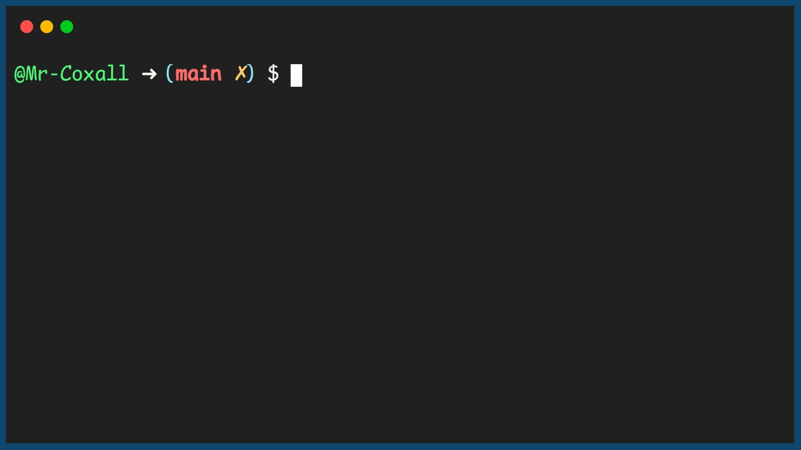

.. _associative_array:

Associative Array
=================

An `associative array <https://en.wikipedia.org/wiki/Associative_array>`_, dictionary, map, or symbol table all refer to the same thing, usually, in computer science. It is an abstract data type composed of a collection of key and value pairs, such that each possible key appears at most once in the collection. The key and value can usually be of almost any type, although usually the key is represented by a string. (If it was an integer, then you would just have an array!). The data type usually comes with operators like, the addition of a pair to the collection, the removal of a pair from the collection, the modification of an existing pair, the lookup of a value associated with a particular key.

You can think of associative arrays like a list of phone numbers. In this list, you can look up a person's name by finding their phone number. The name is the value and the number is the key. This list would look like the following table:

+----------------+--------------+
| Phone Number   | Name         |
+================+==============+
| 1-203-456-4657 | John Doe     |
+----------------+--------------+
| 1-964-725-5617 | Jane Smith   |
+----------------+--------------+
| 1-275-486-8562 | Daniel Brown |
+----------------+--------------+
| 1-347-374-3412 | John Doe     |
+----------------+--------------+

Associative arrays have two important properties. Every key can only appear once, just like every phone number can only appear once in a directory. And, every key can only have one value, just like every phone number can only refer to one person. It is possible that two people can have the same name in this list, so it's important to remember that a given value can appear more than once in an associative array.

Code for Creating an Associative Array
^^^^^^^^^^^^^^^^^^^^^^^^^^^^^^^^^^^^^^
.. tabs::

  .. group-tab:: C
    .. code-block:: C
      .. literalinclude:: ../../code_examples/5-Holding_Data/4-Associative_Array/C/main.c
        :language: C

  .. group-tab:: C++
    .. code-block:: C++
      .. literalinclude:: ../../code_examples/5-Holding_Data/4-Associative_Array/CPP/main.cpp
        :language: C++
        :linenos:
        :emphasize-lines: 8, 14-15, 18-22, 24-28, 31-33, 40-44

  .. group-tab:: C#
    .. code-block:: C#
      .. literalinclude:: ../../code_examples/5-Holding_Data/4-Associative_Array/CSharp/main.cs
        :language: C#
        :linenos:
        :emphasize-lines: 7, 15, 20-24, 26, 30-33

  .. group-tab:: Go
    .. code-block:: Go
      .. literalinclude:: ../../code_examples/5-Holding_Data/4-Associative_Array/Go/main.go
        :language: go
        :linenos:
        :emphasize-lines: 10, 16, 21-25, 27, 31-33

  .. group-tab:: Java
    .. code-block:: Java
      .. literalinclude:: ../../code_examples/5-Holding_Data/4-Associative_Array/Java/Main.java
        :language: java
        :linenos:
        :emphasize-lines: 10-11, 16, 22-26, 28, 32-34

  .. group-tab:: JavaScript
    .. code-block:: JavaScript
      .. literalinclude:: ../../code_examples/5-Holding_Data/4-Associative_Array/JavaScript/main.js
        :language: javascript
        :linenos:
        :emphasize-lines: 9, 14-17, 19, 23-25

  .. group-tab:: Python
    .. code-block:: Python
      .. literalinclude:: ../../code_examples/5-Holding_Data/4-Associative_Array/Python/main.py
        :language: python
        :linenos:
        :emphasize-lines: 12-15, 17-21, 26-27, 31-34

Example Output
^^^^^^^^^^^^^^

