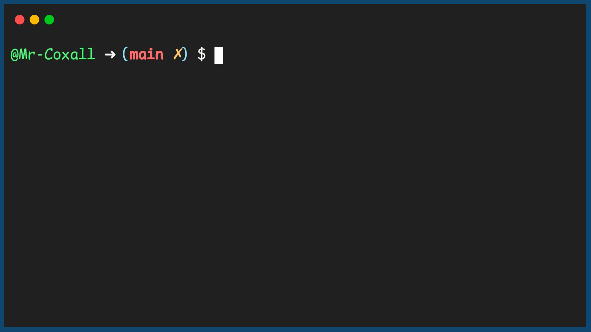

.. _lists:

Lists
=====

Since in many programming languages, when you create an array the size must be set during coding so that the memory can be allocated when it is compiled, there is no way to dynamically change the size of an array during run time. This can be a huge disadvantage. One great example of wanting to have dynamic arrays is the classic video game, Space Invaders. If you imagine that all the lazer you shoot are held in an array, then how big should the array be? You have no idea how fast the user can press the "A" button. You can not tell how many lazers might be on the screen at any given time! If you cannot change the size of the array, what can we do, just making a "huge" array is wasteful and not really practical. Fortunately in many programming languages there is a data structure called a `List <https://en.wikipedia.org/wiki/List_(abstract_data_type)>`_.

A list is similar to an array in that it is an ordered grouping of data. You still reference the items in the list using an index. The key difference is that the size of the list can shrink and grow, during run time as needed. As you need to add items, you just use an “Add” (or something similar like append). To remove an item you use "Remove" (or something similar like pop). The list usually has many useful methods for adding, sorting, clearing, finding the length an so on.

Here is an example of creating a list of items:

Code for Creating a List
^^^^^^^^^^^^^^^^^^^^^^^^
.. tabs::

  .. group-tab:: C
    .. code-block:: C
      .. literalinclude:: ../../code_examples/5-Holding_Data/2-Lists/C/main.c
        :language: C
        :linenos:
        :emphasize-lines: 12, 16, 19-23, 27-29

  .. group-tab:: C++
    .. code-block:: C++
      .. literalinclude:: ../../code_examples/5-Holding_Data/2-Lists/CPP/main.cpp
        :language: C++
        :linenos:
        :emphasize-lines: 13, 17, 20-24, 28-30

  .. group-tab:: C#
    .. code-block:: C#
      .. literalinclude:: ../../code_examples/5-Holding_Data/2-Lists/CSharp/main.cs
        :language: C#
        :linenos:
        :emphasize-lines: 14, 18, 21-25, 30-32

  .. group-tab:: Go
    .. code-block:: Go
      .. literalinclude:: ../../code_examples/5-Holding_Data/2-Lists/Go/main.go
        :language: go
        :linenos:
        :emphasize-lines: 16, 19, 22-26, 32-34

  .. group-tab:: Java
    .. code-block:: Java
      .. literalinclude:: ../../code_examples/5-Holding_Data/2-Lists/Java/Main.java
        :language: java
        :linenos:
        :emphasize-lines: 16, 20, 24-28, 32-34

  .. group-tab:: JavaScript
    .. code-block:: JavaScript
      .. literalinclude:: ../../code_examples/5-Holding_Data/2-Lists/JavaScript/main.js
        :language: javascript
        :linenos:
        :emphasize-lines: 8, 12, 15-18, 23-25

  .. group-tab:: Python
    .. code-block:: Python
      .. literalinclude:: ../../code_examples/5-Holding_Data/2-Lists/Python/main.py
        :language: python
        :linenos:
        :emphasize-lines: 13, 19-21, 27-28

Example Output
^^^^^^^^^^^^^^

.. tabs::

  .. group-tab:: C++

    .. code-block:: C++

		// Copyright (c) 2019 St. Mother Teresa HS All rights reserved.
		//
		// Created by: Mr. Coxall
		// Created on: Dec 2019
		// This program program uses a list

		#include <iostream>
		#include <list>

		main() {
		    // this function uses a list

		    std::list<std::string> words;
		    std::string tempWord = "";
		    std::list<std::string> reversedWords;

		    // input
		    std::cout << "Please enter 1 word at a time. Enter STOP to end.";
		    std::cout << std::endl;

		    std::cout << "Enter a word: ";
		    std::cin >> tempWord;
		    words.push_back(tempWord);
		    
		    while (tempWord != "STOP") {
		        std::cout << "Enter a word: ";
		        std::cin >> tempWord;
		        words.push_back(tempWord);
		    }
		        
		    words.pop_back(); // remove the "Stop" that was added
		    std::cout << "" << std::endl;
		    
		    //reversed words
		    for (std::string tempWord2 : words) {
		        reversedWords.push_front(tempWord2);
		    }
		    
		    std::cout << "Here are the words reversed." << std::endl;
		    for (std::string tempWord3 : reversedWords) {
		        std::cout << tempWord3 << " ";
		    }
		    std::cout << std::endl;
		}

  .. group-tab:: Go

    .. code-block:: Go

      // using a list

  .. group-tab:: Java

    .. code-block:: Java

      // using a list

  .. group-tab:: JavaScript

    .. code-block:: JavaScript

      // using a list

  .. group-tab:: Python3

    .. code-block:: Python

		#!/usr/bin/env python3

		# Created by: Mr. Coxall
		# Created on: Dec 2019
		# This program uses a list

		def main():
		    # this function uses a list
		    
		    words = []
		    temp_word = None
		    
		    # input
		    print("Please enter 1 word at a time. Enter STOP to end.")
		    
		    temp_word = input("Enter a word: ")
		    words.append(temp_word)
		    while temp_word.upper() != "STOP":
		        temp_word = input("Enter a word: ")
		        words.append(temp_word)
		        
		    words.pop() # remove the "Stop" that was added
		    print("")
		    
		    print("Here are the words reversed.")
		    for counter in range(0, len(words)):
		        print(words.pop())

		if __name__ == "__main__":
		    main()

  .. group-tab:: Ruby

    .. code-block:: Ruby

      // using a list

  .. group-tab:: Swift

    .. code-block:: Swift

      // using a list