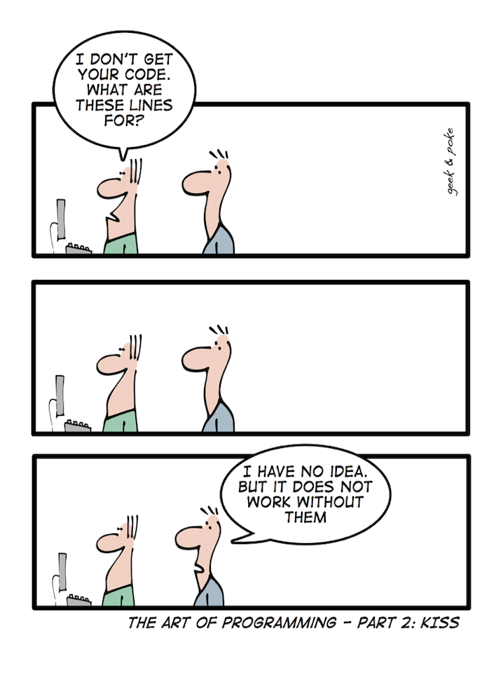

.. _introduction:

************
Introduction
************

Problems have been around for as long as people have been around. The process of solving a problem is not something new. Using a computer to aid in solving a problem is new. Modern electronic computers have only been around since the Second World War (1939-1945), which might seem like a long time ago to you but in the history of the human race it is a very short time. The purpose of this book is to help you learn to structure your problem solving method, so that you can consistently develop a verifiable solution that will solve a problem and in the process, use the computer to help you more easily and quickly solve that problem.

.. toctree::
   :maxdepth: 1
   :glob:

   What is programming <what-is-programming>
   Goal of this book <goal-of-this-book>
