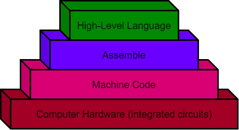

.. _what-is-programming:

What is programming
===================

Before you can actually start to write programs on a computer to help you solve problems, it would be nice to know what programming really is! We all use and see computers every day and hear people say how smart computers are. Actually, computers are not very smart at all! A computer, broken down into its most basic form is nothing more than a bunch of tiny electronic switches, called `transistors <https://en.wikipedia.org/wiki/Transistors>`_, that can be set to either a 1 or 0 (on or off, also known as `binary <https://en.wikipedia.org/wiki/Binary_number>`_). By getting the computer to set these tiny switches on or off in a certain pattern, you can get the computer to actually do something useful, like show a picture on the screen that you have taken. The computer does not know how to do this by itself though.

To communicate with your friends, one way for them to understand what you mean is for you to talk to them. To keep things simple, you both usually talk in the same language. Since a computer is just a bunch of switches, it does not understand English, so you have to talk to it in a language that it does understand. Computers use a language called `machine language <https://en.wikipedia.org/wiki/Machine_code>`_, made up of just the 1’s and 0’s mentioned above. Trying to talk in machine language is quiet difficult, easy to make mistakes in and tedious. To help people talk to a computer a `high-level programming language <https://en.wikipedia.org/wiki/High-level_programming_language>`_ is normally used, that is then translated into machine language so that the computer can understand what to do. This high-level language comes in many different variations and is normally just called a `programming language <https://en.wikipedia.org/wiki/Programming_language>`_ and you have probably already heard of some of them (Java, C++, Python, …). Just like there are many different languages that people speak around the world (English, French, Spanish, …), there have been many different programming languages developed to help people instruct computers in what to do. The purpose of a programming language is to make it easier for a human to tell a computer what to do, by not having to talk machine language.

A person that uses a programming language to instruct a computer what to do is called a `programmer <https://en.wikipedia.org/wiki/Programmer>`_. The programmer solves whatever problem they are working on, then writes the instructions that the computer is to follow in the programming language that they have chosen. Then the computer translates the instructions into machine language (the language that the computer actually understands) and the computer performs these actions.