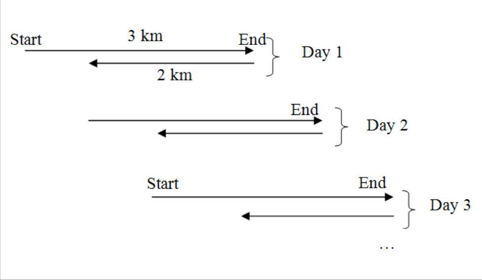

.. _example-problems:

Example Problems
================

Here are some examples of problems and a possible solution using the six step method. Note that these problems are not necessarily problems that you would use a computer to help you solve. This is an important thing to remember, not all problems should be solved with a computer. Although this book is about solving problems using a computer, there are many problems that are better solved not using a computer and that is perfectly ok. Sometimes your job as a programmer might be to identify that you should not be solving the problem on a computer. Latter on these six steps will be translated into six step used to solve problems that a computer program will be used to help solve.

1. Folding Paper
----------------

**How small can a piece of paper be made?**  

1. What is the problem?
^^^^^^^^^^^^^^^^^^^^^^^
The wording in this problem is a little vague and could be confusing. What is meant by “made”? Is it cutting, burning or shredding? You should go back to the source of the question to find out. You might find out that the real question is, “How many times can a piece of paper be folded?”

2. Make a model.
^^^^^^^^^^^^^^^^
For this problem our model will just be our actual physical piece of paper. It is not always possible to make a model using that “real” item. What would happen if the question was to fold paper made of gold, can you afford gold leaf paper? You might have to use a suitable substitute.

3. Analyze the model.
^^^^^^^^^^^^^^^^^^^^^
You should check to make sure that your model will be correct. What is your size of paper? Would that not make a difference in how many times you can fold it? Maybe not? Once again you might have to go back to the source of the question and get more information. Maybe the real question is, “How many times can a piece of 8½"x 11" paper be folded?”

4. Find the solution.
^^^^^^^^^^^^^^^^^^^^^
In this case to find the solution we will take our piece of 8½"x 11" piece of paper and keep folding it until we cannot longer do it. Should we try more than once?

5. Check the solution.
^^^^^^^^^^^^^^^^^^^^^^
It is always important to check your solution to see if it can be reproduced with accuracy. Maybe you could get someone else to fold a piece of paper and see how many times they can do it. Is it different from your answer? Maybe they have some special technique?

6. Document the solution.
^^^^^^^^^^^^^^^^^^^^^^^^^
Now that you have proven that a piece of 8½" x 11" can only be folded X number of times (where X is your answer), the next step is to document the solution so that other people can benefit from your analysis and can reproduce your experiment.

So what did you get as your answer? When you got someone else to do the experiment, did they get a higher number than you? Here are a few web
links to also look at:

* `Folding paper to the moon <https://scienceblogs.com/startswithabang/2009/08/31/paper-folding-to-the-moon>`_
*  `Can you really only fold a piece of paper 7 times <https://www.scienceabc.com/eyeopeners/can-you-really-fold-a-piece-of-paper-only-7-times.html>`_

2. The Salmon Swimming
----------------------

**A salmon swims 3 km upstream and the current brings her back 2 km each day. How long does it take her to swim 100 km?**

1) What is the problem?
^^^^^^^^^^^^^^^^^^^^^^^
The first thing that should be asked is, does the fish swim up 3 km during the day and fall back 2 km at night or does she swim continuously all day and would go 3 km if it was not for the 2 km current so she only ever gets 1 km? Once again you will have to go back to the source of the problem to find out. We will say she swims 3 km and then drifts back 2 km.

2) Make a model.
^^^^^^^^^^^^^^^^
For this problem our model will be a picture of a piece of what is happening.

3) Analyze the model.
^^^^^^^^^^^^^^^^^^^^^
You should check to make sure that your model will be correct. We will follow what is going on in a table:

==========  =======================  ===============================
Day Number  Distance at end of Swim  Distance after being moved back
1           3                        1
2           4                        2
3           5                        3
==========  =======================  ===============================

4) Find the solution
^^^^^^^^^^^^^^^^^^^^
In this case to find the solution we need to know how many days it took to get to 100 km. Your first reaction might be 100 days BUT if you look at the table on day 98 after the fish swam the 3 km, it is actually at 100 km, so that is the answer, 98 days not 100 days.

5) Check the solution
^^^^^^^^^^^^^^^^^^^^^
It is always important to check your solution. In this case since our solution came from the table, check to make sure there is no error in the table. It might be a good idea to let it sit for a few days and then come back to look at it or get somebody else to look at your solution and see if it is correct.

6) Document the solution
^^^^^^^^^^^^^^^^^^^^^^^^
Now that you have proven that the answer is 98 days, make sure you document it, so that someone else does not have to figure it out but can just refer to your answer and check your solution.

Remember not to always go with your gut instinct and thing because it is following a patter you know the answer instantly without following through with the steps. Do all six steps and always check your answer.