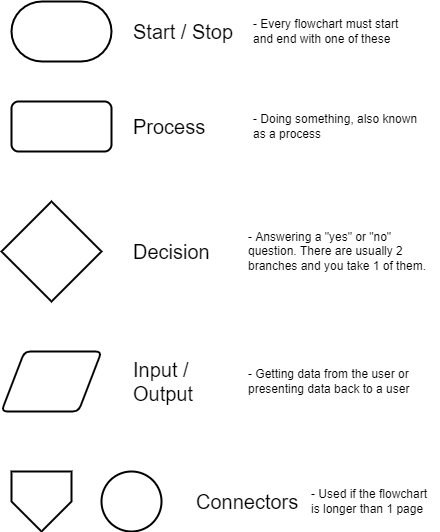
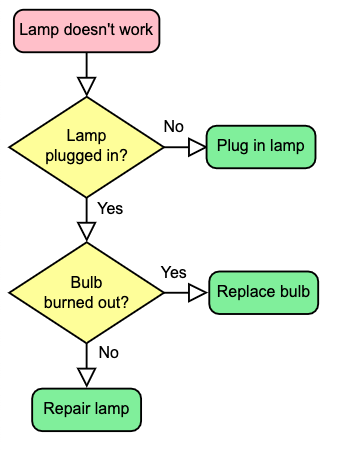

.. _flow-charts:

Flow-Charts
===========

Some people think that there is no need to do `flow-charts <https://en.wikipedia.org/wiki/Flow_charts>`_ before writing a program; that you can just go to the computer and start writing code. Any “interesting” computer problem is so complex though, that without planning you would just end up spinning your wheels and have to throw out most of your code. In our six step problem solving model, the second step was to create a model and flow-charts are an excellent tool to make a model of what happens in most computer problems. Remember that a computer program is just a set of steps that the computer follows to solve a problem. A flow-chart is just a pictorial representation of a sequence of steps.

A flow-chart is a set of different shapes that each represent a certain type of action. These shapes are connected together with arrows so that you can see the flow of logic. The shapes are:

Here is an example of a flowchart for a none-computer based problem:

Flow-chart from `Wikipedia <https://en.wikipedia.org/wiki/Flowchart>`_