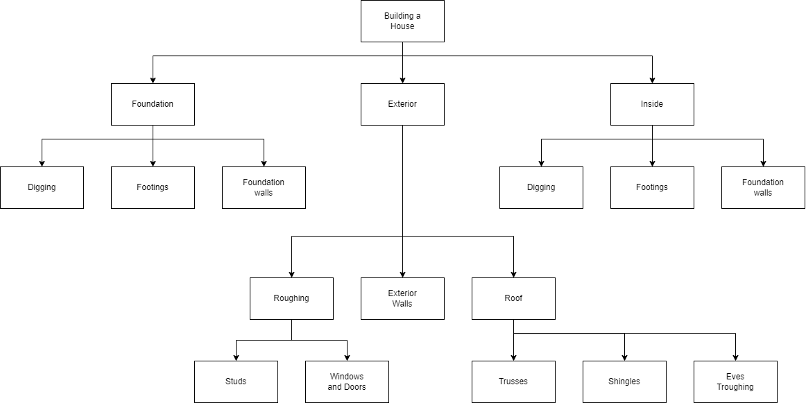

.. _top-down-design:

Top Down Design
=================

`Top-down <https://en.wikipedia.org/wiki/Top-down_and_bottom-up_design>`_ design is a method of breaking a problem down into smaller, less complex pieces from the initial overall problem. Most “good” problems are too complex to solve in just one step, so we divide the problem up into smaller manageable pieces, solve each one of them and then bring everything back together again. The process of making the steps more and more specific in top-down design is called stepwise refinement.

As mentioned before my father use to work in construction building houses. If someone gave you a piece of land and told you to, “Build me a house” you would not immediately go over and start nailing 2 x 4’s together. Building a house is a very complex adventure, not to mention there are many rules, codes and laws that must be followed. To build a house you could break the project up into smaller jobs, plan and do each one of these jobs (in the correct order) and in the end you would have a house. You will notice in the following top-down design diagram that some jobs get broken down several times, until they are a manageable size.

We will be using top-down design (and top-down design diagrams, like the one above) to help us understand a problem and all its components.