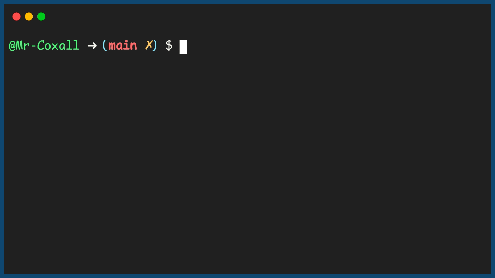

.. _assignment-statements:

Assignment Statement
====================

Programs can have many variables. Usually information is gathered from the user, stored in variable, processed with other variables, saved back to one/some variable(s) and then returned to the user. Variables are changed or initially assigned a value by the use of an `assignment statement <https://en.wikipedia.org/wiki/Assignment_(computer_science)>`_. Assignment statement are usually read in reverse order from what we are use to in math class. A variable on the left side of the assignment statement will receive the value that is on the right hand side of the assignment statement. Note that different programming languages use different symbols to represent the assignment statement (for example in `Alpha <https://en.wikipedia.org/wiki/Alpha_(programming_language)>`_ it is” ←”, in `Pascal <https://en.wikipedia.org/wiki/Pascal_(programming_language)>`_ it is” :=”). No matter what the symbol is, you always read it as, “is assigned”. This is particularly important in many languages where the assignment symbol is an equal sign ( = ) and people are use to reading this as “is equal to”. In many of these language when you actually want to check for "equality" you then use (==). 

Here are a few examples of assignment statements:

.. tabs::
  .. group-tab:: C
    .. code-block:: C
      .. literalinclude:: ../../code_examples/3-Structured_Problem_Solving/3-Assingment_Statements/C/main.c
        :language: C
        :linenos:
        :emphasize-lines: 20-25

  .. group-tab:: C++
    .. code-block:: C++
      .. literalinclude:: ../../code_examples/3-Structured_Problem_Solving/3-Assingment_Statements/CPP/main.cpp
        :language: C++
        :linenos:
        :emphasize-lines: 19-22

  .. group-tab:: C#
    .. code-block:: C#
      .. literalinclude:: ../../code_examples/3-Structured_Problem_Solving/3-Assingment_Statements/CSharp/main.cs
        :language: C#
        :linenos:
        :emphasize-lines: 23-26

  .. group-tab:: Go
    .. code-block:: Go
      .. literalinclude:: ../../code_examples/3-Structured_Problem_Solving/3-Assingment_Statements/Go/main.go
        :language: go
        :linenos:
        :emphasize-lines: 19-22

  .. group-tab:: Java
    .. code-block:: Java
      .. literalinclude:: ../../code_examples/3-Structured_Problem_Solving/3-Assingment_Statements/Java/Main.java
        :language: java
        :linenos:
        :emphasize-lines: 45-47

  .. group-tab:: JavaScript
    .. code-block:: JavaScript
      .. literalinclude:: ../../code_examples/3-Structured_Problem_Solving/3-Assingment_Statements/JavaScript/main.js
        :language: javascript
        :linenos:
        :emphasize-lines: 13-16

  .. group-tab:: Python
    .. code-block:: Python
      .. literalinclude:: ../../code_examples/3-Structured_Problem_Solving/3-Assingment_Statements/Python/main.py
        :language: python
        :linenos:
        :emphasize-lines: 17-20

Example Output
^^^^^^^^^^^^^^

