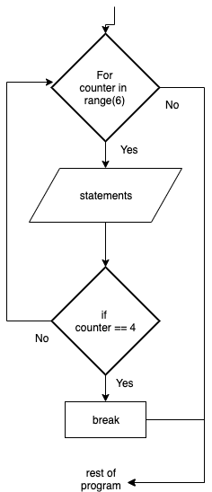

.. _break-statement:

Break Statements
================

In Python, the break statement can alter the flow of a normal loop. Loops iterate over a block of code until the Boolean expression is false, but sometimes we wish to terminate the iteration or even the whole loop early. The break statement is used in these cases.

The break statement terminates the loop containing it. Control of the program flows to the statement immediately after the body of the loop. If the break statement is inside a nested loop (loop inside another loop), the break will terminate the innermost loop only. Note you will most likely need to place an if statement inside the loop to use the break statement, because if you just have a break statement all by itself inside a loop, it will always hit it the first time through and that is not really useful!

The break statement (in most computer programming languages) takes the generic form of:

| **WHILE** bolean expression
|     statement_1 
|     statement_2
|     ...
|     **IF** bolean expression **THEN**
|         **BREAK**
|     **ENDIF**
| **END**

| **FOR** counter in range(n)
|     statement_1 
|     statement_2
|     ...
|     **IF** bolean expression **THEN**
|         **BREAK**
|     **ENDIF**
| **END**

The flowchart for a Break statement will look like this:

The following code snippet is a break program:

.. tabs::

  .. group-tab:: C++

    .. code-block:: C++

      // Copyright (c) 2019 St. Mother Teresa HS All rights reserved.
      //
      // Created by: Mr. Coxall
      // Created on: Oct 2019
      // This program uses a break statement

      #include <iostream>

      main() {
          // this function uses a break statement
          int positiveInteger;
          int loopCounter;

          // input
          std::cout << "Enter how many times to repeat: ";
          std::cin >> positiveInteger;

          // process & output
          for (loopCounter = 0; loopCounter < positiveInteger; loopCounter++) {
              if (loopCounter == 5) {
                  break;
              } else {
                  std::cout << loopCounter <<" time through loop." << std::endl;            
              }
          }
      }

  .. group-tab:: Go

    .. code-block:: Go

      // break statement

  .. group-tab:: Java

    .. code-block:: Java

      // break statement

  .. group-tab:: JavaScript

    .. code-block:: JavaScript

      // break statement

  .. group-tab:: Python3

    .. code-block:: Python

      #!/usr/bin/env python3

      # Created by: Mr. Coxall
      # Created on: Oct 2019
      # This program uses a break statement

      def main():
          # this function uses a break statement

          # input
          positive_integer = int(input("Enter how many times to repeat: "))
          print("")

          # process & output
          for loop_counter in range(positive_integer):
              if loop_counter == 5:
                  break
              else:
                  print("{0} time through loop.".format(loop_counter))

      if __name__ == "__main__":
          main()

  .. group-tab:: Ruby

    .. code-block:: Ruby

      // break statement

  .. group-tab:: Swift

    .. code-block:: Swift

      // break statement
