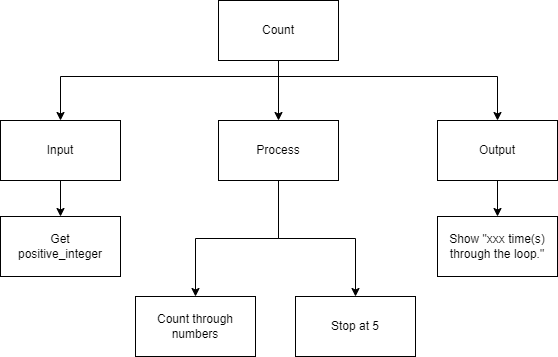
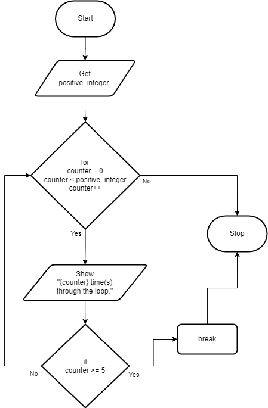

.. _break-statement:

Break Statements
================

The `Break Statement <https://en.wikipedia.org/wiki/Control_flow#Early_exit_from_loops>`_ can alter the flow of a normal loop. Loops iterate over a block of code until the Boolean expression is false, but sometimes we wish to terminate the iteration or even the whole loop early. The break statement is used in these cases.

The break statement terminates the loop containing it. Control of the program flows to the statement immediately after the body of the loop. If the break statement is inside a nested loop (loop inside another loop), the break will terminate the innermost loop only. Note you will most likely need to place an if statement inside the loop to use the break statement, because if you just have a break statement all by itself inside a loop, it will always hit it the first time through and that is not really useful!

The break statement (in most computer programming languages) takes the generic form of:

| **WHILE** bolean expression
|     statement_1 
|     statement_2
|     ...
|     **IF** (Boolean expression) **THEN**
|         **BREAK**
|     **ENDIF**
|     counter = counter + 1
| **ENDWHILE**

| **FOR** counter in range(n)
|     statement_1 
|     statement_2
|     ...
|     **IF** Boolean expression **THEN**
|         **BREAK**
|     **ENDIF**
| **ENDFOR**

In this example program, the user is asked to enter a posative integer and the program will count how many times it goes through the loop until it reaches that number, except it will always stop when it hits 5!

Top-Down Design for the Break Statement
^^^^^^^^^^^^^^^^^^^^^^^^^^^^^^^^^^^^^^^

Flowchart for the Break Statement
^^^^^^^^^^^^^^^^^^^^^^^^^^^^^^^^^

Pseudocode for the Break Statement
^^^^^^^^^^^^^^^^^^^^^^^^^^^^^^^^^^
| **GET** positive_integer
| **FOR** (int counter = 0; counter < positive_integer; counter++)
|     **SHOW** counter
|     **IF** (counter >= 5) **THEN**
|         **BREAK**
|     **ENDIF**
| **ENDFOR** 

Code for the Break Statement
^^^^^^^^^^^^^^^^^^^^^^^^^^^^
.. tabs::

  .. group-tab:: C
    .. code-block:: C
      .. literalinclude:: ../../code_examples/3-Structured_Problem_Solving/16-Break/C/main.c
        :language: C
        :linenos:
        :emphasize-lines: 21-23

  .. group-tab:: C++
    .. code-block:: C++
      .. literalinclude:: ../../code_examples/3-Structured_Problem_Solving/16-Break/CPP/main.cpp
        :language: C++
        :linenos:
        :emphasize-lines: 21-23

  .. group-tab:: C#
    .. code-block:: C#
      .. literalinclude:: ../../code_examples/3-Structured_Problem_Solving/16-Break/CSharp/main.cs
        :language: C#
        :linenos:
        :emphasize-lines: 25-27

  .. group-tab:: Go
    .. code-block:: Go
      .. literalinclude:: ../../code_examples/3-Structured_Problem_Solving/16-Break/Go/main.go
        :language: go
        :linenos:
        :emphasize-lines: 27-29

  .. group-tab:: Java
    .. code-block:: Java
      .. literalinclude:: ../../code_examples/3-Structured_Problem_Solving/16-Break/Java/Main.java
        :language: java
        :linenos:
        :emphasize-lines: 28-30

  .. group-tab:: JavaScript
    .. code-block:: JavaScript
      .. literalinclude:: ../../code_examples/3-Structured_Problem_Solving/16-Break/JavaScript/main.js
        :language: javascript
        :linenos:
        :emphasize-lines: 19-21

  .. group-tab:: Python
    .. code-block:: Python
      .. literalinclude:: ../../code_examples/3-Structured_Problem_Solving/16-Break/Python/main.py
        :language: python
        :linenos:
        :emphasize-lines: 19-20

Example Output
^^^^^^^^^^^^^^
.. code-block:: console

	@Mr-Coxall ➜ (main ✗) $ python ./main.py 
	Enter how many times to repeat: 10

	0 time(s) through the loop.
	1 time(s) through the loop.
	2 time(s) through the loop.
	3 time(s) through the loop.
	4 time(s) through the loop.

	Done.
