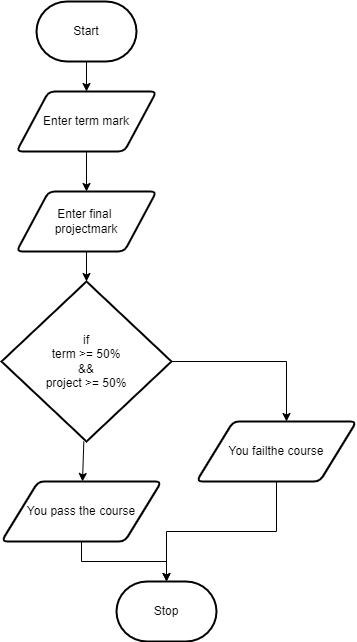

.. _compound-boolean-expressions:

Compound Boolean Expressions
============================

Just before we looked at the If … Then statement we looked at Boolean expressions. Boolean expressions have two and only two potential answers, either they are true or false. So far we have looked at just simple boolean expression, with just one comparison. A boolean expression can actually have more than one comparison and be quiet complex. A compound boolean expression is generated by combining more than one simple boolean expression together with a  `logical operator <https://en.wikipedia.org/wiki/Logical_connective>`_ And or Or. And is used to form an expression that evaluates to True only when both operands are true. Or is used to form an expression that evaluates to true when either operand is true. Here is a truth table for each operator: 

AND Truth Table

+-------+-------+---------+
|   A   |   B   | A AND B | 
+=======+=======+=========+ 
| True  | True  |  True   | 
+-------+-------+---------+ 
| True  | False |  False  | 
+-------+-------+---------+ 
| False | True  |  False  | 
+-------+-------+---------+ 
| False | False |  False  | 
+-------+-------+---------+ 

OR Truth Table

+-------+-------+---------+
|   A   |   B   | A OR B  | 
+=======+=======+=========+ 
| True  | True  |  True   | 
+-------+-------+---------+ 
| True  | False |  True   | 
+-------+-------+---------+ 
| False | True  |  True   | 
+-------+-------+---------+ 
| False | False |  False  | 
+-------+-------+---------+ 

| **IF** (boolean expression #1 and boolean expression #2) **THEN** 
|    Statements to be performed
| **ENDIF**

In some programming languages the operators are simpley the words “AND and OR”. In others they are “&&” for AND and “||” for OR. The following are some examples of compound boolean expressions:

.. tabs::

  .. group-tab:: C++

    .. code-block:: C++

      // Copyright (c) 2019 St. Mother Teresa HS All rights reserved.
      //
      // Created by: Mr. Coxall
      // Created on: Oct 2019
      // This program uses a compound boolean statement

      #include <iostream>

      main() {
          // this function uses a compound boolean statement
          std::string integer_as_string;
          int term_mark;
          int project_mark;

          // input
          std::cout << "Enter term mark: ";
          std::cin >> term_mark;
          
          std::cout << "Enter project mark: ";
          std::cin >> project_mark;

          // process & output
          if (term_mark >= 50 && project_mark >= 50) {
              std::cout << "You passed the course.";
          } else {
              std::cout << "You did not pass the course.";
          }
      }

  .. group-tab:: Go

    .. code-block:: Go

      // compound boolean expressions

  .. group-tab:: Java

    .. code-block:: Java

      // compound boolean expressions

  .. group-tab:: JavaScript

    .. code-block:: JavaScript

      // compound boolean expressions

  .. group-tab:: Python3

    .. code-block:: Python

      #!/usr/bin/env python3

      # Created by: Mr. Coxall
      # Created on: Sep 2019
      # This program uses a compound boolean statement

      def main():
          # this function uses a compound boolean statement

          # input
          term_mark = int(input("Enter term mark: "))
          project_mark = int(input("Enter project mark: "))
          print("")

          # process & output
          if term_mark >= 50 and project_mark >= 50:
              print("You passed the course.")
          else:
              print("You did not pass the course.")

      if __name__ == "__main__":
          main()

  .. group-tab:: Ruby

    .. code-block:: Ruby

      // compound boolean expressions

  .. group-tab:: Swift

    .. code-block:: Swift

      // compound boolean expressions

Besides these two logical operators, there is one more, the NOT. NOT is used most often at the beginning of a Boolean expression to invert its evaluation. It does not compare 2 values but just inversts a single one.

NOT Truth Table

+-------+--------+
|   A   | NOT(A) | 
+=======+========+ 
| True  | False  |
+-------+--------+ 
| False | True   | 
+-------+--------+ 

For example:

.. tabs::

  .. group-tab:: C++

    .. code-block:: C++

      // Copyright (c) 2019 St. Mother Teresa HS All rights reserved.
      //
      // Created by: Mr. Coxall
      // Created on: Oct 2019
      // This program uses a NOT boolean statement

      #include <iostream>

      main() {
          // this function uses a NOT boolean statement
          bool isSunday = true;
          bool isHoliday = false;
          
          if (!isHoliday == true) {
              std::cout << "Please start working, it is not holiday.";
          } else {
              std::cout << "Today is holiday!!";
          }
      }

  .. group-tab:: Go

    .. code-block:: Go

      // NOT boolean expressions

  .. group-tab:: Java

    .. code-block:: Java

      // NOT boolean expressions

  .. group-tab:: JavaScript

    .. code-block:: JavaScript

      // NOT boolean expressions

  .. group-tab:: Python3

    .. code-block:: Python

      #!/usr/bin/env python3

      # Created by: Mr. Coxall
      # Created on: Sep 2019
      # This program uses a NOT boolean statement

      def main():
          # this function uses a NOT boolean statement

          is_sunday = True
          is_holiday = False
          
          if not is_holiday == True:
              print('Please start working, it is not holiday')
          else:
              print('Today is holiday!!')

      if __name__ == "__main__":
          main()

  .. group-tab:: Ruby

    .. code-block:: Ruby

      // NOT boolean expressions

  .. group-tab:: Swift

    .. code-block:: Swift

      // NOT boolean expressions
