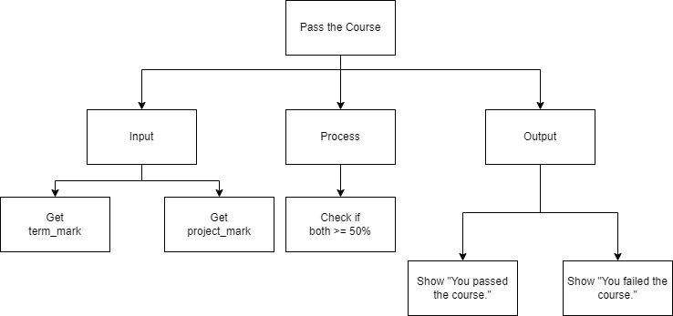

.. _compound-boolean-expressions:

Compound Boolean Expressions
============================

Just before we looked at the If … Then statement we looked at Boolean expressions. Boolean expressions have two and only two potential answers, either they are true or false. So far we have looked at just simple boolean expression, with just one comparison. A boolean expression can actually have more than one comparison and be quiet complex. A compound boolean expression is generated by combining more than one simple boolean expression together with a  `logical operator <https://en.wikipedia.org/wiki/Logical_connective>`_ NOT, AND & OR. NOT is used to form an expression that evaluates to True only when the operand is false. AND is used to form an expression that evaluates to True only when both operands are true. OR is used to form an expression that evaluates to true when either operand is true. 

Here is a truth table for each operator:

NOT Truth Table

+-------+-------+
|   A   | NOT A |
+=======+=======+
| True  | False |
+-------+-------+
| False | True  |
+-------+-------+

AND Truth Table

+-------+-------+---------+
|   A   |   B   | A AND B | 
+=======+=======+=========+ 
| True  | True  |  True   | 
+-------+-------+---------+ 
| True  | False |  False  | 
+-------+-------+---------+ 
| False | True  |  False  | 
+-------+-------+---------+ 
| False | False |  False  | 
+-------+-------+---------+ 

OR Truth Table

+-------+-------+---------+
|   A   |   B   | A OR B  | 
+=======+=======+=========+ 
| True  | True  |  True   | 
+-------+-------+---------+ 
| True  | False |  True   | 
+-------+-------+---------+ 
| False | True  |  True   | 
+-------+-------+---------+ 
| False | False |  False  | 
+-------+-------+---------+ 

The general form in a programming language for a compound boolean expression is:

NOT
^^^
| **IF** not(boolean expression #1) **THEN** 
|    Statements to be performed ...
| **ELSE**
|    Statements to be performed ...
| **ENDIF**

AND
^^^
| **IF** ((boolean expression #1) and (boolean expression #2)) **THEN** 
|    Statements to be performed
| **ELSE**
|    Statements to be performed ...
| **ENDIF**

OR
^^
| **IF** ((boolean expression #1) or (boolean expression #2)) **THEN** 
|    Statements to be performed
| **ELSE**
|    Statements to be performed ...
| **ENDIF**

In some programming languages the operators are simpley the words not, and & or. In others they are “!” for NOT, “&&” for AND & “||” for OR.

In this example program, the user is asked to enter a term mark and a final project mark. The program then tells the user if they passed the course or not. The rule for passing the course is that the student must have a term mark of at least 50% **and** a final project mark of at least 50. The program uses a compound boolean expression to determine if the student passed the course.

Top-Down Design for Compound Boolean Expression statement
^^^^^^^^^^^^^^^^^^^^^^^^^^^^^^^^^^^^^^^^^^^^^^^^^^^^^^^^^

Flowchart for Compound Boolean Expression statement
^^^^^^^^^^^^^^^^^^^^^^^^^^^^^^^^^^^^^^^^^^^^^^^^^^^
.. image:: ./images/flowchart-compound-boolean.png
   :alt: Compound Boolean Expression flowchart
   :align: center

Pseudocode for Compound Boolean Expression statement
^^^^^^^^^^^^^^^^^^^^^^^^^^^^^^^^^^^^^^^^^^^^^^^^^^^^
| **GET** term_mark
| **GET** project_mark
| **IF** ((term_mark >= 50) and (project_mark >= 50)) **THEN** 
|    **SHOW** "You passed the course."
| **ELSE**
|    **SHOW** "You failed the course."
| **ENDIF**

Code for Select Case statement
^^^^^^^^^^^^^^^^^^^^^^^^^^^^^^^^^^^^^^
.. tabs::

  .. group-tab:: C
    .. code-block:: C
      .. literalinclude:: ../../code_examples/3-Structured_Problem_Solving/11-Compound_Boolean/C/main.c
        :language: C
        :linenos:
        :emphasize-lines: 22-26

  .. group-tab:: C++
    .. code-block:: C++
      .. literalinclude:: ../../code_examples/3-Structured_Problem_Solving/11-Compound_Boolean/CPP/main.cpp
        :language: C++
        :linenos:
        :emphasize-lines: 22-26

  .. group-tab:: C#
    .. code-block:: C#
      .. literalinclude:: ../../code_examples/3-Structured_Problem_Solving/11-Compound_Boolean/CSharp/main.cs
        :language: C#
        :linenos:
        :emphasize-lines: 23-27

  .. group-tab:: Go
    .. code-block:: Go
      .. literalinclude:: ../../code_examples/3-Structured_Problem_Solving/11-Compound_Boolean/Go/main.go
        :language: go
        :linenos:
        :emphasize-lines: 27-31

  .. group-tab:: Java
    .. code-block:: Java
      .. literalinclude:: ../../code_examples/3-Structured_Problem_Solving/11-Compound_Boolean/Java/Main.java
        :language: java
        :linenos:
        :emphasize-lines: 26-30

  .. group-tab:: JavaScript
    .. code-block:: JavaScript
      .. literalinclude:: ../../code_examples/3-Structured_Problem_Solving/11-Compound_Boolean/JavaScript/main.js
        :language: javascript
        :linenos:
        :emphasize-lines: 14-18

  .. group-tab:: Python
    .. code-block:: Python
      .. literalinclude:: ../../code_examples/3-Structured_Problem_Solving/11-Compound_Boolean/Python/main.py
        :language: python
        :linenos:
        :emphasize-lines: 19-22

Example Output
^^^^^^^^^^^^^^
.. code-block:: console

  @Mr-Coxall ➜ (main ✗) $ python ./main.py 
  Enter term mark (as %): 42
  Enter project mark (as %): 42

  You did not pass the course.

  Done.
  @Mr-Coxall ➜ (main ✗) $ python ./main.py 
  Enter term mark (as %): 42
  Enter project mark (as %): 88

  You did not pass the course.

  Done.
  @Mr-Coxall ➜ (main ✗) $ python ./main.py 
  Enter term mark (as %): 88
  Enter project mark (as %): 88

  You passed the course.

  Done.
