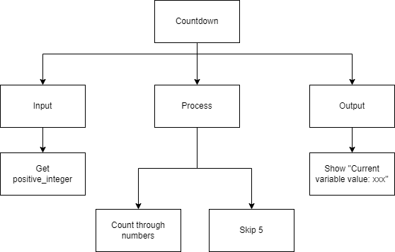
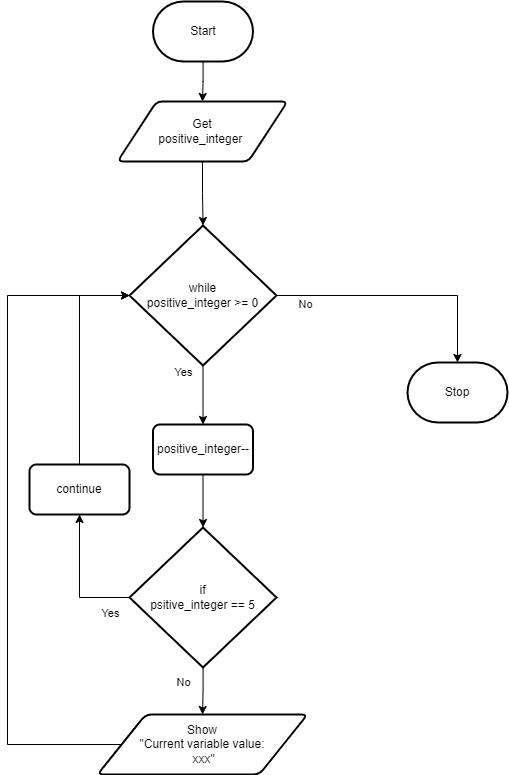
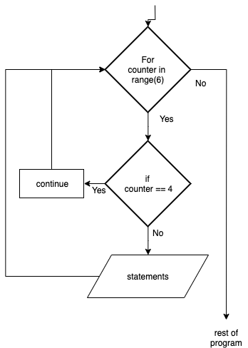

.. _continue-statement:

Continue Statement
==================

The `Continue Statement <https://en.wikipedia.org/wiki/Control_flow#Continuation_with_next_iteration>`_ gives you the option to skip over the part of a loop where an external condition is triggered, but to go on to complete the rest of the loop iterations. That is, the current iteration of the loop will be disrupted, but the program will return to the top of the loop. The continue statement will be within the block of code under the loop statement, usually after a conditional if statement.

The continue statement (in most computer programming languages) takes the generic form of:

| **WHILE** bolean expression
|     statement_1 
|     ...
|     **IF** bolean expression **THEN**
|         **CONTINUE**
|     **ENDIF**
|     statement_2
|     ...
|     counter = counter + 1
| **ENDWHILE**

| **FOR** counter in range(n)
|     statement_1
|     ...
|     **IF** bolean expression **THEN**
|         **CONTINUE**
|     **ENDIF**
|     statement_2
|     ...
| **ENDFOR**

In this example program, the user is asked to enter a positive integer and the program will count how many times it goes through the loop until it reaches that number, except it will always skip 5!

Top-Down Design for the Continue Statement
^^^^^^^^^^^^^^^^^^^^^^^^^^^^^^^^^^^^^^^^^^

Flowchart for the Continue Statement
^^^^^^^^^^^^^^^^^^^^^^^^^^^^^^^^^^^^

Pseudocode for the Continue Statement
^^^^^^^^^^^^^^^^^^^^^^^^^^^^^^^^^^^^^
| **GET** positive_integer
| **FOR** (int counter = 0; counter < positive_integer; counter++)
|     **IF** (counter == 5) **THEN**
|         **CONTINUE**
|     **ENDIF**
|     **SHOW** counter
| **ENDFOR** 

Code for the Continue Statement
^^^^^^^^^^^^^^^^^^^^^^^^^^^^
.. tabs::

  .. group-tab:: C
    .. code-block:: C
      .. literalinclude:: ../../code_examples/3-Structured_Problem_Solving/17-Continue/C/main.c
        :language: C
        :linenos:
        :emphasize-lines: 24-26

  .. group-tab:: C++
    .. code-block:: C++
      .. literalinclude:: ../../code_examples/3-Structured_Problem_Solving/17-Continue/CPP/main.cpp
        :language: C++
        :linenos:
        :emphasize-lines: 24-26

  .. group-tab:: C#
    .. code-block:: C#
      .. literalinclude:: ../../code_examples/3-Structured_Problem_Solving/17-Continue/CSharp/main.cs
        :language: C#
        :linenos:
        :emphasize-lines: 28-30

  .. group-tab:: Go
    .. code-block:: Go
      .. literalinclude:: ../../code_examples/3-Structured_Problem_Solving/17-Continue/Go/main.go
        :language: go
        :linenos:
        :emphasize-lines: 30-32

  .. group-tab:: Java
    .. code-block:: Java
      .. literalinclude:: ../../code_examples/3-Structured_Problem_Solving/17-Continue/Java/Main.java
        :language: java
        :linenos:
        :emphasize-lines: 31-33

  .. group-tab:: JavaScript
    .. code-block:: JavaScript
      .. literalinclude:: ../../code_examples/3-Structured_Problem_Solving/17-Continue/JavaScript/main.js
        :language: javascript
        :linenos:
        :emphasize-lines: 22-24

  .. group-tab:: Python
    .. code-block:: Python
      .. literalinclude:: ../../code_examples/3-Structured_Problem_Solving/17-Continue/Python/main.py
        :language: python
        :linenos:
        :emphasize-lines: 21-22

Example Output
^^^^^^^^^^^^^^
.. code-block:: console

	@Mr-Coxall ➜ (main ✗) $ python ./main.py 
  Enter a count-down number (ex: 10): 9

  Current variable value: 9
  Current variable value: 8
  Current variable value: 7
  Current variable value: 5
  Current variable value: 4
  Current variable value: 3
  Current variable value: 2
  Current variable value: 1
  Current variable value: 0

  Done.

The flowchart for a Continue statement will look like this:

The following code snippet is a continue program:

.. tabs::

  .. group-tab:: C++

    .. code-block:: C++

		// Copyright (c) 2019 St. Mother Teresa HS All rights reserved.
		//
		// Created by: Mr. Coxall
		// Created on: Oct 2019
		// This program uses a continue statement

		#include <iostream>

		main() {
		    // this function uses a continue statement
		    int positiveInteger;

		    // input
		    std::cout << "Enter a count-down number (ex: 10): ";
		    std::cin >> positiveInteger;

		    // process & output
		    while (positiveInteger > 0) {
		        // yes, this is the exception on placing the counter at the top
		        positiveInteger = positiveInteger - 1;
		        
		        if (positiveInteger == 5) {
		            continue;
		        }
		        std::cout << "Current variable value : " << positiveInteger << std::endl;
		    }
		    
		    std::cout << "Good bye!";
		}

  .. group-tab:: Go

    .. code-block:: Go

      // continue statement

  .. group-tab:: Java

    .. code-block:: Java

      // continue statement

  .. group-tab:: JavaScript

    .. code-block:: JavaScript

      // continue statement

  .. group-tab:: Python

    .. code-block:: Python

		#!/usr/bin/env python3

		# Created by: Mr. Coxall
		# Created on: Oct 2019
		# This program uses a continue statement

		def main():
		    # this function uses a continue statement

		    # input
		    positive_integer = int(input("Enter a count-down number (ex: 10): "))
		    print("")

		    # process & output
		    while positive_integer > 0:
		        # yes, this is the exception on placing the counter at the top
		        positive_integer = positive_integer - 1
		        
		        if positive_integer == 5:
		            continue
		        print("Current variable value : {}".format(positive_integer))
		    
		    print("Good bye!")

		if __name__ == "__main__":
		    main()

  .. group-tab:: Ruby

    .. code-block:: Ruby

      // continue statement

  .. group-tab:: Swift

    .. code-block:: Swift

      // continue statement
