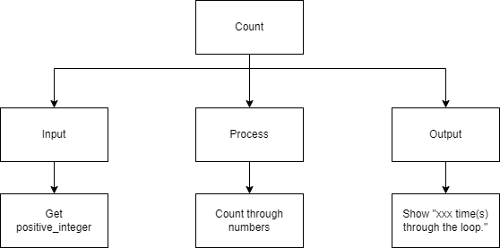
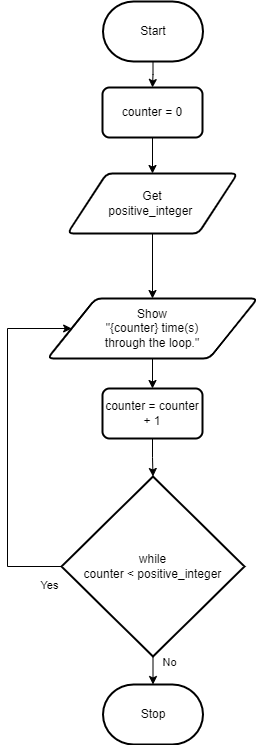
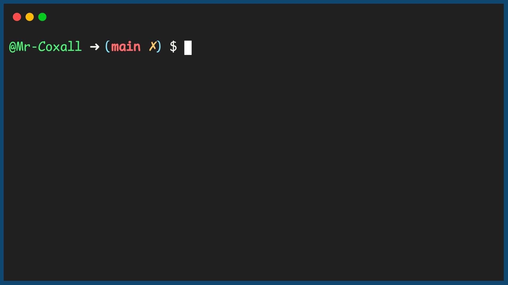

.. _do-while-loop:

Do While Loop
=============

The `Do…While <https://en.wikipedia.org/wiki/Do_while_loop>`_ loop is a repetition structure where the statements inside the loop are executed **at least once**. Only then after being executed once, the Boolean expression is evaluated. If the Boolean expression is true, the body of the loop is executed again and the Boolean expression is re-evaluated once again. Note that this is different from the while loop, where the Boolean expression is at the top. Being at the top in a while loop, it is evaluated first and there might be a circumstance where the Boolean expression is false, right from the beginning. In this case the while loop will never happen. In a Do…While loop, the statements will always happen at least once.

Note that not all programming languages have a Do…While loop structure.

The Do…While loop (in most computer programming languages) takes the generic form of:

| **DO**
|     statement(s)
|     ...
|     counter = counter + 1
| **WHILE** (boolean expression)

In this example program once again the user is asked to enter a positive integer and the program will count how many times it goes through the loop until it reaches that number. This time a Do…While loop is used.

Top-Down Design for Do…While loop
^^^^^^^^^^^^^^^^^^^^^^^^^^^^^^^^^^^^^

Flowchart for Do…While loop
^^^^^^^^^^^^^^^^^^^^^^^^^^^

Pseudocode for Do…While loop
^^^^^^^^^^^^^^^^^^^^^^^^^^^^
| **GET** positive_integer
| **DO**
|     **SHOW** counter
|     counter = counter + 1
| **WHILE** (counter < positive_integer)

Code for Do…While loop
^^^^^^^^^^^^^^^^^^^^^^
.. tabs::

  .. group-tab:: C
    .. code-block:: C
      .. literalinclude:: ../../code_examples/3-Structured_Problem_Solving/14-Do_While_Loop/C/main.c
        :language: C
        :linenos:
        :emphasize-lines: 20-23

  .. group-tab:: C++
    .. code-block:: C++
      .. literalinclude:: ../../code_examples/3-Structured_Problem_Solving/14-Do_While_Loop/CPP/main.cpp
        :language: C++
        :linenos:
        :emphasize-lines: 20-23

  .. group-tab:: C#
    .. code-block:: C#
      .. literalinclude:: ../../code_examples/3-Structured_Problem_Solving/14-Do_While_Loop/CSharp/main.cs
        :language: C#
        :linenos:
        :emphasize-lines: 24-27

  .. group-tab:: Go
    .. code-block:: Go
      .. literalinclude:: ../../code_examples/3-Structured_Problem_Solving/14-Do_While_Loop/Go/main.c
        :language: go
        :linenos:
        :emphasize-lines: 1

  .. group-tab:: Java
    .. code-block:: Java
      .. literalinclude:: ../../code_examples/3-Structured_Problem_Solving/14-Do_While_Loop/Java/Main.java
        :language: java
        :linenos:
        :emphasize-lines: 28-31

  .. group-tab:: JavaScript
    .. code-block:: JavaScript
      .. literalinclude:: ../../code_examples/3-Structured_Problem_Solving/14-Do_While_Loop/JavaScript/main.js
        :language: javascript
        :linenos:
        :emphasize-lines: 17-20

  .. group-tab:: Python
    .. code-block:: Python
      .. literalinclude:: ../../code_examples/3-Structured_Problem_Solving/14-Do_While_Loop/Python/main.py
        :language: python
        :linenos:
        :emphasize-lines: 1

Example Output
^^^^^^^^^^^^^^

