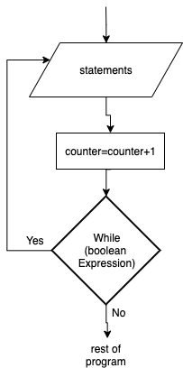

.. _do-while-loop:

Do While Loop
=============

The Do…While loop is a repetition structure where the statements inside the loop are executed **at least once**. Only then after being executed once, the Boolean expression is evaluated. If the Boolean expression is true, the body of the loop is executed again and the Boolean expression is re-evaluated once again. Note that this is different from the while loop, where the Boolean expression is at the top. Being at the top in a while loop, it is evaluated first and there might be a circumstance where the Boolean expression is false, right from the beginning. In this case the while loop will never happen. In a Do...While loop, the statements will always happen at least once.

Note that not all programming languages have a Do ... While loop structure.

The do...while loop (in most computer programming languages) takes the generic form of:

| **DO**
|     statement(s)
|     ...
|     counter = counter + 1
| **WHILE** (boolean expression)

In this example program once again the user is asked to enter a posative integer and the program will count how many times it goes through the loop until it reaches that number. This time a Do ... While loop is used.

Top-Down Design for Do ... While loop
^^^^^^^^^^^^^^^^^^^^^^^^^^^^^^^^^^^^^
.. image:: ./images/top-down-do-while-loop.png
   :alt: Top-Down Design for Do ... While loop
   :align: center

Flowchart for Do ... While loop
^^^^^^^^^^^^^^^^^^^^^^^^^^^^^^^
.. image:: ./images/flowchart-do-while-loop.png
   :alt: Do ... While loop flowchart
   :align: center

Pseudocode for Do ... While loop
^^^^^^^^^^^^^^^^^^^^^^^^^^^^^^^^
| **GET** positive_integer
| **Do**
|     **SHOW** counter
|     counter = counter + 1
| **WHILE** (counter < positive_integer)

Code for Do ... While loop
^^^^^^^^^^^^^^^^^^^^^^^^^^
.. tabs::

  .. group-tab:: C
    .. code-block:: C
      .. literalinclude:: ../../code_examples/3-Structured_Problem_Solving/14-Do-While_Loop/C/main.c
        :language: C
        :linenos:
        :emphasize-lines: 20-23

  .. group-tab:: C++
    .. code-block:: C++
      .. literalinclude:: ../../code_examples/3-Structured_Problem_Solving/14-Do-While_Loop/CPP/main.cpp
        :language: C++
        :linenos:
        :emphasize-lines: 20-23

  .. group-tab:: C#
    .. code-block:: C#
      .. literalinclude:: ../../code_examples/3-Structured_Problem_Solving/14-Do-While_Loop/CSharp/main.cs
        :language: C#
        :linenos:
        :emphasize-lines: 24-27

  .. group-tab:: Go
    .. code-block:: Go
      .. literalinclude:: ../../code_examples/3-Structured_Problem_Solving/14-Do-While_Loop/Go/main.go
        :language: go
        :linenos:
        :emphasize-lines: 25-28

  .. group-tab:: Java
    .. code-block:: Java
      .. literalinclude:: ../../code_examples/3-Structured_Problem_Solving/14-Do-While_Loop/Java/Main.java
        :language: java
        :linenos:
        :emphasize-lines: 28-31

  .. group-tab:: JavaScript
    .. code-block:: JavaScript
      .. literalinclude:: ../../code_examples/3-Structured_Problem_Solving/14-Do-While_Loop/JavaScript/main.js
        :language: javascript
        :linenos:
        :emphasize-lines: 17-20

  .. group-tab:: Python
    .. code-block:: Python
      .. literalinclude:: ../../code_examples/3-Structured_Problem_Solving/14-Do-While_Loop/Python/main.py
        :language: python
        :linenos:
        :emphasize-lines: 18-20

Example Output
^^^^^^^^^^^^^^
.. code-block:: console

	@Mr-Coxall ➜ (main ✗) $ python ./main.py 
	Enter how many times to repeat: 5

	0 time(s) through the loop.
	1 time(s) through the loop.
	2 time(s) through the loop.
	3 time(s) through the loop.
	4 time(s) through the loop.

	Done.

The flowchart for a Do...While Loop will look like this:

The following code snippet is a repetition program. The user enters a positive integer and the program prints out that many lines:

.. tabs::

  .. group-tab:: C++

    .. code-block:: C++

		// Copyright (c) 2019 St. Mother Teresa HS All rights reserved.
		//
		// Created by: Mr. Coxall
		// Created on: Oct 2019
		// This program uses a do...while loop

		#include <iostream>

		main() {
		    // this function uses a while loop
		    int positiveInteger;
		    int loopCounter = 0;

		    // input
		    std::cout << "Enter how many times to repeat: ";
		    std::cin >> positiveInteger;

		    // process & output
		    do {
		        std::cout << loopCounter <<" time through loop." << std::endl;
		        loopCounter = loopCounter + 1;
		    } while (loopCounter < positiveInteger);
		}

  .. group-tab:: Go

    .. code-block:: Go

      // do...while loop

  .. group-tab:: Java

    .. code-block:: Java

      /**
       * Class do-while
       * 
       * Created by: Mr. Coxall
       * Created on: Oct 2019
       * This program uses a do while loop
       */

      public class do_while {
          public static void main(String[] args) {
            // this function uses a while loop
            String positiveIntegerAsString;
            int positiveInteger;
            int loopCounter = 0;

            // input
            System.out.println("Enter how many times to repeat: ");
            positiveIntegerAsString = System.console().readLine();
            positiveInteger = Integer.valueOf(positiveIntegerAsString);
        
            // process & output
            do {
                System.out.println(loopCounter + " time through loop.");
                loopCounter = loopCounter + 1;
            } while (loopCounter < positiveInteger);
          }
      }

  .. group-tab:: JavaScript

    .. code-block:: JavaScript

      // do...while loop

  .. group-tab:: Python

    .. code-block:: Python

		# there is no Do...While Loop structure in Python

  .. group-tab:: Ruby

    .. code-block:: Ruby

      // do...while loop

  .. group-tab:: Swift

    .. code-block:: Swift

      // do...while loop

