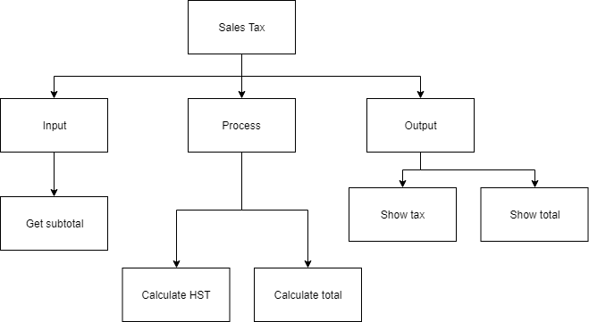
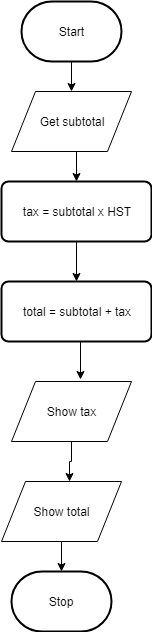

.. _example-sequence-problem:

Example Sequence Problem
========================

The following is an example problem that has been solved using the six step computer based problem solving method mentioned above. The goal is to show you how a sequential program works and also to show how the six steps are used to develop a program from a given problem.

Sequence Programming Example
----------------------------

Here is the problem:
Write a program that will allow the user to enter a subtotal and the program will calculate the final total including tax.

1. **Top-Down Chart**

The first thing we need to find out is how to calculate tax in your particular province. If the program is to be used anywhere in Canada, it could get really confusing since each province has a different tax rate and some even calculate taxes differently than other provinces. To help simplify the problem, we are just going to do it for Ontario. The Harmonized Sale Tax (HST) in Ontario is currently 13%. The following is a top-down design breaking the problem up into smaller manageable pieces:

2. **Flow Chart**

The next step is to convert the top-down design into a flowchart. To help create the flow chart, use the bottom boxes of each of the arms, in order from left to right from the top-down design. This would mean Get subtotal, Calculate HST, Add 2 values together and Put final total. Remember that every flowchart has the “Start” oval at the top and the “Stop” oval at the bottom. This is so people know where to begin and end. The arrows are used so people can follow the flow. The words in the flow charts are not full sentences but simplified pieces of code. Ensure that you include any formulas and use the variable names that you will plan on using in your code.

3. **Pseudo-code**

Pseudo-code converts your flowchart into something that more resembles the final code you will write. Once again though it is not code (hence the name pseudo-code), so it is generically written so that it can be translated into any language. It should be understood by anyone that can write a computer program, not just people that use the same programming language that you do. The first word on each line should be a verb (an action word), since you want the computer to do something for you. By convention the first verb is also in all caps (capital letters). Here is the pseudo-code for the problem:
**GET** subtotal from user
**CALCULATE** tax ← subTotal * HST
**CALCULATE** total ← subTotal + tax
**SHOW** taxes back to user
**SHOW** total back to user

4. **Code**
Once you have the pseudo-code done, the hardest part of solving the problem should be finished. Now you just convert your pseudo-code into the specific programming language you have chosen:
.. tabs::

  .. group-tab:: C++

    .. code-block:: C++

	// Copyright (c) 2019 St. Mother Teresa HS All rights reserved.
	//
	// Created by: Mr. Coxall
	// Created on: Sep 2019
	// This program shows how local and global variables work

	#include <iostream>

	// global variable
	int variableX = 25;

	void localVariable() {
	    // this shows what happens with local variables

	    int variableX = 10;
	    int variableY = 30;
	    int variableZ = variableX + variableY;
	    std::cout << "Local variableX, variableY, variableZ: " << variableX
	              << " + " << variableY << " = " << variableZ << std::endl;
	}

	void globalVariable() {
	    // this shows what happens with global variables

	    variableX = variableX + 1;
	    int variableY = 30;
	    int variableZ = variableX + variableY;
	    std::cout << "Local variableX, variableY, variableZ: " << variableX
	              << " + " << variableY << " = " << variableZ << std::endl;
	}

	int main() {
	    // this function calls local and global

	    localVariable();
	    globalVariable();
	}

  .. group-tab:: Go

    .. code-block:: Go

      // This program shows how local and global variables work

  .. group-tab:: Java

    .. code-block:: Java

       // This program shows how local and global variables work

  .. group-tab:: JavaScript

    .. code-block:: JavaScript

       // This program shows how local and global variables work

  .. group-tab:: Python3

    .. code-block:: Python

	#!/usr/bin/env python3

	# Created by: Mr. Coxall
	# Created on: Sept 2019
	# This program shows how local and global variables work

	# global variable
	variable_X = 25

	def local_variable():
	    # this shows what happens with local variables

	    variable_X = 10
	    variable_Y = 30
	    variable_Z = variable_X + variable_Y
	    print("Local variable_X, variable_Y, variable_Z: {0} + {1} = {2}".
	          format(variable_X, variable_Y, variable_Z))

	def global_variable():
	    # this shows what happens with global variables

	    global variable_X
	    variable_X = variable_X + 1
	    variable_Y = 30
	    variable_Z = variable_X + variable_Y
	    print("Global variable_X, variable_Y, variable_Z: {0} + {1} = {2}".
	          format(variable_X, variable_Y, variable_Z))

	def main():
	    # this function shows how local and global variables work

	    local_variable()
	    global_variable()

	if __name__ == "__main__":
	    main()

  .. group-tab:: Ruby

    .. code-block:: Ruby

       # This program shows how local and global variables work

  .. group-tab:: Swift

    .. code-block:: Swift

      // This program shows how local and global variables work

5. **Debug**
It is hard to show the debugging step, since I ensured that the program above worked correctly before I pasted it into the page. When programmers write code it is extremely unlikely that it will work right away the first time. This is why the development environment has tools to help the programmer fix simple mistakes. The two main kinds of mistakes are syntax errors and logical errors.

In modern languages high level languages and IDEs, syntax errors are usually easy to see and fix. A syntax error is a piece of code that the compiler or interpreter does not understand. It would be like speaking to you and one of the sentences did not make any sense to you. A modern IDE will nicely place a squiggly line under the code (or some other way of showing you) it does not understand, so that you can fix the problem. A logical error is a lot harder to find. This is a problem with the way you solved the problem. The code will still compile or be interpreted and run but the program will give you the wrong answer (or maybe just the wrong answer some times!). There is not easy way to solve these problems than to step though your code one line at a time.

6.	Document the code
This is hopefully not done just at the end of your programming but as you write your code. All the same it is good practice to go over you code at the end to ensure that someone else looking at it will understand what is going on. In the above example you can see that there is a comment at the start of the program and in the Sub as well. Also I have used a naming convention that is hopefully easy to understand what the variables are holding. In addition, the values of the taxes are places as constants, since they only change very infrequently. Below is the top part of the VB solution showing the comment section at the beginning of the program, so everyone will know who made it, when, and why.

The above six steps are an example of how you should go about solving a compute based problem. Ensure when you are given a problem, you do not make the mistake that most people do and go directly to the computer and start coding. If you have not first been able to break the problem down into smaller pieces and solve the problem on paper, going to the computer and starting to code will not help you. You will just end up going in circles, wasting time, creating bad code and getting nowhere. Programming is just problem solving on a computer but you have to have solved the problem before you actually get to the computer to help you get the answer.
