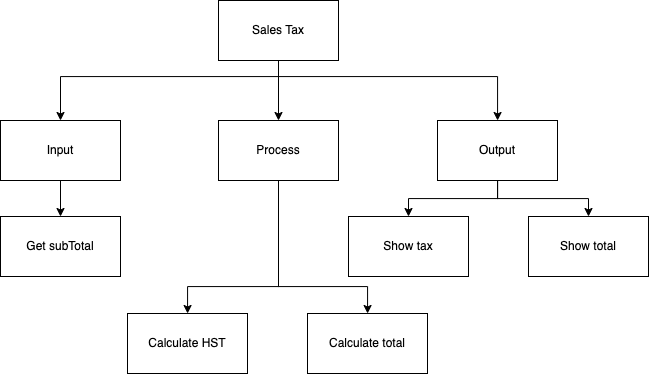
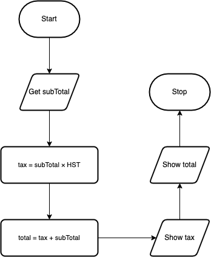

.. _example-sequence-problem:

Example Sequence Problem
========================

The following is an example problem that has been solved using the six step computer based problem solving method mentioned above. The goal is to show you how a sequential program works and also to show how the six steps are used to develop a program from a given problem.

Sequence Programming Example
----------------------------

Here is the problem:
Write a program that will allow the user to enter a subtotal and the program will calculate the final total including tax.

1. Top-Down Chart
The first thing we need to find out is how to calculate tax in your particular province. If the program is to be used anywhere in Canada, it could get really confusing since each province has a different tax rate and some even calculate taxes differently than other provinces. To help simplify the problem, we are just going to do it for Ontario. The Harmonized Sale Tax (HST) in Ontario is currently 13%. The following is a top-down design breaking the problem up into smaller manageable pieces:

2. Flow Chart
The next step is to convert the top-down design into a flowchart. To help create the flow chart, use the bottom boxes of each of the arms, in order from left to right from the top-down design. This would mean Get subtotal, Calculate HST, Add 2 values together and Put final total. Remember that every flowchart has the “Start” oval at the top and the “Stop” oval at the bottom. This is so people know where to begin and end. The arrows are used so people can follow the flow. The words in the flow charts are not full sentences but simplified pieces of code. Ensure that you include any formulas and use the variable names that you will plan on using in your code.

3.	Pseudo-code
Pseudo-code converts your flowchart into something that more resembles the final code you will write. Once again though it is not code (hence the name pseudo-code), so it is generically written so that it can be translated into any language. It should be understood by anyone that can write a computer program, not just people that use the same programming language that you do. The first word on each line should be a verb (an action word), since you want the computer to do something for you. By convention the first verb is also in all caps (capital letters). Here is the pseudo-code for the problem:
