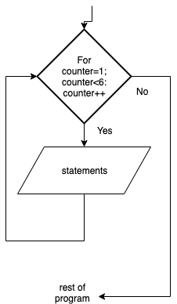

.. _for-loop:

For Loop
========

The For loop is another repetition structure. The advantage of using the for loop is that the structure itself keeps track of incrimenting the counter, so you do not have to. Usually by default, the counter is just incrimented by 1 each time you go through the loop. As normal, there is some way to exit the loop, usually by some kind of Boolean expression. Some for loops allow you to just specify how many times you would like to do the loop, by providing a number and no Boolean expression.

To use the For…Next loop, there will also be a loop counter that keeps track of how many times through the loop the program has executed. Each time the code inside the loop is executed, the loop counter is automatically incremented by 1. Then a expression checks to see that the predetermined number of times has been reached. 

The for loop (in most computer programming languages) takes the generic form of:

| **FOR** counter in range(n)
|    statement(s)
| **END** 

or

| **FOR** (counter = 0; boolean expresion; counter++)
|    statement(s)
| **END** 

The flowchart for a For Loop will look like this:

The following code snippet is a repetition program. The user enters a positive integer and the program prints out that many lines:

.. tabs::

  .. group-tab:: C++

    .. code-block:: C++

		// Copyright (c) 2019 St. Mother Teresa HS All rights reserved.
		//
		// Created by: Mr. Coxall
		// Created on: Oct 2019
		// This program uses a for loop

		#include <iostream>

		main() {
		    // this function uses a for loop
		    int positiveInteger;
		    int loopCounter = 0;

		    // input
		    std::cout << "Enter how many times to repeat: ";
		    std::cin >> positiveInteger;

		    // process & output
		    for (loopCounter = 0; loopCounter < positiveInteger; loopCounter++) {
		        std::cout << loopCounter <<" time through loop." << std::endl;
		    }
		}

  .. group-tab:: Go

    .. code-block:: Go

      // for loop

  .. group-tab:: Java

    .. code-block:: Java

      // for loop

  .. group-tab:: JavaScript

    .. code-block:: JavaScript

      // for loop

  .. group-tab:: Python3

    .. code-block:: Python

		#!/usr/bin/env python3

		# Created by: Mr. Coxall
		# Created on: Oct 2019
		# This program uses a for loop

		def main():
		    # this function uses a for loop

		    # input
		    positive_integer = int(input("Enter how many times to repeat: "))
		    print("")

		    # process & output
		    for loop_counter in range(positive_integer):
		        print("{0} time through loop.".format(loop_counter))

		if __name__ == "__main__":
		    main()

  .. group-tab:: Ruby

    .. code-block:: Ruby

      // for loop

  .. group-tab:: Swift

    .. code-block:: Swift

      // for loop
