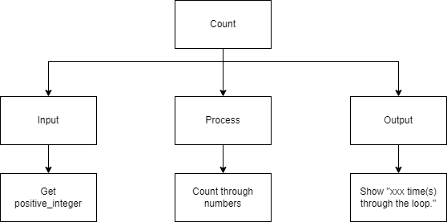
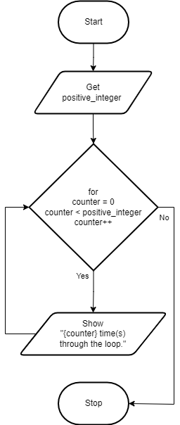

.. _for-loop:

For Loop
========

The `For loop <https://en.wikipedia.org/wiki/For_loop>`_ is another repetition structure. The advantage of using the for loop is that the structure itself keeps track of incrimenting the counter, so you do not have to. Usually by default, the counter is just incrimented by 1 each time you go through the loop. As normal, there is some way to exit the loop, usually by some kind of Boolean expression. Some for loops allow you to just specify how many times you would like to do the loop, by providing a number and no Boolean expression.

To use the For…Next loop, there will also be a loop counter that keeps track of how many times through the loop the program has executed. Each time the code inside the loop is executed, the loop counter is automatically incremented by 1. Then a expression checks to see that the predetermined number of times has been reached. 

The for loop (in most computer programming languages) takes the generic form of:

| **FOR** counter in range(n)
|     statement(s)
|     ...
| **ENDFOR** 

or

| **FOR** (int counter = 0; boolean expresion; counter++)
|     statement(s)
|     ...
| **ENDFOR** 

In this example program, the user is asked to enter a posative integer and the program will count how many times it goes through the loop until it reaches that number.

Top-Down Design for the For loop
^^^^^^^^^^^^^^^^^^^^^^^^^^^^^^^^

Flowchart for the For loop
^^^^^^^^^^^^^^^^^^^^^^^^^^

Pseudocode for the For loop
^^^^^^^^^^^^^^^^^^^^^^^^^^^
| **GET** positive_integer
| **FOR** (int counter = 0; counter < positive_integer; counter++)
|     **SHOW** counter
| **ENDFOR** 

Code for the For loop
^^^^^^^^^^^^^^^^^^^^^
.. tabs::

  .. group-tab:: C
    .. code-block:: C
      .. literalinclude:: ../../code_examples/3-Structured_Problem_Solving/15-For_Loop/C/main.c
        :language: C
        :linenos:
        :emphasize-lines: 19-21

  .. group-tab:: C++
    .. code-block:: C++
      .. literalinclude:: ../../code_examples/3-Structured_Problem_Solving/15-For_Loop/CPP/main.cpp
        :language: C++
        :linenos:
        :emphasize-lines: 19-21

  .. group-tab:: C#
    .. code-block:: C#
      .. literalinclude:: ../../code_examples/3-Structured_Problem_Solving/15-For_Loop/CSharp/main.cs
        :language: C#
        :linenos:
        :emphasize-lines: 23-25

  .. group-tab:: Go
    .. code-block:: Go
      .. literalinclude:: ../../code_examples/3-Structured_Problem_Solving/15-For_Loop/Go/main.go
        :language: go
        :linenos:
        :emphasize-lines: 25-28

  .. group-tab:: Java
    .. code-block:: Java
      .. literalinclude:: ../../code_examples/3-Structured_Problem_Solving/15-For_Loop/Java/Main.java
        :language: java
        :linenos:
        :emphasize-lines: 26-28

  .. group-tab:: JavaScript
    .. code-block:: JavaScript
      .. literalinclude:: ../../code_examples/3-Structured_Problem_Solving/15-For_Loop/JavaScript/main.js
        :language: javascript
        :linenos:
        :emphasize-lines: 17-19

  .. group-tab:: Python
    .. code-block:: Python
      .. literalinclude:: ../../code_examples/3-Structured_Problem_Solving/15-For_Loop/Python/main.py
        :language: python
        :linenos:
        :emphasize-lines: 17-18

Example Output
^^^^^^^^^^^^^^
.. code-block:: console

  @Mr-Coxall ➜ (main ✗) $ python ./main.py
  Enter how many times to repeat: 5

  0 time(s) through the loop.
  1 time(s) through the loop.
  2 time(s) through the loop.
  3 time(s) through the loop.
  4 time(s) through the loop.

  Done.
