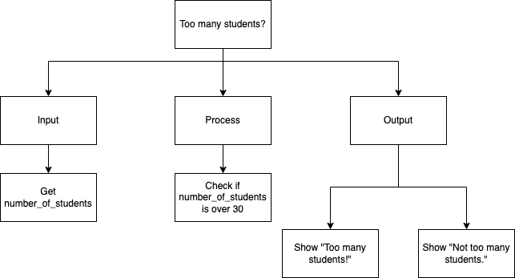
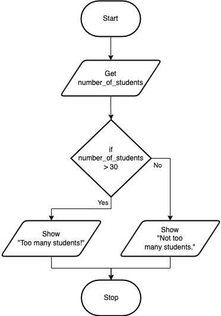
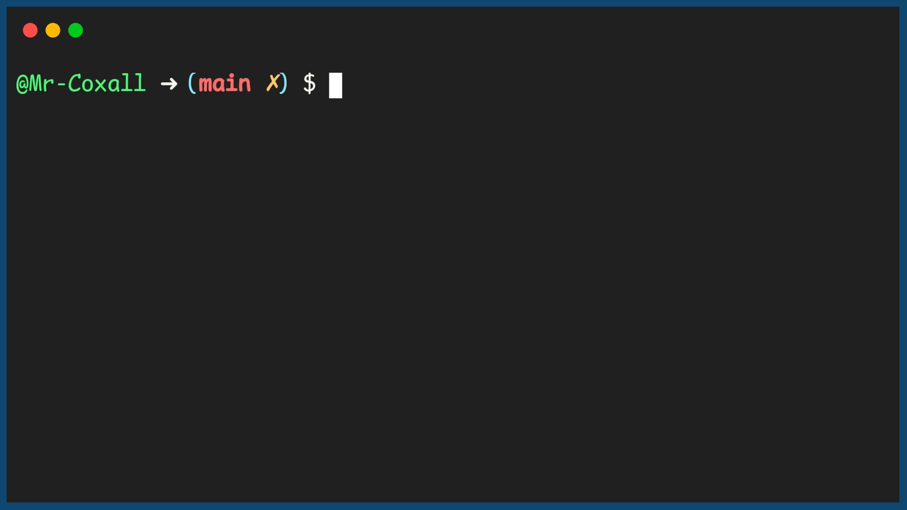

.. _if-then-else:

If…Then…Else
============

In the previous section we looked at the If…Then statement that is used for making a decision. When used a section of code is either performed or not performed, depending if the boolean statement is true or false. In some situations, if the statement is false and the section of code is not performed you would like an **alternative** piece of code to be performed instead. In this case an optional Else statement can be used. The If…Then…Else statement (in most computer programming languages) takes the generic form of:

| **IF** (boolean expression) **THEN** 
|    statements to be performed ...
| **ELSE**
|    alternate statements to be performed ...
| **ENDIF**

In the previous example of asking the user how many students were in the class, you might have noticed that the user was given no feedback if there were 30 or fewer students. This can add confusion for the user; they might be unsure if the program worked correctly.

An example of what this would look like using an If .. Then .. Else statement is shown below:

Top-Down Design for If…Then...Else statement
^^^^^^^^^^^^^^^^^^^^^^^^^^^^^^^^^^^^^^^^^^^^^

Flowchart for If…Then...Else statement
^^^^^^^^^^^^^^^^^^^^^^^^^^^^^^^^^^^^^^^

Pseudocode for If…Then...Else statement
^^^^^^^^^^^^^^^^^^^^^^^^^^^^^^^^^^^^^^^^
| **GET** number_of_students
| **IF** (number_of_students > 30) **THEN**
|     **SHOW** "Too many students!"
| **ELSE**
|     **SHOW** "Not too many students."
| **ENDIF**

Code for If…Then...Else statement
^^^^^^^^^^^^^^^^^^^^^^^^^^^^^^^^^
.. tabs::

  .. group-tab:: C
    .. code-block:: C
      .. literalinclude:: ../../code_examples/3-Structured_Problem_Solving/7-If_Then_Else/C/main.c
        :language: C
        :linenos:
        :emphasize-lines: 19-23

  .. group-tab:: C++
    .. code-block:: C++
      .. literalinclude:: ../../code_examples/3-Structured_Problem_Solving/7-If_Then_Else/CPP/main.cpp
        :language: C++
        :linenos:
        :emphasize-lines: 19-23

  .. group-tab:: C#
    .. code-block:: C#
      .. literalinclude:: ../../code_examples/3-Structured_Problem_Solving/7-If_Then_Else/CSharp/main.cs
        :language: C#
        :linenos:
        :emphasize-lines: 22-26

  .. group-tab:: Go
    .. code-block:: Go
      .. literalinclude:: ../../code_examples/3-Structured_Problem_Solving/7-If_Then_Else/Go/main.go
        :language: go
        :linenos:
        :emphasize-lines: 21-25

  .. group-tab:: Java
    .. code-block:: Java
      .. literalinclude:: ../../code_examples/3-Structured_Problem_Solving/7-If_Then_Else/Java/Main.java
        :language: java
        :linenos:
        :emphasize-lines: 23-27

  .. group-tab:: JavaScript
    .. code-block:: JavaScript
      .. literalinclude:: ../../code_examples/3-Structured_Problem_Solving/7-If_Then_Else/JavaScript/main.js
        :language: javascript
        :linenos:
        :emphasize-lines: 13-17

  .. group-tab:: Python
    .. code-block:: Python
      
      constants.py

      .. literalinclude:: ../../code_examples/3-Structured_Problem_Solving/7-If_Then_Else/Python/constants.py
        :language: python
        :linenos:
        :emphasize-lines: 8-9

      main.py

      .. literalinclude:: ../../code_examples/3-Structured_Problem_Solving/7-If_Then_Else/Python/main.py
        :language: python
        :linenos:
        :emphasize-lines: 19-22

.. literalinclude:: test_py_module/test.py
    :language: python
    :caption: Literal includes can also have captions.
    :linenos:
    :lines: 1-40

Example Output
^^^^^^^^^^^^^^

