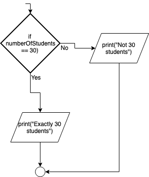

.. _if-then-else:

If…Then…Else
============

In the previous section we looked at the If…Then statement that is used for making a decision. When used a section of code is either performed or not performed, depending if the boolean statement is true or not. In some situations, if the statement is false and the section of code is not performed you would like an **alternative** piece of code to be performed instead. In this case an optional Else statement can be used. The If…Then…Else statement (in most computer programming languages) takes the generic form of:

| **IF** (boolean expression) **THEN** 
|    Statements to be performed ...
| **ELSE**
|    Alternate statements to be performed ...
| **ENDIF**

An example of what this would look like in a specific programming language is:

.. tabs::

  .. group-tab:: C++

    .. code-block:: C++

      // if ... then ... else example
      if (numberOfStudents == 30) {
          std::cout << "Exactly 30 students!"
      } else {
          std::cout << "Not 30 students."
      }

  .. group-tab:: Go

    .. code-block:: Go

      // if ... then ... else example
      if numberOfStudents == 30 {
          fmt.Println("Exactly 30 students!")
      } else {
          fmt.Println("Not 30 students")
      }

  .. group-tab:: Java

    .. code-block:: Java

      // if ... then ... else example
      if (numberOfStudents == 30) {
          print("Exactly 30 students!");
      } else {
          print("Not 30 students");
      }

  .. group-tab:: JavaScript

    .. code-block:: JavaScript

      /**
      * Created by: Mr. Coxall
      * Created on: Sep 2020
      * This program shows an if ... else statement
      */

      // this allows for console input in Node.js
      const prompt = require('prompt-sync')()

      // input
      const numberOfStudents = prompt("Enter the number of students: ")

      // if ... then ... else example
      if (numberOfStudents == 30) {
        console.log("Exactly 30 students!")
      } else {
        console.log("Not 30 students.")
      }

      console.log("\nDone.")

  .. group-tab:: Python

    .. code-block:: Python

      # if ... then ... else example
      if number_of_students == 30 :
          print("Exactly 30 students!")
      else:
          print("Not 30 students.")

  .. group-tab:: Ruby

    .. code-block:: Ruby

      // if ... then ... else example
      if numberOfStudents == 30
          puts "Exactly 30 students!"
      else
          puts "Not 30 students."

  .. group-tab:: Swift

    .. code-block:: Swift

      // if ... then ... else example
      if numberOfStudents == 30 {
          print("Exactly 30 students!")
      } else {
          print("Not 30 students.")
      }

In the above examples, if the variable numberOfStudents happens to be exactly equal to 30, the next line of code is performed (print("Exactly 30 students!")). If the variable is not equal to 30 (say it is 32 or 17), then the next line of code is skipped over and **NOT** performed but the following line of code will be performed (print("Exactly 30 students!")). Once again the diamond shape represented decision, even if it has a statement if it is true and a different one if it is false. The above examples would look like the following in a flow-chart:

