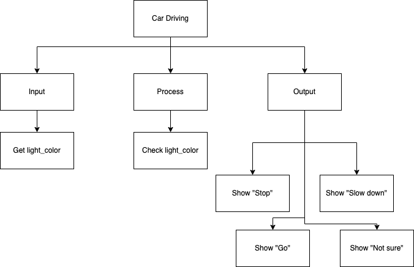
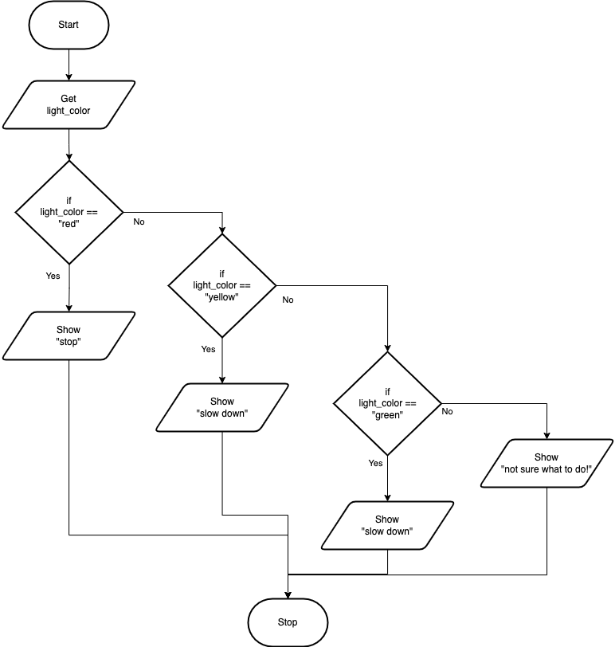
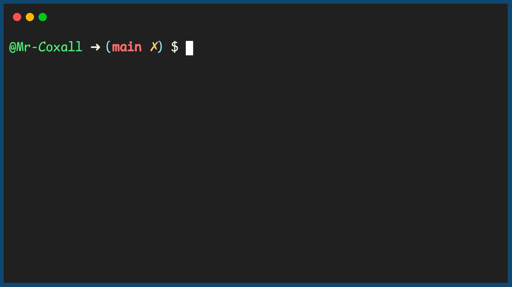

.. _if-then-elseif-else:

If…Then…ElseIf…Else
===================

In some problems there are not just two different outcomes but more than two. If this is the case, then a simple If…Then…Else structure will not work. In these situations an If…Then…ElseIf…Else might be used. In this type of structure there can be more than just one Boolean condition and each is checked in sequence. Once a Boolean expression is met (the value is true), then the specified section of code for that Boolean expression is executed. Once executed, all other conditions are skipped over and the flow of logic goes right down to the bottom of the structure. It is important to remember that **one and only one** section of code can be executed. Even if several of the Boolean conditions happen to be met, the first and only the first one will be evaluated and run. 

The structure can contain many ElseIfs, as many as the programmer needs. Another optional piece of the structure is the “Else”. If none of the above boolean conditions are met, the programmer might want a section of code to be executed that is a catch all. If this is the case, then the code is placed in the else section. Any code in the else section is run if and only if none of the Boolean expressions were met. It should also be noted that there is no Boolean condition associated with the else. That is because it is run only if all the above boolean conditions are not met. The If…Then…ElseIf…Else statement (in most computer programming languages) takes the generic form of:

| **IF** (boolean expression #1) **THEN** 
|    first potential statements to be performed
| **ELSEIF** (boolean expression #2) **THEN** 
|    second potential statements to be performed
| **ELSEIF** (boolean expression #3) **THEN** 
|    third potential statements to be performed
| ...
| **ELSEIF** (boolean expression #n) **THEN** 
|    Nth potential statements to be performed
| **ELSE**
|    alternate statements to be performed
| **ENDIF**

When you approach a street light, there are not just 2 choices there are actually 3 (or maybe more). The following example will tell the driver (or the self-driving car) what to do as they approach a stop light. The driver will need to know what to do if the light is red, yellow or green. If the light is red, the driver needs to stop. If the light is yellow, the driver needs to slow down. If the light is green, the driver needs to go. If the light is not red, yellow or green, the driver needs to do something else. The following code shows how this might be done:

Top-Down Design for If…Then…ElseIf…Else statement
^^^^^^^^^^^^^^^^^^^^^^^^^^^^^^^^^^^^^^^^^^^^^^^^^^^^^^

Flowchart for If…Then…ElseIf…Else statement
^^^^^^^^^^^^^^^^^^^^^^^^^^^^^^^^^^^^^^^

Pseudocode for If…Then…ElseIf…Else statement
^^^^^^^^^^^^^^^^^^^^^^^^^^^^^^^^^^^^^^^^^^^^
| **GET** light_color
| **IF** (light_color == "red") **THEN**
|     **SHOW** "Stop!"
| **ELSEIF** (light_color == "yellow") **THEN**
|     **SHOW** "Slow down!"
| **ELSEIF** (light_color == "green") **THEN**
|     **SHOW** "Go!"
| **ELSE**
|     **SHOW** "Not sure!"
| **ENDIF**

Code for If…Then…ElseIf…Else statement
^^^^^^^^^^^^^^^^^^^^^^^^^^^^^^^^^^^^^^
.. tabs::

  .. group-tab:: C
    .. code-block:: C
      .. literalinclude:: ../../code_examples/3-Structured_Problem_Solving/8-If_Then_ElseIf_Else/C/main.c
        :language: C
        :linenos:
        :emphasize-lines: 20-28

  .. group-tab:: C++
    .. code-block:: C++
      .. literalinclude:: ../../code_examples/3-Structured_Problem_Solving/8-If_Then_ElseIf_Else/CPP/main.cpp
        :language: C++
        :linenos:
        :emphasize-lines: 19-27

  .. group-tab:: C#
    .. code-block:: C#
      .. literalinclude:: ../../code_examples/3-Structured_Problem_Solving/8-If_Then_ElseIf_Else/CSharp/main.cs
        :language: C#
        :linenos:
        :emphasize-lines: 21-29

  .. group-tab:: Go
    .. code-block:: Go
      .. literalinclude:: ../../code_examples/3-Structured_Problem_Solving/8-If_Then_ElseIf_Else/Go/main.go
        :language: go
        :linenos:
        :emphasize-lines: 20-28

  .. group-tab:: Java
    .. code-block:: Java
      .. literalinclude:: ../../code_examples/3-Structured_Problem_Solving/8-If_Then_ElseIf_Else/Java/Main.java
        :language: java
        :linenos:
        :emphasize-lines: 22-30

  .. group-tab:: JavaScript
    .. code-block:: JavaScript
      .. literalinclude:: ../../code_examples/3-Structured_Problem_Solving/8-If_Then_ElseIf_Else/JavaScript/main.js
        :language: javascript
        :linenos:
        :emphasize-lines: 12-20

  .. group-tab:: Python
    .. code-block:: Python
      .. literalinclude:: ../../code_examples/3-Structured_Problem_Solving/8-If_Then_ElseIf_Else/Python/main.py
        :language: python
        :linenos:
        :emphasize-lines: 16-23

Example Output
^^^^^^^^^^^^^^

