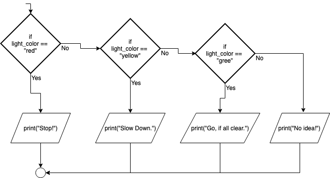

.. _if-then-elseif-else:

If…Then…ElseIf…Else
===================

In some problems there are not just two different outcomes but more than two. If this is the case, then a simple If…Then…Else structure will not work. In these situations an If…Then…ElseIf…Else might be used. In this type of structure there can be more than just one Boolean condition and each is checked in sequence. Once a Boolean expression is met (the value is true), then the specified section of code for that Boolean expression is executed. Once executed, all other conditions are skipped over and the flow of logic goes right down to the bottom of the structure. It is important to remember that **one and only one** section of code can be executed. Even if several of the Boolean conditions happen to be met, the first and only the first one will be evaluated and run. 

The structure can contain many ElseIfs, as many as the programmer needs. Another optional piece of the structure is the “Else”. If none of the above boolean conditions are met, the programmer might want a section of code to be executed. If this is the case, then the code is placed in the else section. Any code in the else section is run if and only if none of the Boolean expressions were met. It should also be noted that there is no Boolean condition associated with the else. That is because it is run only if all the above boolean conditions are not met. The If…Then…ElseIf…Else statement (in most computer programming languages) takes the generic form of:

| **IF** (boolean expression #1) **THEN** 
|    First potential statement to be performed
| **ELSEIF** (boolean expression #2) **THEN** 
|    Second potential statement to be performed
| **ELSEIF** (boolean expression #3) **THEN** 
|    Third potential statement to be performed
| ...
| **ELSEIF** (boolean expression #n) **THEN** 
|    Nth potential statement to be performed
| **ELSE**
|    Alternate statements to be performed
| **ENDIF**

An example of what this would look like in a specific programming language is:

.. tabs::

  .. group-tab:: C++

    .. code-block:: C++

      // if ... then ... elseif ... else example
      if (colourOfLight == “red”) {
          std::cout << "Stop!";
      } else if (colourOfLight == “yellow") {
          std::cout << "Slow Down.";
      } else if (colourOfLight == green") {
          std::cout << "Go, if all clear.";
      } else {
          std::cout << "No idea!";
      }

  .. group-tab:: Go

    .. code-block:: Go

      // if ... then ... elseif ... else example

  .. group-tab:: Java

    .. code-block:: Java

      // if ... then ... elseif ... else example

  .. group-tab:: JavaScript

    .. code-block:: JavaScript

      // if ... then ... elseif ... else example

  .. group-tab:: Python3

    .. code-block:: Python

      # if ... then ... elseif ... else example
      if colour_of_light == “red”) {
          print("Stop!")
      } elif (colour_of_light == “yellow") {
          print("Slow Down.")
      } elif (colour_of_light == green") {
          print("Go, if all clear.")
      } else {
          print("No idea!")
      }

  .. group-tab:: Ruby

    .. code-block:: Ruby

      // if ... then ... elseif ... else example

  .. group-tab:: Swift

    .. code-block:: Swift

      // if ... then ... elseif ... else example

In the above examples, if the variable colourOfLight is red, yellow or green than the appropriate section of code is executed. If the variable does not equal any of these, then the last statement is executed, “No idea!” The above examples would look like the following in a flow-chart:

