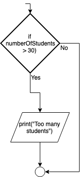

.. _if-then:

If ... Then
===========

The If…Then structure is a conditional statement, or sometimes referred to as a decision structure. It is used to perform a section of code if and only if the condition is true. The condition is checked by using a Boolean statement. If the condition is not true (meaning false), then the section of code is not performed it is just passed over. The If…Then statement (in most computer programming languages) takes the generic form of:

| **If** (boolean expression) **Then** 
|    Statements to be performed
| **End If**

The indentation (usually 4 spaces, **NOT A TAB**) used in the If…Then statement is a coding convention used in almost every language. It is there to make the statement easier to read. It has no effect on how the code works and could be ignored; however, it is **REALLY BAD** programming style not to have it. Here is what an If…Then statement looks like in specific programming languages:

.. tabs::

  .. group-tab:: C++

    .. code-block:: C++

		if (numberOfStudents > 30) {
            print("Too many Students!");
		}

  .. group-tab:: Go

    .. code-block:: Go

      // This program 

  .. group-tab:: Java

    .. code-block:: Java

       // This program 

  .. group-tab:: JavaScript

    .. code-block:: JavaScript

       // This program 

  .. group-tab:: Python3

    .. code-block:: Python

		if number_of_students > 30 :
            print("Too many Students!")

  .. group-tab:: Ruby

    .. code-block:: Ruby

       # This program 

  .. group-tab:: Swift

    .. code-block:: Swift

In the above examples, if the variable numberOfStudents (or number_of_students) happens to be a number that is greater than 30 (say 32), the next line of code is performed (print("Too many Students!")). If the variable is not greater than 30 (say it is exactly 30), then the next line of code is skipped over and NOT performed. Remember from the section on flowcharts, the diamond shape represented decision. The If…Then statement is the translation of a decision in a flowchart to code. The above examples would look like the following in a flowchart:

