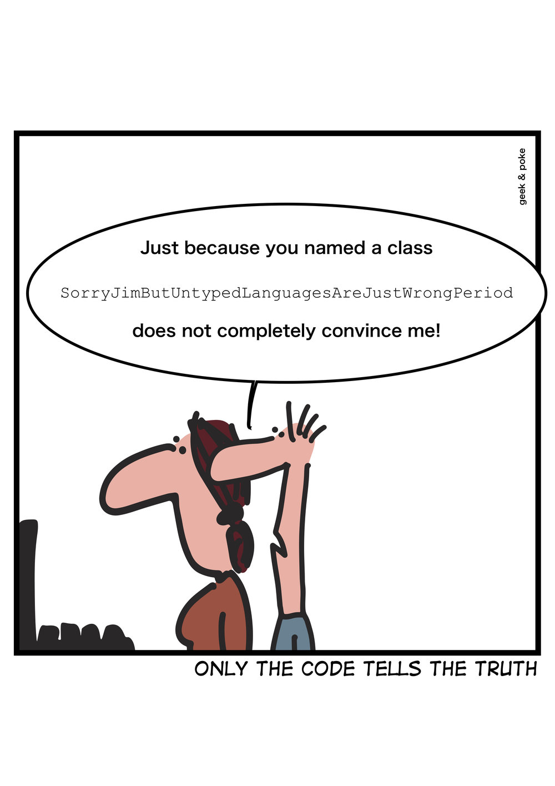

.. _structured-problem-solving:
**************************
Structured Problem Solving
**************************

Teachers often hear students complain that they "...don't know where to begin." when they are expected to solve what seem to be straightforward problems. Obviously they are not straightforward to the students for reasons that we are now beginning to understand, knowing where to begin is usually the hardest part. Structured problem solving is a set of tools to help you guide yourself though the process of solving computer related problems that seem to be impossible to solve.

.. toctree::
   :maxdepth: 2
   :glob:

   Top-Down Design in Programming <top-down-design>
   Variables <variables>
   Constants <constants>
   Assignment Statements <assignment-statements>
   Scope of Variables <scope-of-variables>
   Sequence <sequence>
   Selection <selection>
   Repetition <repetition>