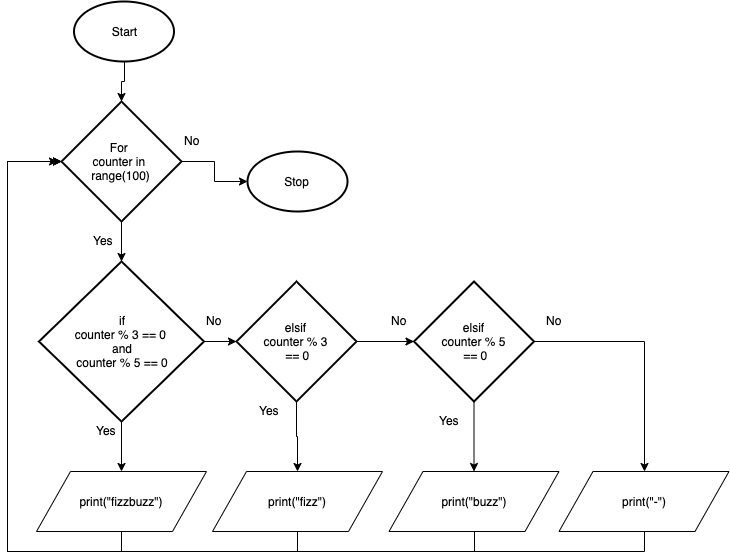

.. _loops-and-if-statements:

Loops and If Statements
=======================

As you can probably guess from now, yes you can place loops inside if statements and if statements inside loops. 

An if statement inside a loop would (in most computer programming languages) take the generic form of:

| **FOR** counter in range(n)
|     **IF** (boolean expression) **THEN** 
|         Statements to be performed
|     **ENDIF**
| **END** 

or using While loops:

| **WHILE** counter1 <= n :
|     **IF** (boolean expression) **THEN** 
|         Statements to be performed
|     **ENDIF**
|     ...
|     counter1 = counter1 + 1
| **END**

Here is one of the most well-known examples of the exercises that you might be given as the opening question in a junior data scientist job interview.

The task is:
*Go through all the whole numbers up until 100. Print ‘fizz’ for every number that’s divisible by 3, print ‘buzz’ for every number divisible by 5, and print ‘fizzbuzz’ for every number divisible by 3 and by 5! If the number is not divisible either by 3 or 5, print a dash (‘-‘)!*

In a flow chart it looks like:

The following code snippet is the solution to the above problem:

.. tabs::

  .. group-tab:: C++

    .. code-block:: C++

		// Copyright (c) 2019 St. Mother Teresa HS All rights reserved.
		//
		// Created by: Mr. Coxall
		// Created on: Nov 2019
		// This program uses a loop and an if statement
		//   It is also the famous Fizz-Buzz problem

		#include <iostream>

		main() {
		    // this function is the the famous Fizz-Buzz problem
		    
		    int counter;

		    for (counter = 0; counter < 100 + 1; counter++) {
		        if (counter % 3 == 0 && counter % 5 == 0) {
		            std::cout << counter <<" → fizzbuzz" << std::endl;
		        } else if (counter % 3 == 0) {
		            std::cout << counter <<" → fizz" << std::endl;
		        } else if (counter % 5 == 0) {
		            std::cout << counter <<" → buzz" << std::endl;
		        } else {
		            std::cout << counter <<" → -" << std::endl;
		        }
		    }
		}

  .. group-tab:: Go

    .. code-block:: Go

      // nested loop

  .. group-tab:: Java

    .. code-block:: Java

      // nested loop

  .. group-tab:: JavaScript

    .. code-block:: JavaScript

      // nested loop

  .. group-tab:: Python

    .. code-block:: Python

		#!/usr/bin/env python3

		# Created by: Mr. Coxall
		# Created on: Nov 2019
		# This program uses a loop and an if statement
		#   It is also the famous Fizz-Buzz problem

		def main():
		    # this function is the the famous Fizz-Buzz problem

		    for counter in range(100 + 1):
		        if counter % 3 == 0 and counter % 5 == 0:
		            print('{0} → fizzbuzz'.format(counter))
		        elif counter % 3 == 0:
		            print('{0} → fizz'.format(counter))
		        elif counter % 5 == 0:
		            print('{0} → buzz'.format(counter))
		        else:
		            print('{0} → -'.format(counter))

		if __name__ == "__main__":
		    main()

  .. group-tab:: Ruby

    .. code-block:: Ruby

      // nested loop

  .. group-tab:: Swift

    .. code-block:: Swift

      // nested loop
