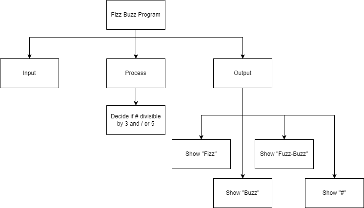
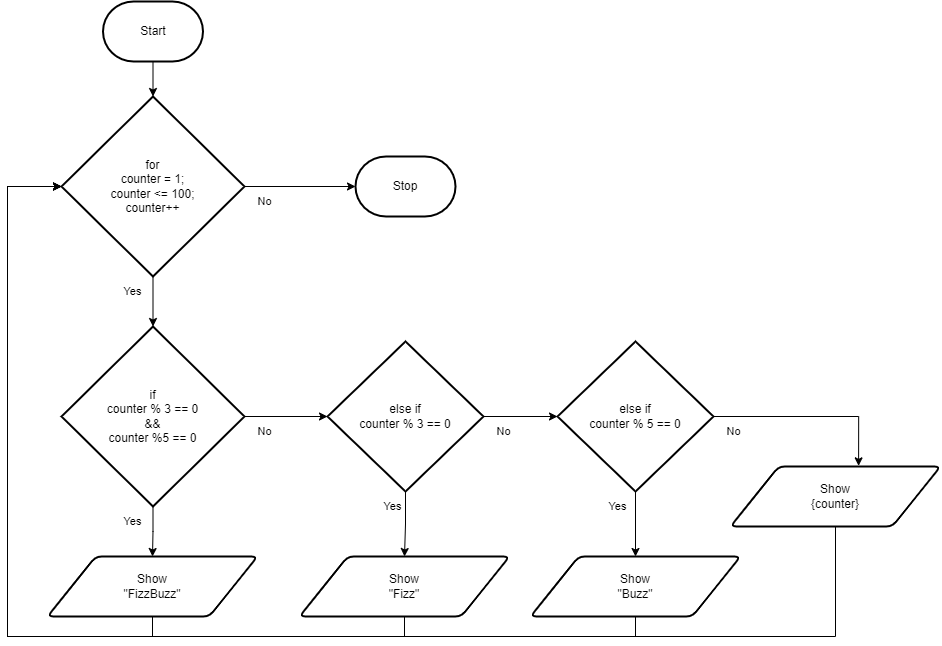

.. _loops-and-if-statements:

Loops and If Statements
=======================

As you can probably guess from now, yes you can place loops inside if statements and if statements inside loops. 

An if statement inside a loop would (in most computer programming languages) take the generic form of:

| **FOR** counter in range(n)
|     **IF** (boolean expression) **THEN** 
|         Statements to be performed
|     **ENDIF**
| **END** 

or using While loops:

| **WHILE** counter1 <= n :
|     **IF** (boolean expression) **THEN** 
|         Statements to be performed
|     **ENDIF**
|     ...
|     counter1 = counter1 + 1
| **END**

Here is one of the most well-known examples of the exercises that you might be given as the opening question in a junior data scientist job interview.

The task is:
*Go through all the whole numbers up until 100 (1 to 100). Print ‘Fizz’ for every number that’s divisible by 3, print ‘Buzz’ for every number divisible by 5, and print ‘Fizz-Buzz’ for every number divisible by 3 and by 5! If the number is not divisible either by 3 or 5, print out the number.*

Top-Down Design for Loops and If Statements
^^^^^^^^^^^^^^^^^^^^^^^^^^^^^^^^^^^^^^^^^^^

Flowchart for Loops and If Statements
^^^^^^^^^^^^^^^^^^^^^^^^^^^^^^^^^^^^^

Pseudocode for Loops and If Statements
^^^^^^^^^^^^^^^^^^^^^^^^^^^^^^^^^^^^^^
| **FOR** counter1 in range(10)
|     **FOR** counter2 in range(10)
|         **SHOW** Odometer {counter1}{counter2}
|     **END**
| **END** 

Code for the Loops and If Statements
^^^^^^^^^^^^^^^^^^^^^^^^^^^^^^^^^^^^
.. tabs::

  .. group-tab:: C
    .. code-block:: C
      .. literalinclude:: ../../code_examples/3-Structured_Problem_Solving/19-Loops_and_Ifs/C/main.c
        :language: C
        :linenos:

  .. group-tab:: C++
    .. code-block:: C++
      .. literalinclude:: ../../code_examples/3-Structured_Problem_Solving/19-Loops_and_Ifs/CPP/main.cpp
        :language: C++
        :linenos:

  .. group-tab:: C#
    .. code-block:: C#
      .. literalinclude:: ../../code_examples/3-Structured_Problem_Solving/19-Loops_and_Ifs/CSharp/main.cs
        :language: C#
        :linenos:

  .. group-tab:: Go
    .. code-block:: Go
      .. literalinclude:: ../../code_examples/3-Structured_Problem_Solving/19-Loops_and_Ifs/Go/main.go
        :language: go
        :linenos:

  .. group-tab:: Java
    .. code-block:: Java
      .. literalinclude:: ../../code_examples/3-Structured_Problem_Solving/19-Loops_and_Ifs/Java/Main.java
        :language: java
        :linenos:

  .. group-tab:: JavaScript
    .. code-block:: JavaScript
      .. literalinclude:: ../../code_examples/3-Structured_Problem_Solving/19-Loops_and_Ifs/JavaScript/main.js
        :language: javascript
        :linenos:

  .. group-tab:: Python
    .. code-block:: Python
      .. literalinclude:: ../../code_examples/3-Structured_Problem_Solving/19-Loops_and_Ifs/Python/main.py
        :language: python
        :linenos:

Example Output
^^^^^^^^^^^^^^
.. code-block:: console

  @Mr-Coxall ➜ (main ✗) $ python ./main.py
  1
  2
  Fizz
  4
  Buzz
  Fizz
  7
  ...
  92
  Fizz
  94
  Buzz
  Fizz
  97
  98
  Fizz
  Buzz

  Done.
