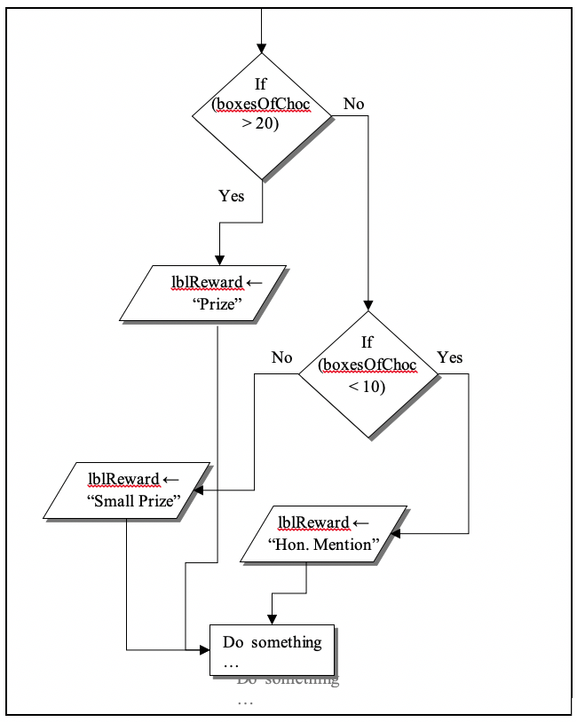

.. _nested-if-statements:

Nested If Statements
====================

Sometimes a single if statement, even a long If…Then…ElseIf…ElseIf…Else is not a suitable structure to model your problem. Sometimes after one decision is made, there is another second decision that must follow. In these cases, if statements can be nested within if statements (or other structures as we will see later). Here is a problem:

A school is going to sell chocolate bars to raise money. If a student sells over 20 boxes, they get a prize. If they sell 20 to 10, they get a “small” prize. If they sell less than 10, they get honorable mention. Create a program that will let the user input the number of boxes sold and then state what the reward would be and use nested if statements.

The nested if statements (in most computer programming languages) takes the generic form of:

| **IF** expression1:
|    statement(s)
|    **IF** expressionA:
|        statement(s)
|    **ELSE**
|        Alternate statements to be performed
| **ELSE**
|     Alternate statements to be performed
| **ENDIF**

An example of what this would look like in a specific programming language is:

.. tabs::

  .. group-tab:: C++

    .. code-block:: C++

      // if ... then ... elseif ... else example
      if (colourOfLight == “red”) {
          std::cout << "Stop!";
      } else if (colourOfLight == “yellow") {
          std::cout << "Slow Down.";
      } else if (colourOfLight == green") {
          std::cout << "Go, if all clear.";
      } else {
          std::cout << "No idea!";
      }

  .. group-tab:: Go

    .. code-block:: Go

      // nested if example

  .. group-tab:: Java

    .. code-block:: Java

      // nested if example

  .. group-tab:: JavaScript

    .. code-block:: JavaScript

      // nested if example

  .. group-tab:: Python3

    .. code-block:: Python

      # nested if example

  .. group-tab:: Ruby

    .. code-block:: Ruby

      // nested if example

  .. group-tab:: Swift

    .. code-block:: Swift

      // nested if example

The flowchart for this type of problem will look something like this:

