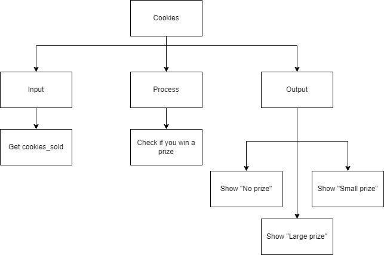
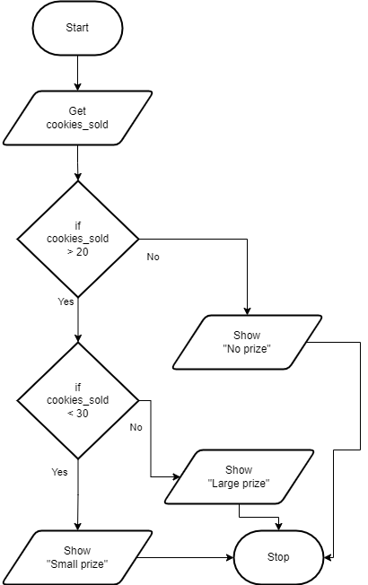
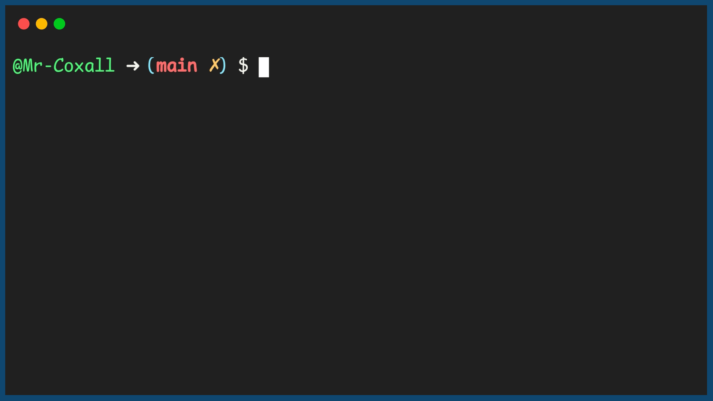

.. _nested-if-statements:

Nested If Statements
====================

Sometimes a single if statement, even a long If…Then…ElseIf…ElseIf…Else is not a suitable structure to model your problem. Sometimes after one decision is made, there is another second decision that must follow. In these cases, if statements can be nested within if statements (or other structures as we will see later).

The nested if statements (in most computer programming languages), takes the generic form of:

| **IF** (Boolean expression A) **THEN**
|    statement(s)
|    **IF** (Boolean expression B) **THEN**
|        statement(s)
|    **ELSE**
|        Alternate statements to be performed
|    **ENDIF**
| **ELSE**
|     Alternate statements to be performed
| **ENDIF**

In this example problem a school is going to sell cookies to raise money. If a student sells 20 or more boxes, they get a prize. If they sell less than 30, they get a, “small” prize. If they sell more than 30, they get a, "large" prize. (Yes you could use an If…Then…ElseIf… statement.)

Top-Down Design for Nested If statement
^^^^^^^^^^^^^^^^^^^^^^^^^^^^^^^^^^^^^^^^^^^^^^^^^^^^^^

Flowchart for Nested If statement
^^^^^^^^^^^^^^^^^^^^^^^^^^^^^^^^^^^^^^^

Pseudocode for Nested If statement
^^^^^^^^^^^^^^^^^^^^^^^^^^^^^^^^^^^^^^^^^^^^
| **GET** cookies_sold
| **IF** (cookies_sold >= 20) **THEN**
|    **IF** (cookies_sold < 30) **THEN**
|        **SHOW** "Small prize!"
|    **ELSE**
|        **SHOW** "Large prize!"
|    **ENDIF**
| **ELSE**
|    **SHOW** "No prize."
| **ENDIF**

Code for Nested If statement
^^^^^^^^^^^^^^^^^^^^^^^^^^^^^^^^^^^^^^
.. tabs::

  .. group-tab:: C
    .. code-block:: C
      .. literalinclude:: ../../code_examples/3-Structured_Problem_Solving/12-Nested_If_Statements/C/main.c
        :language: C
        :linenos:
        :emphasize-lines: 19-27

  .. group-tab:: C++
    .. code-block:: C++
      .. literalinclude:: ../../code_examples/3-Structured_Problem_Solving/12-Nested_If_Statements/CPP/main.cpp
        :language: C++
        :linenos:
        :emphasize-lines: 19-27

  .. group-tab:: C#
    .. code-block:: C#
      .. literalinclude:: ../../code_examples/3-Structured_Problem_Solving/12-Nested_If_Statements/CSharp/main.cs
        :language: C#
        :linenos:
        :emphasize-lines: 23-31

  .. group-tab:: Go
    .. code-block:: Go
      .. literalinclude:: ../../code_examples/3-Structured_Problem_Solving/12-Nested_If_Statements/Go/main.go
        :language: go
        :linenos:
        :emphasize-lines: 24-32

  .. group-tab:: Java
    .. code-block:: Java
      .. literalinclude:: ../../code_examples/3-Structured_Problem_Solving/12-Nested_If_Statements/Java/Main.java
        :language: java
        :linenos:
        :emphasize-lines: 26-34

  .. group-tab:: JavaScript
    .. code-block:: JavaScript
      .. literalinclude:: ../../code_examples/3-Structured_Problem_Solving/12-Nested_If_Statements/JavaScript/main.js
        :language: javascript
        :linenos:
        :emphasize-lines: 15-23

  .. group-tab:: Python
    .. code-block:: Python
      .. literalinclude:: ../../code_examples/3-Structured_Problem_Solving/12-Nested_If_Statements/Python/main.py
        :language: python
        :linenos:
        :emphasize-lines: 17-23

Example Output
^^^^^^^^^^^^^^

