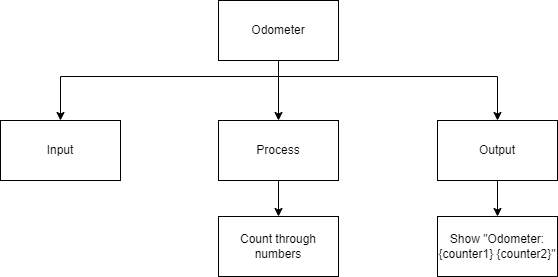
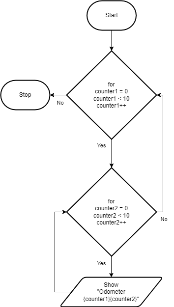
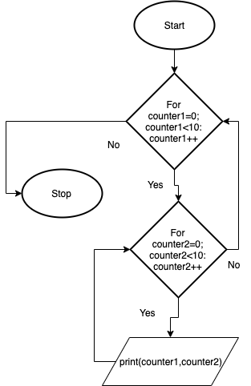

.. _nested-loops:

Nested Loops
============

The placing of one loop inside the body of another loop is called nesting. When you "nest" two loops, the outer loop takes control of the number of complete repetitions of the inner loop. How this works is that the first pass of the outer loop triggers the inner loop, which executes to completion. Then the second pass of the outer loop triggers the inner loop again. This repeats until the outer loop finishes. 

A Nested for loop (in most computer programming languages) takes the generic form of:

| **FOR** counter1 in range(n)
|     **FOR** counter2 in range(m)
|         statement(s)
|         ...
|     **END**
| **END** 

or using While loops:

| **WHILE** counter1 <= n :
|     **WHILE** counter2 >= m :
|         statement(s)
|         ...
|         counter2 = counter2 + 1
|     **END**
|     ...
|     counter1 = counter1 + 1
| **END**

In this example program, the output shows a 2 digit odometer, using a nested loop.

Top-Down Design for Nested Loops
^^^^^^^^^^^^^^^^^^^^^^^^^^^^^^^^

Flowchart for Nested Loops
^^^^^^^^^^^^^^^^^^^^^^^^^^

Pseudocode for Nested Loops
^^^^^^^^^^^^^^^^^^^^^^^^^^^
| **FOR** counter1 in range(10)
|     **FOR** counter2 in range(10)
|         **SHOW** Odometer {counter1}{counter2}
|     **END**
| **END** 

Code for the Nested Loops
^^^^^^^^^^^^^^^^^^^^^^^^^
.. tabs::

  .. group-tab:: C
    .. code-block:: C
      .. literalinclude:: ../../code_examples/3-Structured_Problem_Solving/18-Nested_Loops/C/main.c
        :language: C
        :linenos:
        :emphasize-lines: 24-26

  .. group-tab:: C++
    .. code-block:: C++
      .. literalinclude:: ../../code_examples/3-Structured_Problem_Solving/18-Nested_Loops/CPP/main.cpp
        :language: C++
        :linenos:
        :emphasize-lines: 24-26

  .. group-tab:: C#
    .. code-block:: C#
      .. literalinclude:: ../../code_examples/3-Structured_Problem_Solving/18-Nested_Loops/CSharp/main.cs
        :language: C#
        :linenos:
        :emphasize-lines: 28-30

  .. group-tab:: Go
    .. code-block:: Go
      .. literalinclude:: ../../code_examples/3-Structured_Problem_Solving/18-Nested_Loops/Go/main.go
        :language: go
        :linenos:
        :emphasize-lines: 30-32

  .. group-tab:: Java
    .. code-block:: Java
      .. literalinclude:: ../../code_examples/3-Structured_Problem_Solving/18-Nested_Loops/Java/Main.java
        :language: java
        :linenos:
        :emphasize-lines: 31-33

  .. group-tab:: JavaScript
    .. code-block:: JavaScript
      .. literalinclude:: ../../code_examples/3-Structured_Problem_Solving/18-Nested_Loops/JavaScript/main.js
        :language: javascript
        :linenos:
        :emphasize-lines: 22-24

  .. group-tab:: Python
    .. code-block:: Python
      .. literalinclude:: ../../code_examples/3-Structured_Problem_Solving/18-Nested_Loops/Python/main.py
        :language: python
        :linenos:
        :emphasize-lines: 21-22

Example Output
^^^^^^^^^^^^^^
.. code-block:: console

  @Mr-Coxall ➜ (main ✗) $ python ./main.py
  Odometer: 00
  Odometer: 01
  Odometer: 02
  ...
  Odometer: 97
  Odometer: 98
  Odometer: 99

  Done.

In a flow chart it looks like:

The following code snippet is a nested loop example of a 2 digit odometer:

.. tabs::

  .. group-tab:: C++

    .. code-block:: C++

		// Copyright (c) 2019 St. Mother Teresa HS All rights reserved.
		//
		// Created by: Mr. Coxall
		// Created on: Oct 2019
		// This program uses a nested loop

		#include <iostream>

		main() {
		    // this function uses a nested loop
		    int counter1;
		    int counter2;

		    // process & output
		    for (counter1 = 0; counter1 < 10; counter1++) {
		        for (counter2 = 0; counter2 < 10; counter2++) {
		            std::cout << "Odometer reading: " << counter1 << counter2 << std::endl;
		        }
		    }
		}

  .. group-tab:: Go

    .. code-block:: Go

      // nested loop

  .. group-tab:: Java

    .. code-block:: Java

      // nested loop

  .. group-tab:: JavaScript

    .. code-block:: JavaScript

      // nested loop

  .. group-tab:: Python3

    .. code-block:: Python

		#!/usr/bin/env python3

		# Created by: Mr. Coxall
		# Created on: Oct 2019
		# This program uses a nested loop

		def main():
		    # this function uses a nested loop
		    
		    counter1 = 0
		    counter2 = 0

		    # process & output
		    for counter1 in range(10):
		        for counter2 in range(10):
		            print("Odometer {0}{1}".format(counter1, counter2))

		if __name__ == "__main__":
		    main()

  .. group-tab:: Ruby

    .. code-block:: Ruby

      // nested loop

  .. group-tab:: Swift

    .. code-block:: Swift

      // nested loop
