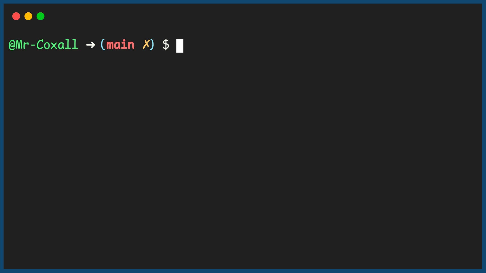

.. _nested-loops:

Nested Loops
============

The placing of one loop inside the body of another loop is called nesting. When you, "nest" two loops, the outer loop takes control of the number of complete repetitions of the inner loop. How this works is that the first pass of the outer loop triggers the inner loop, which executes to completion. Then the second pass of the outer loop triggers the inner loop again. This repeats until the outer loop finishes. 

A Nested for loop (in most computer programming languages), takes the generic form of:

| **FOR** counter1 in range(n)
|     **FOR** counter2 in range(m)
|         statement(s)
|         ...
|     **END**
| **END** 

or using While loops:

| **WHILE** counter1 <= n :
|     **WHILE** counter2 <= m :
|         statement(s)
|         ...
|         counter2 = counter2 + 1
|     **END**
|     counter2 = 0
|     ...
|     counter1 = counter1 + 1
| **END**

In this example program, the output shows a 2 digit odometer, using a Nested loop.

Top-Down Design for Nested loops
^^^^^^^^^^^^^^^^^^^^^^^^^^^^^^^^

Flowchart for Nested loops
^^^^^^^^^^^^^^^^^^^^^^^^^^

Pseudocode for Nested loops
^^^^^^^^^^^^^^^^^^^^^^^^^^^
| **FOR** counter1 in range(10)
|     **FOR** counter2 in range(10)
|         **SHOW** Odometer {counter1}{counter2}
|     **END**
| **END** 

Code for the Nested loops
^^^^^^^^^^^^^^^^^^^^^^^^^
.. tabs::

  .. group-tab:: C
    .. code-block:: C
      .. literalinclude:: ../../code_examples/3-Structured_Problem_Solving/18-Nested_Loops/C/main.c
        :language: C
        :linenos:
        :emphasize-lines: 13-17

  .. group-tab:: C++
    .. code-block:: C++
      .. literalinclude:: ../../code_examples/3-Structured_Problem_Solving/18-Nested_Loops/CPP/main.cpp
        :language: C++
        :linenos:
        :emphasize-lines: 13-17

  .. group-tab:: C#
    .. code-block:: C#
      .. literalinclude:: ../../code_examples/3-Structured_Problem_Solving/18-Nested_Loops/CSharp/main.cs
        :language: C#
        :linenos:
        :emphasize-lines: 16-20

  .. group-tab:: Go
    .. code-block:: Go
      .. literalinclude:: ../../code_examples/3-Structured_Problem_Solving/18-Nested_Loops/Go/main.go
        :language: go
        :linenos:
        :emphasize-lines: 20-27

  .. group-tab:: Java
    .. code-block:: Java
      .. literalinclude:: ../../code_examples/3-Structured_Problem_Solving/18-Nested_Loops/Java/Main.java
        :language: java
        :linenos:
        :emphasize-lines: 14-18

  .. group-tab:: JavaScript
    .. code-block:: JavaScript
      .. literalinclude:: ../../code_examples/3-Structured_Problem_Solving/18-Nested_Loops/JavaScript/main.js
        :language: javascript
        :linenos:
        :emphasize-lines: 7-11

  .. group-tab:: Python
    .. code-block:: Python
      .. literalinclude:: ../../code_examples/3-Structured_Problem_Solving/18-Nested_Loops/Python/main.py
        :language: python
        :linenos:
        :emphasize-lines: 13-16

Example Output
^^^^^^^^^^^^^^

