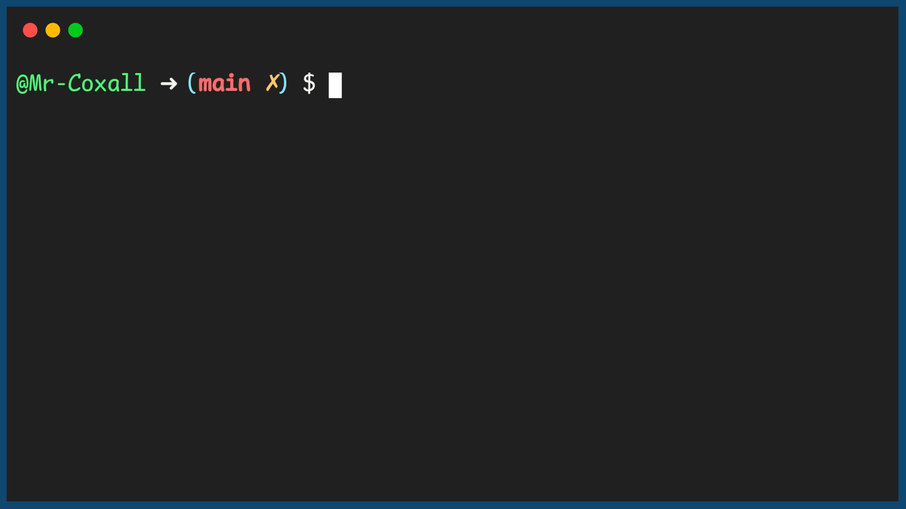

.. _select-case:

Select Case
===========

As you have seen from the If…Elseif…Elseif…Else statement, when there are many choices, the structure can be hard to follow. Some programming languages have an alternative structure when this happens. The Select Case or Switch Case statement is also a decision structure that is sometimes preferred because code might be easier to read and understand, by people. 

The Select Case structure takes a variable and then compares it to a list of expressions. The first expressions that is evaluated as, “True” is executed and the remaining of the select case structure is skipped over, just like an If…ElseIf… statement (but not in all languages!). There are several different ways to create your expression. You can just use a value (a single digit for example and then it does an equal comparison), several digits, a range or having a regular expression. Just like the If structure, there is an optional “Else” that can be placed at the end as a catch all. The general form of a Select…Case statement (in most computer programming languages), takes the generic form of:

| **SELECT** (variable)
|       **CASE** valueOne
|           //statements
|       **CASE** valueTwo
|           //statements
|       **CASE** valueThree
|           //statements
|       …      
|       **ELSE**  //optional
|           //statements

In this example program, the user enters in a grade letter. The letter grades are A, B, C, D & F. The computer will tell you if you are doing well, average or poorly. If the user enters in a grade that is not A, B, C, D or F, the computer will tell you that you have entered in an invalid grade.

Top-Down Design for Select Case statement
^^^^^^^^^^^^^^^^^^^^^^^^^^^^^^^^^^^^^^^^^
.. image:: ./images/top-down-select-case.png
    :alt: Top-Down Design for Select Case statement
    :align: center

Flowchart for Select Case statement
^^^^^^^^^^^^^^^^^^^^^^^^^^^^^^^^^^^
.. image:: ./images/flowchart-select-case.png
    :alt: Select Case flowchart
    :align: center

Pseudocode for Select Case statement
^^^^^^^^^^^^^^^^^^^^^^^^^^^^^^^^^^^^
| **GET** grade
| **SELECT** (grade)
|       **CASE** "A"
|           **SHOW** "Excellent!"
|       **CASE** "B"
|           **SHOW** "Good job!"
|       **CASE** "C"
|           **SHOW** "Average."
|       **CASE** "D"
|           **SHOW** "Poor."
|       **CASE** "F"
|           **SHOW** "Fail."
|       **ELSE**
|           **SHOW** "Invalid grade."

Code for Select Case statement
^^^^^^^^^^^^^^^^^^^^^^^^^^^^^^
.. tabs::

  .. group-tab:: C
    .. code-block:: C
      .. literalinclude:: ../../code_examples/3-Structured_Problem_Solving/9-Select_Case/C/main.c
        :language: C
        :linenos:
        :emphasize-lines: 19-40

  .. group-tab:: C++
    .. code-block:: C++
      .. literalinclude:: ../../code_examples/3-Structured_Problem_Solving/9-Select_Case/CPP/main.cpp
        :language: C++
        :linenos:
        :emphasize-lines: 19-41

  .. group-tab:: C#
    .. code-block:: C#
      .. literalinclude:: ../../code_examples/3-Structured_Problem_Solving/9-Select_Case/CSharp/main.cs
        :language: C#
        :linenos:
        :emphasize-lines: 20-39

  .. group-tab:: Go
    .. code-block:: Go
      .. literalinclude:: ../../code_examples/3-Structured_Problem_Solving/9-Select_Case/Go/main.go
        :language: go
        :linenos:
        :emphasize-lines: 24-37

  .. group-tab:: Java
    .. code-block:: Java
      .. literalinclude:: ../../code_examples/3-Structured_Problem_Solving/9-Select_Case/Java/Main.java
        :language: java
        :linenos:
        :emphasize-lines: 23-42

  .. group-tab:: JavaScript
    .. code-block:: JavaScript
      .. literalinclude:: ../../code_examples/3-Structured_Problem_Solving/9-Select_Case/JavaScript/main.js
        :language: javascript
        :linenos:
        :emphasize-lines: 12-31

  .. group-tab:: Python
    .. code-block:: Python
      .. literalinclude:: ../../code_examples/3-Structured_Problem_Solving/9-Select_Case/Python/main.py
        :language: python
        :linenos:
        :emphasize-lines: 17-29

Example Output
^^^^^^^^^^^^^^

