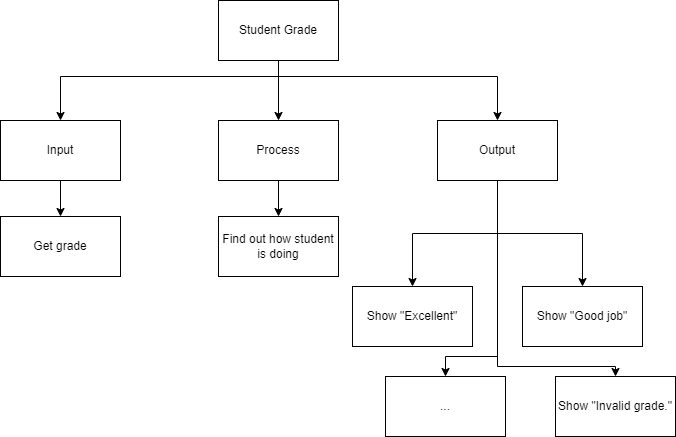

.. _select-case:

Select Case
===========

As you have seen from the If…Elseif…Elseif…Else statement, when there are many choices, the structure can be hard to follow. Some programming languages have an alternative structure when this happens. The Select Case or Switch Case statement is also a decision structure that is sometimes preferred because code might be easier to read and understand, by people. 

The Select Case structure takes a variable and then compares it to a list of expressions. The first expressions that is evaluated as “True” is executed and the remaining of the select case structure is skipped over, just like an If…ElseIf… statement (but not in all languages!). There are several different ways to create your expression. You can just use a value (a single digit for example and then it does an equal comparison), several digits, a range or having a regular expression (Is < 10). Just like the If structure, there is an optional “Else” that can be placed at the end as a catch all. The general form of a Select…Case statement (in most computer programming languages) takes the generic form of:

| **SELECT** (variable)
|       **CASE** valueOne
|           //statements
|       **CASE** valueTwo
|           //statements
|       **CASE** valueThree
|           //statements
|       …      
|       **ELSE**  //optional
|           //statements

In this example program, the user enters in a grade letter. The letter grades are A, B, C, D & F. The computer will tell you if you are doing well, average or poorly. If the user enters in a grade that is not A, B, C, D or F, the computer will tell you that you have entered in an invalid grade.

Top-Down Design for Select Case statement
^^^^^^^^^^^^^^^^^^^^^^^^^^^^^^^^^^^^^^^^^^^^^^^^^^^^^^

Flowchart for Select Case statement
^^^^^^^^^^^^^^^^^^^^^^^^^^^^^^^^^^^^^^^
.. image:: ./images/flowchart-select-case.png
   :alt: Select Case flowchart
   :align: center

Pseudocode for Select Case statement
^^^^^^^^^^^^^^^^^^^^^^^^^^^^^^^^^^^^^^^^^^^^
| **GET** grade
| **SELECT** (grade)  
|       **CASE** "A"
|           **SHOW** "Excellent!"
|       **CASE** "B"
|           **SHOW** "Good job!"
|       **CASE** "C"
|           **SHOW** "Average."
|       **CASE** "D"
|           **SHOW** "Poor."
|       **CASE** "F"
|           **SHOW** "Fail."
|       **ELSE**
|           **SHOW** "Invalid grade."

Code for Select Case statement
^^^^^^^^^^^^^^^^^^^^^^^^^^^^^^^^^^^^^^
.. tabs::

  .. group-tab:: C
    .. code-block:: C
      .. literalinclude:: ../../code_examples/3-Structured_Problem_Solving/9-Select-Case/C/main.c
        :language: C
        :linenos:
        :emphasize-lines: 20-28

  .. group-tab:: C++
    .. code-block:: C++
      .. literalinclude:: ../../code_examples/3-Structured_Problem_Solving/9-Select-Case/CPP/main.cpp
        :language: C++
        :linenos:
        :emphasize-lines: 19-27

  .. group-tab:: C#
    .. code-block:: C#
      .. literalinclude:: ../../code_examples/3-Structured_Problem_Solving/9-Select-Case/CSharp/main.cs
        :language: C#
        :linenos:
        :emphasize-lines: 21-29

  .. group-tab:: Go
    .. code-block:: Go
      .. literalinclude:: ../../code_examples/3-Structured_Problem_Solving/9-Select-Case/Go/main.go
        :language: go
        :linenos:
        :emphasize-lines: 20-28

  .. group-tab:: Java
    .. code-block:: Java
      .. literalinclude:: ../../code_examples/3-Structured_Problem_Solving/9-Select-Case/Java/Main.java
        :language: java
        :linenos:
        :emphasize-lines: 22-30

  .. group-tab:: JavaScript
    .. code-block:: JavaScript
      .. literalinclude:: ../../code_examples/3-Structured_Problem_Solving/9-Select-Case/JavaScript/main.js
        :language: javascript
        :linenos:
        :emphasize-lines: 12-20

  .. group-tab:: Python
    .. code-block:: Python
      .. literalinclude:: ../../code_examples/3-Structured_Problem_Solving/9-Select-Case/Python/main.py
        :language: python
        :linenos:
        :emphasize-lines: 16-23

Example Output
^^^^^^^^^^^^^^
.. code-block:: console

  @Mr-Coxall ➜ (master ✗) $ python ./main.py 
  Enter the color of the traffic light: red
  Stop!

  Done.
  @Mr-Coxall ➜ (master ✗) $ python ./main.py 
  Enter the color of the traffic light: yellow
  Slow down!

  Done.
  @Mr-Coxall ➜ (master ✗) $ python ./main.py 
  Enter the color of the traffic light: green
  Go!

  Done.
  @Mr-Coxall ➜ (master ✗) $ python ./main.py 
  Enter the color of the traffic light: blue
  Not a valid color.

  Done.

.. tabs::

  .. group-tab:: C++

    .. code-block:: C++

      // Copyright (c) 2019 St. Mother Teresa HS All rights reserved.
      //
      // Created by: Mr. Coxall
      // Created on: Sep 2019
      // This program checks your grade

      #include <iostream>

      int main() {
          // this function checks your grade
          char gradeLevel;  // a single character

          // input
          std::cout << "Enter grade mark as a single character(ex: A, B, ...): ";
          std::cin >> gradeLevel;

          // switch in C++ can not support strings, only numbers and char
          // also note you need the break in C++ or it will move to next
          // line in switch statement and might be true again
          switch (gradeLevel) {
              case 'A' :
                  std::cout << "Excellent!" << std::endl;
                  break;
              case 'B' :
                  std::cout << "Really good!" << std::endl;
                  break;
              case 'C' :
                  std::cout << "Well done" << std::endl;
                  break;
              case 'D' :
                  std::cout << "You passed" << std::endl;
                  break;
              case 'F' :
                  std::cout << "Better try again" << std::endl;
                  break;
              default :
                  std::cout << "Invalid grade" << std::endl;
          }
      }

  .. group-tab:: Go

    .. code-block:: Go

      // select ...case example

  .. group-tab:: Java

    .. code-block:: Java

      // select ...case example

  .. group-tab:: JavaScript

    .. code-block:: JavaScript

      // select ...case example

  .. group-tab:: Python3

    .. code-block:: Python

      #!/usr/bin/env python3

      # Created by: Mr. Coxall
      # Created on: Sep 2020
      # This program checks your grade
      # NOTE: This will only work on >= Python 3.10

      def main():
          # this function checks your grade

          # input
          grade_level = input("Enter grade mark as a single character(ex: A, B, ...): ")
          print("")

          # process & output
          match grade_level:
              case "A":
                  print("Excellent!")
              case "B":
                  print("Really good!")
              case "C":
                  print("Well done")
              case "D":
                  print("You passed")
              case "F":
                  print("Better try again")
              case _:
                  print("Invalid grade")

      if __name__ == "__main__":
          main()

  .. group-tab:: Ruby

    .. code-block:: Ruby

      #!/usr/bin/env ruby

      # Created by: Mr. Coxall
      # Created on: Sep 2019
      # This program checks your grade

      # input
      print "Enter grade mark as a single character(ex: A, B, ...): "
      gradeLevel = gets
      gradeLevel = gradeLevel.chomp

      # process & output
      case gradeLevel
          when "A"
              puts "Excellent!"
          when "B"
              puts "Really good!"
          when "C"
              puts "Well done"
          when "D"
              puts "You passed"
          when "F"
              puts "Better try again"
          else
              puts "Invalid grade"
      end

  .. group-tab:: Swift

    .. code-block:: Swift

      // select ...case example

In the above examples, if the variable gradeLevel is "A" it will print out "Excellent!", and so on for each letter of grades. If the variable does not equal any of these, then the last statement is executed, Invalid grade”. The above examples would look like the following in a flow-chart:

.. image:: ./images/select-case.png
   :alt: Select…Case flowchart
   :align: center 
