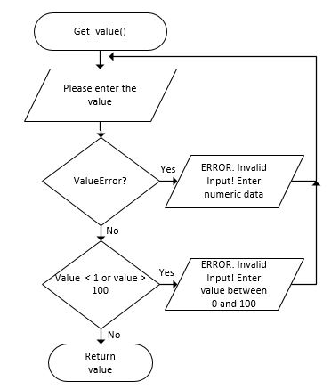

.. _try-catch:

Try Catch
=========

When a runtime error or exception occurs, the program will terminate and generate an error message. This is not exactly ideal for the user. What would be better is if we could catch these errors and then do what is necessary to get fix the problem. A common example is when we ask the user to enter a number, but for some reason they entered text. Ideally we would not want the program just to crash, we would want to explain to the user they entered something incorrectly.

To catch these runtime errors, a portion of code is enclosed in a try-block. When an exceptional circumstance arises within that block, an exception is thrown that transfers the control to the exception handler. If no exception is thrown, the code continues normally and all handlers are ignored. The try statement (in python) takes the generic form of:

| **TRY**
|    some statement(s) to be performed
| **EXCEPT** (type of error)
|    some statement(s) to be performed
| **ELSE**
|    some statement(s) to be performed
| **FINALLY**
|    some statement(s) to be performed
| **END**

You can define as many exception blocks as you want (e.g. if you want to execute a special block of code for a special kind of error).
You can use the else keyword to define a block of code to be executed if no errors were raised.
The finally block, if specified, will be executed regardless if the try block raises an error or not.

An example of what this would look like in a specific programming language is:

.. tabs::

  .. group-tab:: C++

    .. code-block:: C++

      // try statement

  .. group-tab:: Go

    .. code-block:: Go

      // try statement

  .. group-tab:: Java

    .. code-block:: Java

      // try statement

  .. group-tab:: JavaScript

    .. code-block:: JavaScript

      // try statement

  .. group-tab:: Python3

    .. code-block:: Python

      #!/usr/bin/env python3

      # Created by: Mr. Coxall
      # Created on: Sep 2019
      # This program uses a try statement

      def main():
          # this function uses a try statement

          # input
          integer_as_string = input("Enter an integer: ")
          print("")

          # process & output
          try:
            integer_as_number = int(integer_as_string)
            print("You entered an integer correctly")
          except:
            print("This was not an integer")
          finally:
            print("Thanks for playing")

      if __name__ == "__main__":
          main()
      

  .. group-tab:: Ruby

    .. code-block:: Ruby

      // try statement

  .. group-tab:: Swift

    .. code-block:: Swift

      // try statement

In the above examples, if you do enter in an integer, it will let you know. If you enter in a string for example, the program will not crash, but give you a warning. The above examples would look like the following in a flow-chart:

