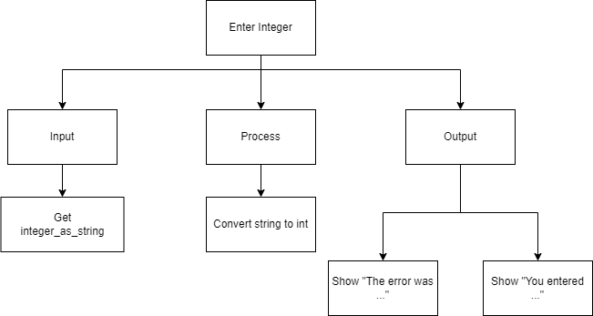
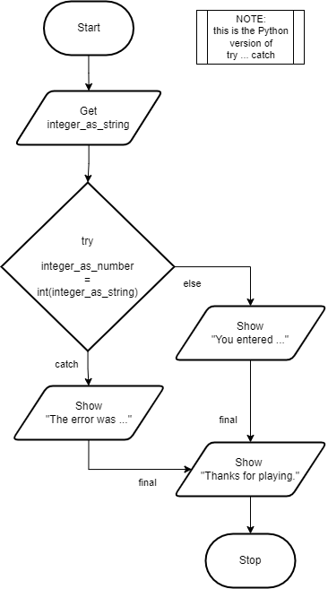
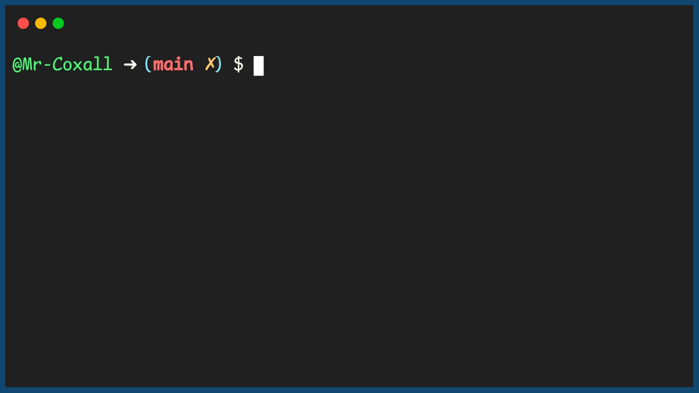

.. _try-catch:

Try Catch
=========

When a runtime error or exception occurs, the program will terminate and generate an error message. This is not exactly ideal for the user. What would be better is if we could catch these errors and then do what is necessary to fix the problem. A common example is when we ask the user to enter a number, but for some reason they entered text. Ideally we would not want the program just to crash, we would want to explain to the user they entered something incorrectly.

To catch these runtime errors, a portion of code is enclosed in a try-catch block. When an exceptional circumstance arises within that block, an exception is thrown that transfers the control to the exception handler. If no exception is thrown, the code continues normally and all handlers are ignored. The try statement normally takes the generic form like:

| **TRY**
|    some statement(s) to be performed, which may raise an exception
| **CATCH** (type of error)
|    some statement(s) to be performed, if an exception is raised
| **ELSE**
|    some statement(s) to be performed, if no exception is raised
| **FINALLY**
|    some statement(s) to be performed, regardless of whether an exception is raised or not
| **ENDTRY**

You can define as many exception blocks as you want (e.g. if you want to execute a special block of code for a special kind of error). You use the else keyword to define a block of code to be executed if no errors were raised (this is python only). The finally block, if specified, will be executed regardless if the try block raises an error or not.

In this example program, the user is asked to enter an integer. The program then tries to convert the entered string into an integer. If the program fails to convert the string to an integer, instead of crashing the program will warn the user. If it succeeds, the program will continue as normal. The program will also print a message at the end, regardless of whether an error was raised or not.

Top-Down Design for Try Catch statement
^^^^^^^^^^^^^^^^^^^^^^^^^^^^^^^^^^^^^^^

Flowchart for Try Catch statement
^^^^^^^^^^^^^^^^^^^^^^^^^^^^^^^^^

Pseudocode for Try Catch statement
^^^^^^^^^^^^^^^^^^^^^^^^^^^^^^^^^^
| **GET** integer_as_string
| **TRY**
|    **CONVERT** integer_as_number = int(integer_as_string)
| **EXCEPT** invalid_argument
|    **SHOW** "The error was ..."
| **ELSE**
|    **SHOW** "You entered: " + integer_as_number
| **FINALLY**
|    **SHOW** "Thanks for playing."
| **ENDTRY**

Code for Try Catch statement
^^^^^^^^^^^^^^^^^^^^^^^^^^^^^^^^^^^^^^
.. tabs::

  .. group-tab:: C
    .. code-block:: C
      .. literalinclude:: ../../code_examples/3-Structured_Problem_Solving/10-Try_Catch/C/main.c
        :language: C
        :linenos:
        :emphasize-lines: 16, 19-23

  .. group-tab:: C++
    .. code-block:: C++
      .. literalinclude:: ../../code_examples/3-Structured_Problem_Solving/10-Try_Catch/CPP/main.cpp
        :language: C++
        :linenos:
        :emphasize-lines: 19-25

  .. group-tab:: C#
    .. code-block:: C#
      .. literalinclude:: ../../code_examples/3-Structured_Problem_Solving/10-Try_Catch/CSharp/main.cs
        :language: C#
        :linenos:
        :emphasize-lines: 20-27

  .. group-tab:: Go
    .. code-block:: Go
      .. literalinclude:: ../../code_examples/3-Structured_Problem_Solving/10-Try_Catch/Go/main.go
        :language: go
        :linenos:
        :emphasize-lines: 26-30

  .. group-tab:: Java
    .. code-block:: Java
      .. literalinclude:: ../../code_examples/3-Structured_Problem_Solving/10-Try_Catch/Java/Main.java
        :language: java
        :linenos:
        :emphasize-lines: 23-30

  .. group-tab:: JavaScript
    .. code-block:: JavaScript
      .. literalinclude:: ../../code_examples/3-Structured_Problem_Solving/10-Try_Catch/JavaScript/main.js
        :language: javascript
        :linenos:
        :emphasize-lines: 12-19

  .. group-tab:: Python
    .. code-block:: Python
      .. literalinclude:: ../../code_examples/3-Structured_Problem_Solving/10-Try_Catch/Python/main.py
        :language: python
        :linenos:
        :emphasize-lines: 16-23

Example Output
^^^^^^^^^^^^^^

