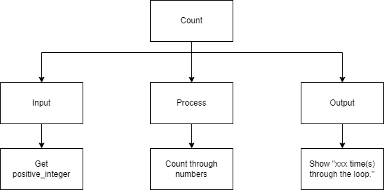
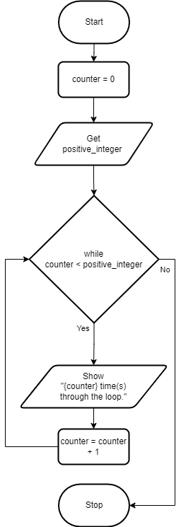
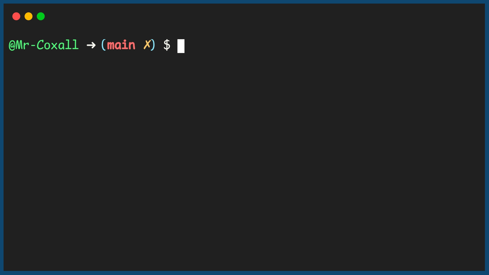

.. _while-loop:

While Loop
==========

The `While loop <https://en.wikipedia.org/wiki/While_loop>`_ is a repetition structure where the statements in the structure are repeated as long as a boolean expression is true. The flow of logic keeps coming back up to the Boolean expression to check if it is still true. As soon as the boolean expression is false, the flow of logic hops down to the end of the loop. Note the boolean condition is also checked before the looping statements are executes the first times. This mean if the condition is not true the first time, the statements will never happen.

It is a common occurrence to have an accumulator or counter within a looping structure. The counter, usually, is incremented (1 is added) or decremented (1 is subtracted) each time the condition is meet and the statements inside the loop are performed. When the counter reaches a certain number that is expressed inside the boolean statement, then the boolean expression becomes false and the loop is exited. Ensure you use proper style and **DO NOT** do what is very common in programming, just declare the variable as i, j or x. Always name a variable for what it is actually doing and holding. For example, if you are using a counter, name it counter or loopCounter. (Yes, I know "i" is short hand for iterator; just do not use it!)

The while loop (in most computer programming languages) takes the generic form of:

| **WHILE** (boolean expression)
|     statement(s)
|     ...
|     counter = counter + 1
| **ENDWHILE**

In this example program, the user is asked to enter a posative integer and the program will count how many times it goes through the loop until it reaches that number.

Top-Down Design for While loop
^^^^^^^^^^^^^^^^^^^^^^^^^^^^^^

Flowchart for While loop
^^^^^^^^^^^^^^^^^^^^^^^^

Pseudocode for While loop
^^^^^^^^^^^^^^^^^^^^^^^^^
| **GET** positive_integer
| **WHILE** (counter < positive_integer)
|     **SHOW** counter
|     counter = counter + 1
| **ENDWHILE**

Code for While loop
^^^^^^^^^^^^^^^^^^^
.. tabs::

  .. group-tab:: C
    .. code-block:: C
      .. literalinclude:: ../../code_examples/3-Structured_Problem_Solving/13-While_Loop/C/main.c
        :language: C
        :linenos:
        :emphasize-lines: 20-23

  .. group-tab:: C++
    .. code-block:: C++
      .. literalinclude:: ../../code_examples/3-Structured_Problem_Solving/13-While_Loop/CPP/main.cpp
        :language: C++
        :linenos:
        :emphasize-lines: 20-23

  .. group-tab:: C#
    .. code-block:: C#
      .. literalinclude:: ../../code_examples/3-Structured_Problem_Solving/13-While_Loop/CSharp/main.cs
        :language: C#
        :linenos:
        :emphasize-lines: 24-27

  .. group-tab:: Go
    .. code-block:: Go
      .. literalinclude:: ../../code_examples/3-Structured_Problem_Solving/13-While_Loop/Go/main.c
        :language: go
        :linenos:
        :emphasize-lines: 25-28

  .. group-tab:: Java
    .. code-block:: Java
      .. literalinclude:: ../../code_examples/3-Structured_Problem_Solving/13-While_Loop/Java/Main.java
        :language: java
        :linenos:
        :emphasize-lines: 28-31

  .. group-tab:: JavaScript
    .. code-block:: JavaScript
      .. literalinclude:: ../../code_examples/3-Structured_Problem_Solving/13-While_Loop/JavaScript/main.js
        :language: javascript
        :linenos:
        :emphasize-lines: 17-20

  .. group-tab:: Python
    .. code-block:: Python
      .. literalinclude:: ../../code_examples/3-Structured_Problem_Solving/13-While_Loop/Python/main.py
        :language: python
        :linenos:
        :emphasize-lines: 18-20

Example Output
^^^^^^^^^^^^^^

