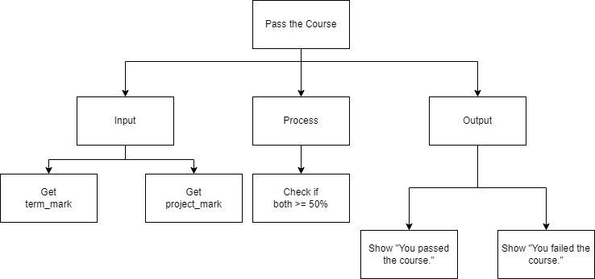
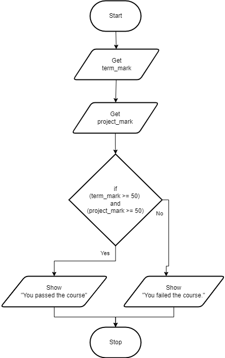

.. _while-loop:

While Loop
==========

The `While loop <https://en.wikipedia.org/wiki/While_loop>`_ is a repetition structure where the statements in the structure are repeated as long as the boolean expression is true. The flow of logic keeps coming back up to the Boolean expression to check if it is still true. As soon as the boolean expression is false, the flow of logic hops down to the end of the loop. The boolean condition is also checked before the looping statements are executes the first times. This mean if the condition is not true the first time, the statements will never happen.

It is a common occurrence to have an accumulator or counter within a looping structure. The counter, usually, is incremented (1 is added) or decremented (1 is subtracted) each time the condition is meet and the statements inside the loop are performed. When the counter reaches a certain number that is expressed inside the boolean statement, then the boolean expression becomes false and the loop is exited. Ensure you use proper style and **DO NOT** do what is very common in programming, just declare the variable as i, j or x. Always name a variable for what it is actually doing and holding. For example, if you are using a counter, name it counter or loopCounter. (Yes, I know "i" is short hand for iterator; just do not use it!)

The while loop (in most computer programming languages) takes the generic form of:

|**WHILE** (boolean expression)
|    statement(s)
|    ...
|    counter = counter + 1
|**ENDWHILE**

In this example program, the user is asked to enter a term mark and a final project mark. The program then tells the user if they passed the course or not. The rule for passing the course is that the student must have a term mark of at least 50% **and** a final project mark of at least 50. The program uses a compound boolean expression to determine if the student passed the course.

Top-Down Design for Compound Boolean Expression statement
^^^^^^^^^^^^^^^^^^^^^^^^^^^^^^^^^^^^^^^^^^^^^^^^^^^^^^^^^

Flowchart for Compound Boolean Expression statement
^^^^^^^^^^^^^^^^^^^^^^^^^^^^^^^^^^^^^^^^^^^^^^^^^^^

Pseudocode for Compound Boolean Expression statement
^^^^^^^^^^^^^^^^^^^^^^^^^^^^^^^^^^^^^^^^^^^^^^^^^^^^
| **GET** term_mark
| **GET** project_mark
| **IF** ((term_mark >= 50) and (project_mark >= 50)) **THEN** 
|    **SHOW** "You passed the course."
| **ELSE**
|    **SHOW** "You failed the course."
| **ENDIF**

Code for Select Case statement
^^^^^^^^^^^^^^^^^^^^^^^^^^^^^^^^^^^^^^
.. tabs::

  .. group-tab:: C
    .. code-block:: C
      .. literalinclude:: ../../code_examples/3-Structured_Problem_Solving/11-Compound_Boolean/C/main.c
        :language: C
        :linenos:
        :emphasize-lines: 22-26

  .. group-tab:: C++
    .. code-block:: C++
      .. literalinclude:: ../../code_examples/3-Structured_Problem_Solving/11-Compound_Boolean/CPP/main.cpp
        :language: C++
        :linenos:
        :emphasize-lines: 22-26

  .. group-tab:: C#
    .. code-block:: C#
      .. literalinclude:: ../../code_examples/3-Structured_Problem_Solving/11-Compound_Boolean/CSharp/main.cs
        :language: C#
        :linenos:
        :emphasize-lines: 23-27

  .. group-tab:: Go
    .. code-block:: Go
      .. literalinclude:: ../../code_examples/3-Structured_Problem_Solving/11-Compound_Boolean/Go/main.go
        :language: go
        :linenos:
        :emphasize-lines: 27-31

  .. group-tab:: Java
    .. code-block:: Java
      .. literalinclude:: ../../code_examples/3-Structured_Problem_Solving/11-Compound_Boolean/Java/Main.java
        :language: java
        :linenos:
        :emphasize-lines: 26-30

  .. group-tab:: JavaScript
    .. code-block:: JavaScript
      .. literalinclude:: ../../code_examples/3-Structured_Problem_Solving/11-Compound_Boolean/JavaScript/main.js
        :language: javascript
        :linenos:
        :emphasize-lines: 14-18

  .. group-tab:: Python
    .. code-block:: Python
      .. literalinclude:: ../../code_examples/3-Structured_Problem_Solving/11-Compound_Boolean/Python/main.py
        :language: python
        :linenos:
        :emphasize-lines: 18-21

Example Output
^^^^^^^^^^^^^^
.. code-block:: console

  @Mr-Coxall ➜ (main ✗) $ python ./main.py 
  Enter term mark (as %): 42
  Enter project mark (as %): 42

  You did not pass the course.

  Done.
  @Mr-Coxall ➜ (main ✗) $ python ./main.py 
  Enter term mark (as %): 42
  Enter project mark (as %): 88

  You did not pass the course.

  Done.
  @Mr-Coxall ➜ (main ✗) $ python ./main.py 
  Enter term mark (as %): 88
  Enter project mark (as %): 88

  You passed the course.

  Done.

The flowchart for a While Loop will look like this:

.. image:: ./images/while-loop.png
   :alt: While Loop
   :align: center 

The following code snippet, a repetition program. The user enters a positive integer and the program prints out that many lines:

.. tabs::

  .. group-tab:: C++

    .. code-block:: C++

		// Copyright (c) 2019 St. Mother Teresa HS All rights reserved.
		//
		// Created by: Mr. Coxall
		// Created on: Oct 2019
		// This program uses a while loop

		#include <iostream>

		main() {
		    // this function uses a while loop
		    int positiveInteger;
		    int loopCounter = 0;

		    // input
		    std::cout << "Enter how many times to repeat: ";
		    std::cin >> positiveInteger;

		    // process
		    while (loopCounter <= positiveInteger) {
		        std::cout << loopCounter <<" time through loop." << std::endl;
		        loopCounter = loopCounter + 1;
		    }
		}

  .. group-tab:: Go

    .. code-block:: Go

      // while loop

  .. group-tab:: Java

    .. code-block:: Java

      // while loop

  .. group-tab:: JavaScript

    .. code-block:: JavaScript

      // while loop

  .. group-tab:: Python3

    .. code-block:: Python

		#!/usr/bin/env python3

		# Created by: Mr. Coxall
		# Created on: Oct 2019
		# This program uses a while loop

		def main():
		    # this function uses a while loop
		    loop_counter = 0

		    # input
		    positive_integer = int(input("Enter how many times to repeat: "))
		    print("")

		    # process & output
		    while loop_counter < positive_integer:
		        print("{0} time through loop.".format(loop_counter))
		        loop_counter = loop_counter + 1

		if __name__ == "__main__":
		    main()

  .. group-tab:: Ruby

    .. code-block:: Ruby

      // while loop

  .. group-tab:: Swift

    .. code-block:: Swift

      // while loop

